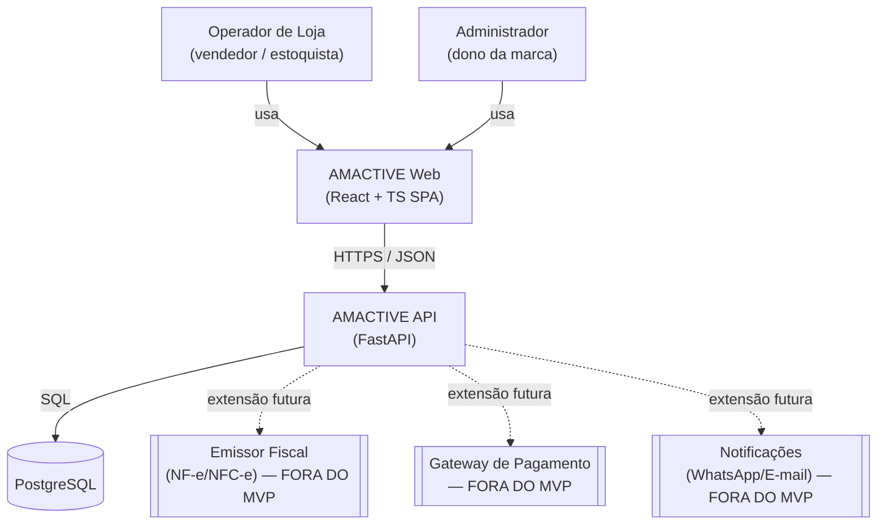
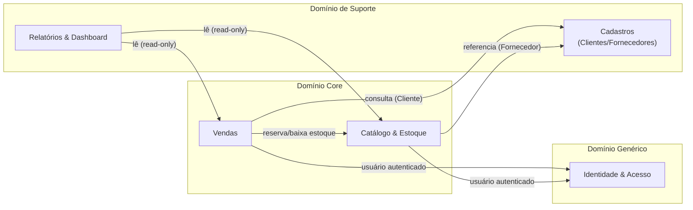

# SDD — AMACTIVE: Sistema de Controle de Estoque e Vendas

> Marca: AMACTIVE — moda fitness feminina.
> Escopo: MVP para controle interno de estoque, vendas (PDV/pedidos), clientes, fornecedores e relatórios. Uso interno (loja física / operação própria), sem integração fiscal ou gateway de pagamento real nesta fase.

---

## Resumo Executivo

O AMACTIVE nasce como um sistema monolítico modular, organizado por Bounded Contexts internos, escrito em **Python (FastAPI)** no backend e **React + TypeScript** no frontend, com **PostgreSQL** como banco de dados primário. O objetivo do MVP é substituir controle manual (planilhas) por um sistema único que garanta consistência entre estoque e vendas — a baixa de estoque em uma venda precisa ser atômica e confiável, o que motiva várias decisões deste documento.

Não há, nesta fase, necessidade de escala multi-serviço, multi-loja ou multi-tenant. Por isso a arquitetura escolhida é um **monolito modular com fronteiras de domínio explícitas** (módulos = bounded contexts), preparado para eventualmente ser decomposto em serviços caso o negócio cresça (múltiplas lojas, marketplace, franquias), mas sem pagar o custo de operar sistemas distribuídos hoje.

---

## 1. Visão Geral da Arquitetura

### 1.1 Contexto do Sistema (C4 Level 1)



O sistema é single-tenant (uma marca, uma operação). Não há apps mobile nem portal de cliente final no MVP — apenas um painel administrativo/operacional web usado pela equipe da loja.

### 1.2 Bounded Contexts (DDD)

| Contexto | Tipo de Subdomínio | Responsabilidade |
|---|---|---|
| **Catálogo & Estoque** | Core | Produtos, variantes (SKU), níveis de estoque, movimentações, alertas de estoque baixo |
| **Vendas** | Core | Pedidos/vendas, itens de pedido, formas de pagamento, baixa de estoque na confirmação da venda |
| **Cadastros** (Master Data) | Supporting | Clientes e fornecedores — dados de terceiros usados por Vendas e por Catálogo & Estoque |
| **Relatórios & Dashboard** | Supporting | Indicadores agregados de vendas, estoque e faturamento (read-model sobre os outros contextos) |
| **Identidade & Acesso** | Generic | Autenticação, usuários internos e papéis (ADMIN, VENDEDOR, ESTOQUISTA) |



**Padrões de integração entre contextos:**

- **Vendas → Catálogo & Estoque**: integração síncrona in-process (mesma transação de banco). Ao confirmar um pedido, o caso de uso de Vendas chama a porta (`EstoqueRepository`/`MovimentacaoEstoqueService`) do contexto de Estoque dentro da mesma unit of work, garantindo atomicidade (não existe cenário de "venda confirmada sem baixa de estoque"). É um **Shared Kernel restrito**: Vendas conhece apenas a interface `IEstoquePort` publicada por Catálogo & Estoque, nunca suas tabelas internas diretamente.
- **Vendas / Catálogo & Estoque → Cadastros**: relação de **Published Language** simples — Vendas e Estoque armazenam apenas `cliente_id` / `fornecedor_id` (referência fraca) e nunca duplicam ou reimplementam regras de cadastro. Cadastros é dona exclusiva do ciclo de vida de Cliente e Fornecedor.
- **Relatórios & Dashboard**: consome os demais contextos **somente leitura**, via views SQL dedicadas (`vw_*`) ou queries diretas de agregação. Não possui tabelas de escrita própria no MVP (ver §1.5 — CQRS-lite).
- **Identidade & Acesso**: Generic Subdomain consumido por todos via um `current_user` injetado no contexto de request (JWT). Nenhum outro contexto duplica lógica de autenticação.

### 1.3 Ubiquitous Language (por contexto)

**Catálogo & Estoque**
| Termo | Significado |
|---|---|
| Produto | Item de catálogo abstrato (ex: "Legging Fitness Alta Compressão") — não é vendável diretamente |
| Variante (SKU) | Combinação vendável de Produto + Tamanho + Cor, com código SKU único |
| Estoque | Saldo atual de uma Variante em um único depósito (MVP é single-location) |
| Movimentação | Registro imutável de entrada, saída ou ajuste de quantidade de uma Variante |
| Estoque mínimo | Limiar configurado por Variante que dispara alerta de estoque baixo |

**Vendas**
| Termo | Significado |
|---|---|
| Pedido | Sinônimo de "Venda" no MVP — um único conceito, sem distinção entre pedido online e venda de balcão |
| Item de Pedido | Linha de um Pedido referenciando uma Variante, quantidade e preço praticado |
| Confirmar Pedido | Ação que dispara a baixa de estoque de forma atômica; pedido em status PENDENTE ainda não baixou estoque |
| Forma de Pagamento | Método declarado (dinheiro, PIX, cartão) — **apenas registro**, sem integração com adquirente/gateway |

**Cadastros**
| Termo | Significado |
|---|---|
| Cliente | Pessoa física ou jurídica que compra da AMACTIVE |
| Fornecedor | Pessoa jurídica (ou física) que abastece o estoque da AMACTIVE |

> Atenção: o termo "Pedido" em Vendas **não** deve ser confundido com "Pedido de Compra" a fornecedor — este último não existe como entidade no MVP (compra é registrada como Movimentação de tipo ENTRADA, opcionalmente referenciando um Fornecedor). Ver §6 (roadmap) para evolução futura de um contexto de Compras dedicado.

### 1.4 Padrão Arquitetural: Clean Architecture / Hexagonal (por contexto)

Cada bounded context é implementado como um módulo Python isolado dentro do monolito, seguindo Clean Architecture com 3 camadas (a camada de Frameworks é compartilhada pelo processo FastAPI):

```
apps/api/src/amactive/contexts/<contexto>/
├── domain/            # Entidades, Value Objects, exceções e PORTAS (interfaces) — zero dependência de framework
│   ├── entities.py
│   ├── value_objects.py
│   ├── events.py
│   └── repositories.py        # Protocols/ABCs — ex: ProdutoRepository, EstoqueRepository
├── application/        # Casos de uso (Commands/Queries — CQRS por caso de uso, não CQRS estrutural completo)
│   ├── use_cases/
│   │   ├── criar_produto.py
│   │   └── ...
│   └── dto.py
└── infrastructure/     # Adaptadores — implementação concreta das portas
    ├── persistence/
    │   ├── models.py           # Modelos SQLAlchemy (ORM) — mapeiam para o schema em /migrations
    │   └── repositories.py     # Implementação concreta dos Protocols do domain/
    └── api/
        ├── router.py           # FastAPI APIRouter — Interface Adapter (Controller)
        └── schemas.py          # Pydantic request/response (nunca reutilizar entidade de domínio como schema HTTP)
```

**Regras invioláveis aplicadas:**
- `domain/` nunca importa `sqlalchemy`, `fastapi` ou qualquer símbolo de `infrastructure/`.
- Portas (`Protocol`/`ABC`) são definidas em `domain/repositories.py`; a implementação concreta mora em `infrastructure/persistence/repositories.py` e é injetada nos casos de uso via `Depends()` do FastAPI (Dependency Injection nativa).
- `application/use_cases/` orquestra: valida invariantes de negócio delegando a entidades de domínio, chama portas, e não conhece detalhes de HTTP nem de SQL.
- `infrastructure/api/schemas.py` (Pydantic) é o único lugar onde o formato JSON público é definido — é o equivalente Python do contrato OpenAPI (`docs/openapi.yaml` é gerado/validado a partir destes schemas com `FastAPI.openapi()`, mantendo os dois em sincronia).

**Justificativa da escolha (Clean/Hexagonal vs. estrutura por camada técnica simples tipo `models/`, `views/`, `routes/`):** com 5 bounded contexts desde o dia 1 (Catálogo & Estoque, Vendas, Cadastros, Relatórios, Identidade), uma estrutura técnica plana rapidamente mistura regras de negócio de domínios diferentes no mesmo arquivo. A estrutura por contexto com Clean Architecture interna paga um pequeno custo de boilerplate agora em troca de fronteiras de módulo claras — essencial se o sistema crescer para múltiplas lojas ou for parcialmente extraído para serviços separados no futuro.

### 1.5 CQRS-lite (decisão deliberadamente escalada para o tamanho do projeto)

Não se aplica CQRS estrutural completo (bancos de leitura/escrita separados) nem Event Sourcing — não há requisito de negócio de histórico de estados que justifique a complexidade, e o volume de dados de uma operação de loja própria é pequeno.

O que se aplica:
- **Separação de casos de uso em Commands e Queries** dentro de cada `application/use_cases/` (ex: `CriarProdutoCommand` vs `ListarProdutosQuery`), mesmo compartilhando o mesmo banco.
- **Relatórios & Dashboard como read-model dedicado**: usa **views SQL** (`vw_vendas_por_periodo`, `vw_produtos_mais_vendidos`, `vw_giro_estoque`) que leem das tabelas de Vendas e Estoque, isolando queries analíticas pesadas das queries transacionais do dia a dia. Isso evita que um relatório complexo degrade a performance do PDV, sem exigir um banco de leitura separado.
- **Evolução documentada (não implementada agora)**: se o volume crescer (múltiplas lojas, histórico de anos), migrar `Relatórios` para uma réplica de leitura do PostgreSQL (`hot_standby`) ou um data mart dedicado é uma extensão natural desta base, sem quebrar contrato.

### 1.6 ADRs (Architecture Decision Records)

**ADR-001 — Backend em Python com FastAPI**
- Decisão fixada pelo usuário. Justificativa: iteração rápida para MVP, equipe com afinidade Python, FastAPI gera OpenAPI automaticamente a partir de Pydantic (mantém contrato e implementação sincronizados), ecossistema maduro para regras de negócio de estoque/vendas (sem necessidade de latência sub-50ms — não há requisito de alta concorrência massiva neste MVP).

**ADR-002 — PostgreSQL como banco primário**
- Domínio é fundamentalmente transacional e relacional: Produto → Variante → Estoque → Movimentação e Pedido → Item → Pagamento têm integridade referencial forte e exigem transações ACID (a baixa de estoque ao confirmar uma venda **precisa** ser atômica com a criação do pedido — não pode haver pedido confirmado sem a movimentação de saída correspondente).
- Alternativas descartadas: MongoDB (o domínio não tem necessidade de schema flexível/documentos aninhados que justifique abrir mão de FK e transações multi-tabela; a modelagem relacional é natural aqui). Elasticsearch (não há requisito de busca full-text avançada no MVP — catálogo pequeno, busca por nome/SKU resolve com índice B-tree/trigram do Postgres). Redis (cogitado como cache futuro para o dashboard, não é necessário para o MVP — ver §5.3).

**ADR-003 — Migrations em SQL puro versionado (não Alembic)**
- Seguindo a convenção já estabelecida em outros projetos do autor (`migrations/000001_nome.up.sql` / `.down.sql`), o schema é a fonte da verdade em SQL puro, aplicado por uma ferramenta de migração simples (`golang-migrate` ou script equivalente em Python — a decidir com o `data-expert`). Isso desacopla o versionamento de schema do ORM e mantém consistência de tooling entre os projetos do autor, mesmo com stacks de backend diferentes (Go em outros projetos, Python aqui).
- SQLAlchemy é usado apenas como camada de acesso a dados (Core/ORM) dentro da API — **não** gera nem versiona schema (sem `Base.metadata.create_all()` em produção, sem Alembic autogenerate).

**ADR-004 — Monolito modular (não microserviços)**
- Com uma única loja/operação, dividir em serviços distribuídos hoje adicionaria custo operacional (deploy, observabilidade distribuída, consistência eventual) sem benefício de escala real. As fronteiras de Bounded Context são aplicadas no nível de **módulo Python**, não de processo — preparando uma extração futura sem reescrever regras de negócio, caso necessário.

**ADR-005 — Frontend como SPA (Vite) em vez de Next.js**
- Trata-se de um painel interno (operador de loja/admin), sem requisito de SEO, sem necessidade de renderização no servidor para crawlers, e com forte interatividade (PDV é essencialmente um formulário complexo com estado local intenso). Uma SPA React + Vite + TypeScript entrega DX mais simples, build estático leve (deploy trivial atrás de qualquer servidor estático/CDN) e evita a complexidade de Server/Client Components do Next.js, que não traz benefício claro aqui. Detalhado em `docs/frontend-architecture.md`.

**ADR-006 — Sem emissão fiscal nem gateway de pagamento real no MVP**
- Confirmado pelo usuário. O sistema registra a **forma de pagamento declarada** (dinheiro/PIX/cartão) sem processar pagamento de fato, e não emite NF-e/NFC-e. Pontos de extensão são documentados em §6 (Plano de Evolução) para que a introdução futura desses módulos não exija redesenho do domínio de Vendas.

**ADR-007 — Identidade & Acesso mínimo desde o MVP**
- Mesmo não estando explicitado no escopo funcional original, todo Pedido e Movimentação de Estoque precisa de rastreabilidade de **quem** realizou a ação (auditoria mínima de operação de loja: qual vendedor fez a venda, qual estoquista fez o ajuste). Por isso um contexto de Identidade mínimo (usuário + papel, JWT) é incluído desde já, como Generic Subdomain, sem inflar o escopo (sem SSO, sem OAuth externo, sem recuperação de senha por e-mail neste MVP — login simples e-mail/senha).

---

## 2. Esquema do Banco de Dados

Ver diagrama ERD completo, tipos de dados, índices e estratégia de migração em **[`docs/data-model.md`](./data-model.md)**.

Resumo das entidades por contexto:

| Contexto | Tabelas |
|---|---|
| Catálogo & Estoque | `categoria`, `produto`, `produto_variante`, `estoque`, `movimentacao_estoque` |
| Vendas | `pedido`, `item_pedido`, `pagamento_pedido` |
| Cadastros | `cliente`, `fornecedor` |
| Identidade & Acesso | `usuario` |
| Relatórios & Dashboard | *(sem tabelas próprias — views `vw_*` sobre as tabelas acima)* |

---

## 3. Definição de Endpoints / Interfaces

Contrato completo em **[`docs/openapi.yaml`](./openapi.yaml)** (OpenAPI 3.0). Escolhido OpenAPI (não gRPC/AsyncAPI) porque:
- A comunicação é exclusivamente HTTP síncrono entre um SPA e uma API — não há comunicação serviço-a-serviço nem necessidade de streaming/alta performance que justifique gRPC.
- Não há mensageria assíncrona no MVP (sem Kafka/RabbitMQ) — todo processamento de estoque/venda é síncrono dentro da mesma transação (ver §1.2). AsyncAPI fica reservado para uma futura fase com notificações assíncronas (ex: fila de e-mails/WhatsApp) — ver §6.

### 3.1 Tabela de Endpoints (resumo — detalhes completos no OpenAPI)

| Método | Path | Contexto | Autenticação | Observação |
|---|---|---|---|---|
| POST | `/auth/login` | Identidade | Não | Retorna JWT |
| GET/POST | `/usuarios` | Identidade | Sim | ADMIN apenas — CRUD administrativo de usuários |
| GET/PUT/DELETE | `/usuarios/{id}` | Identidade | Sim | ADMIN apenas; DELETE = soft delete (`ativo=false`); salvaguarda do último ADMIN ativo |
| PATCH | `/usuarios/{id}/senha` | Identidade | Sim | ADMIN apenas — reset administrativo direto de senha |
| GET/POST | `/categorias` | Catálogo & Estoque | Sim | |
| GET/POST | `/produtos` | Catálogo & Estoque | Sim | |
| GET/PUT/DELETE | `/produtos/{id}` | Catálogo & Estoque | Sim | DELETE = soft delete (`ativo=false`) |
| GET/POST | `/produtos/{id}/variantes` | Catálogo & Estoque | Sim | |
| GET/PUT/DELETE | `/variantes/{id}` | Catálogo & Estoque | Sim | |
| GET | `/estoque` | Catálogo & Estoque | Sim | Saldo atual por variante, filtros |
| GET | `/estoque/alertas` | Catálogo & Estoque | Sim | Variantes abaixo do estoque mínimo |
| GET/POST | `/estoque/movimentacoes` | Catálogo & Estoque | Sim | POST cria entrada/saída/ajuste manual |
| GET/POST | `/pedidos` | Vendas | Sim | POST confirma venda e baixa estoque (transação atômica) |
| GET | `/pedidos/{id}` | Vendas | Sim | |
| PATCH | `/pedidos/{id}/cancelar` | Vendas | Sim | Estorna estoque se já confirmado |
| GET/POST | `/clientes` | Cadastros | Sim | |
| GET/PUT/DELETE | `/clientes/{id}` | Cadastros | Sim | |
| GET/POST | `/fornecedores` | Cadastros | Sim | |
| GET/PUT/DELETE | `/fornecedores/{id}` | Cadastros | Sim | |
| GET | `/dashboard/resumo` | Relatórios | Sim | Faturamento período, alertas, top produtos |
| GET | `/relatorios/vendas-por-periodo` | Relatórios | Sim | |
| GET | `/relatorios/produtos-mais-vendidos` | Relatórios | Sim | |
| GET | `/relatorios/giro-estoque` | Relatórios | Sim | |

### 3.2 Padrão de Erros

Segue **RFC 7807 (Problem Details)**, já nativamente suportado por handlers de exceção customizados no FastAPI:

```json
{
  "type": "https://amactive.dev/errors/estoque-insuficiente",
  "title": "Estoque insuficiente",
  "status": 422,
  "detail": "Variante SKU-LEG-M-PRETO possui 2 unidades, foram solicitadas 5.",
  "instance": "/pedidos"
}
```

### 3.3 Paginação Padrão

Listagens usam paginação por página/tamanho, resposta envelope padrão:

```json
{
  "data": [ /* ... */ ],
  "pagination": { "total": 132, "page": 1, "per_page": 20 }
}
```

### 3.4 Rate Limiting

Não aplicado no MVP (uso interno, poucos usuários simultâneos — equipe de uma loja). Ponto de extensão documentado caso o sistema seja exposto publicamente no futuro (ex: um portal de cliente final).

---

## 4. Stack Tecnológica

| Componente | Tecnologia | Justificativa |
|---|---|---|
| API Principal | Python 3.12 + FastAPI | Decisão do usuário; I/O-bound (requisições HTTP + queries SQL), sem exigência de latência <50ms; Pydantic gera contrato OpenAPI automaticamente |
| ORM / Acesso a Dados | SQLAlchemy 2.x (modo async) | Maduro, tipagem forte com `Mapped[...]`, suporta `asyncpg` para I/O não bloqueante |
| Banco de Dados | PostgreSQL 16 | Ver ADR-002 — domínio transacional/relacional, integridade referencial crítica para baixa de estoque |
| Migrations | SQL puro versionado (`migrations/NNNNNN_nome.up.sql`/`.down.sql`) | Ver ADR-003 — consistência com convenção de outros projetos do autor |
| Autenticação | JWT (PyJWT) + bcrypt para hash de senha | Simplicidade suficiente para uso interno; sem necessidade de OAuth externo no MVP |
| Frontend | React 18 + TypeScript + Vite | Ver ADR-005 |
| Estilo | Tailwind CSS + Design Tokens (`docs/frontend-architecture.md`) | Consistência visual rápida, alinhada à identidade AMACTIVE |
| Data Fetching Frontend | TanStack Query + Zod | Cache/estado de servidor + validação runtime alinhada ao contrato OpenAPI |
| Containerização Local | Docker Compose (API + Postgres) | Único requisito de deploy nesta fase — ver `docker-compose.yml` |
| Observabilidade | Logs estruturados (JSON) via `structlog`; hooks prontos para OpenTelemetry | Ver §5 |

### Critério de decisão Go vs Python aplicado

Este projeto não avalia Go como alternativa por já ter stack de backend fixada pelo usuário (Python/FastAPI). Registrado aqui apenas para consistência de processo: caso um componente de altíssima concorrência/latência crítica surja no futuro (ex: processamento de webhooks de gateway de pagamento em alto volume), a avaliação Go vs Python deve ser refeita para aquele componente específico, isoladamente — não retroativamente para a API principal.

---

## 5. Estratégias de Resiliência e Observabilidade

O MVP é um monolito com uma única dependência externa real (PostgreSQL). As estratégias de resiliência são propositalmente enxutas — proporcionais ao risco real do sistema hoje — mas os pontos de extensão para quando integrações externas (pagamento, fiscal, notificações) forem adicionadas já são definidos.

### 5.1 Resiliência — Hoje (MVP)

| Estratégia | Aplicação |
|---|---|
| **Transações atômicas** | Toda operação que altera Pedido + Estoque ocorre em uma única transação de banco (`BEGIN`/`COMMIT`), com `ROLLBACK` automático em caso de exceção — é a principal garantia de resiliência de dados do sistema |
| **Connection pool com retry de conexão** | `SQLAlchemy` configurado com `pool_pre_ping=True` e retry de conexão inicial (útil para o cenário `docker-compose up`, onde a API pode subir antes do Postgres estar pronto) |
| **Timeout de requisição** | Timeout de statement no Postgres (`statement_timeout`) para evitar queries de relatório travando o pool de conexões |
| **Validação de entrada estrita** | Pydantic v2 rejeita payloads inválidos antes de qualquer lógica de negócio ser executada (fail-fast) |

### 5.2 Resiliência — Pontos de Extensão Futuros

| Quando adicionar | Estratégia a aplicar |
|---|---|
| Integração com gateway de pagamento real | **Circuit Breaker** (threshold: 5 falhas em 10s → estado ABERTO por 30s) + **Retry com backoff exponencial + jitter** apenas para erros 5xx/timeout do gateway (nunca para 4xx) |
| Emissão fiscal (NF-e/NFC-e) — ver §6 | Circuit Breaker + fila de reprocessamento (dead-letter) para notas que falharem — não deve bloquear a confirmação da venda |
| Notificações (WhatsApp/e-mail) | Processamento assíncrono (fila) com retry — nunca síncrono no fluxo de venda |

### 5.3 Observabilidade (Three Pillars)

| Pilar | Definição para o MVP |
|---|---|
| **Logs** | JSON estruturado via `structlog`, incluindo `trace_id`/`request_id` por requisição (middleware FastAPI gera um `request_id` mesmo sem OTEL completo). Níveis padrão (DEBUG/INFO/WARN/ERROR). Local: stdout do container (consumível por `docker logs` hoje; pronto para Loki/ELK se necessário depois) |
| **Tracing** | Não implementado no MVP (não há múltiplos serviços para traçar). Middleware de `request_id` já deixa o código pronto para adicionar OpenTelemetry sem refatoração grande quando/se o sistema crescer |
| **Métricas** | Endpoint `/metrics` no formato Prometheus (via `prometheus-fastapi-instrumentator`) expõe RED (Rate, Errors, Duration) por endpoint desde o MVP — é barato de habilitar e útil mesmo localmente via Grafana, caso o usuário opte por rodá-lo no `docker-compose` futuramente |

### 5.4 SLI / SLO (metas de engenharia internas — não é SLA formal, pois o sistema é de uso interno)

```
SLI: latência p95 do endpoint POST /pedidos (confirmação de venda)
SLO: p95 < 500ms (operação de loja física — não há exigência de tempo real, mas não pode travar o caixa)

SLI: taxa de erro 5xx da API
SLO: < 1% das requisições em qualquer janela de 1h

SLI: consistência estoque x pedidos confirmados
SLO: 100% — divergência aqui é bug crítico (P0), nunca tolerada por design (garantida por transação atômica, §5.1)
```

---

## 6. Plano de Evolução (pós-MVP)

Pontos de extensão deliberadamente deixados abertos no domínio, para que features futuras não exijam redesenho:

| Extensão futura | Onde entra | Nota de design já aplicada |
|---|---|---|
| **Emissão fiscal (NF-e/NFC-e)** | Novo contexto `Fiscal`, consumidor de eventos de `Pedido Confirmado` | `Pedido` já possui campo `status` e timestamps que permitem acoplar um processo assíncrono de emissão sem alterar o fluxo de venda síncrono |
| **Gateway de pagamento real** | Substituir/estender `pagamento_pedido.forma_pagamento` por um fluxo de autorização/captura | Tabela `pagamento_pedido` já é separada de `pedido` (1:N) — suporta múltiplas formas de pagamento por venda (pagamento misto) desde o MVP, facilitando a futura integração com adquirentes |
| **Multi-loja / multi-depósito** | Tabela `estoque` hoje é 1:1 com `produto_variante` (depósito único); evolução natural é `estoque` virar 1:N via `deposito_id` | Modelagem documentada em `data-model.md` já isola a entidade `estoque` da entidade `produto_variante`, facilitando essa mudança |
| **Compras / Pedido de Compra a Fornecedor** | Novo contexto `Compras`, hoje simplificado como `movimentacao_estoque` tipo `ENTRADA` com `fornecedor_id` opcional | `fornecedor_id` já está modelado como referência opcional em `movimentacao_estoque` |
| **Notificações (estoque baixo, confirmação de venda)** | Contexto `Notificações`, assíncrono, consumindo eventos de domínio (`EstoqueBaixoDetectado`, `PedidoConfirmado`) via AsyncAPI/fila | Eventos de domínio já são declarados em `domain/events.py` de cada contexto (in-process hoje; podem publicar em uma fila real sem alterar o domínio) |
| **Portal do cliente final (e-commerce)** | Novo client consumindo a mesma API (ou um Open Host Service dedicado, se as regras divergirem) | Contrato OpenAPI já versionado (`/v1` implícito na estrutura — ver §7 abaixo) permite evolução controlada |

Versionamento de API: o MVP expõe rotas sem prefixo de versão explícito (`/produtos`, não `/v1/produtos`) por simplicidade, mas o `openapi.yaml` já fixa `info.version: "0.1.0"` (SemVer) — a introdução de `/v2` fica reservada para quando houver o primeiro breaking change real (ex: portal de cliente final com regras diferentes).

**Canal de venda externo (Nuvemshop) — status real, não mais hipotético.** Diferente das linhas acima (extensões ainda não iniciadas), a integração com a Nuvemshop já foi desenhada, implementada e testada por completo (contexto `integracao_canais`: webhook HMAC, worker com outbox de estoque/catálogo, reconciliação) — ver `docs/avaliacao-integracao-nuvemshop.md` e `docs/design-integracao-nuvemshop.md`. Está **em espera**: o plano contratado da loja não dá acesso à API necessária. Enquanto isso, pedidos de qualquer canal (PDV, WhatsApp, Nuvemshop) são registrados manualmente via `origem_canal`/`pedido_externo_id` em `Pedido` (ver `docs/avaliacao-alternativas-canal-venda.md` para as alternativas comparadas e o gate de decisão).

---

## 7. Riscos e Decisões Pendentes

### Riscos Identificados
- **Concorrência na baixa de estoque**: duas vendas simultâneas da última unidade de uma variante podem gerar condição de corrida. Mitigação planejada: `SELECT ... FOR UPDATE` na linha de `estoque` dentro da transação de confirmação do pedido (a ser implementado pelo `dev-expert-fullcycle` — documentado aqui como requisito não-funcional obrigatório do caso de uso `ConfirmarPedido`).
- **Ausência de testes de carga**: não há expectativa de alto tráfego no MVP (uso interno de uma loja), mas isso deve ser revisitado se o sistema for exposto externamente.

### Decisões que estavam pendentes e já foram tomadas

- **Estratégia de deploy**: não é mais só `docker-compose` local. A API e o web rodam em Kubernetes (K3s de laboratório), com GitOps via ArgoCD (`automated: {prune, selfHeal}` — mudança de estado do cluster só acontece via commit+push, nunca `kubectl apply` avulso em recurso rastreado) e CI/CD via Tekton disparado por webhook do Gitea. Ver `infra/README.md` para topologia, manifestos e o passo a passo operacional.
- **Ferramenta de migrations**: decidido pelo script Python equivalente (`apps/api/src/amactive/scripts/apply_migrations.py`), não `golang-migrate`. Roda automaticamente no `docker-entrypoint.sh` antes de subir a API/worker — qualquer restart de pod com uma migration nova pendente a aplica sozinho.

### Decisões ainda pendentes (requerem validação com stakeholders/outros agentes)

- Definição final de índices e constraints de schema fica a cargo do `data-expert` (este SDD e `data-model.md` fornecem o modelo lógico; migrations físicas finais — incluindo particionamento futuro de `movimentacao_estoque` se o histórico crescer muito — são responsabilidade dele).
- Gate de decisão do canal de venda externo (Nuvemshop vs. alternativas vs. manual) — ver nota em §6 e `docs/avaliacao-alternativas-canal-venda.md`.

### Premissas Assumidas
- Operação de uma única loja/depósito no MVP (multi-loja é evolução futura, ver §6).
- Nenhuma necessidade de suporte offline/PWA no PDV nesta fase (rede local estável assumida).
- Todos os usuários do sistema são internos/confiáveis (equipe da AMACTIVE) — não há cadastro de cliente final se autenticando no sistema.
