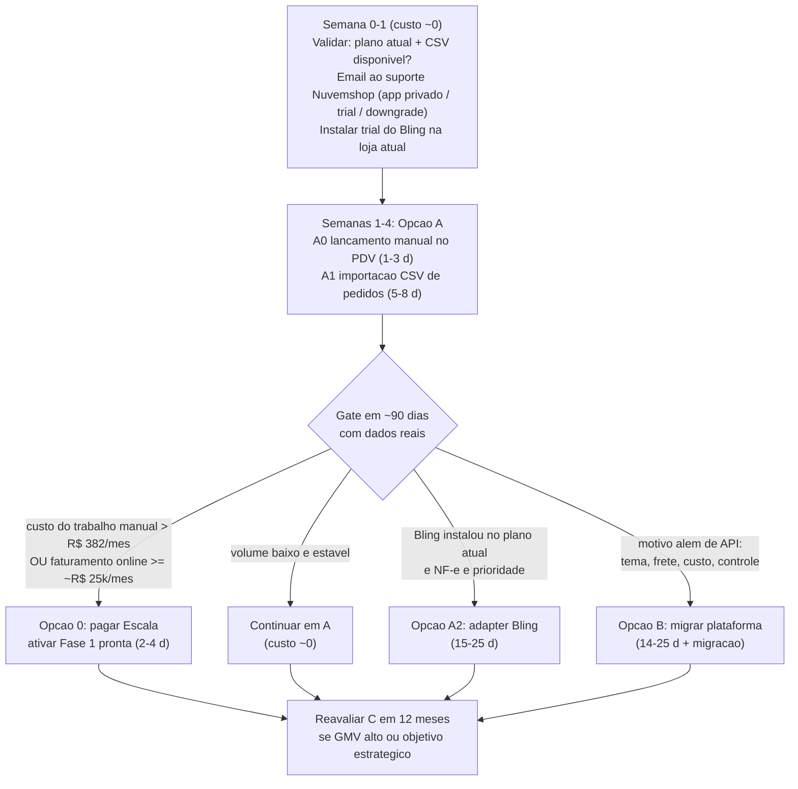

# Avaliação — Alternativas ao Canal de Venda após o bloqueio de plano da Nuvemshop

> Documento de **pesquisa e avaliação arquitetural**, no mesmo formato de [`avaliacao-integracao-nuvemshop.md`](./avaliacao-integracao-nuvemshop.md). Nenhum código, migration ou manifesto foi alterado. Data-base: **2026-09-21** (todas as fontes acessadas nesta data; ver §7).
>
> **Contexto novo.** A Fase 1 da integração AMACTIVE ↔ Nuvemshop (contexto `integracao_canais`: webhook HMAC, worker com outbox de estoque/catálogo, importação de pedidos, reconciliação; 202 testes; deployado) está pronta, mas **não pode ser ativada**: criar o app privado exige um plano da Nuvemshop muito acima do que a marca paga. A marca **não tem loja física**; a Nuvemshop é o **único** canal de venda. Decisão pedida: avaliar as outras opções, "ou mesmo internalizar a solução".
>
> **Legenda de confiança dos fatos externos:** **[P]** = página oficial/primária aberta nesta pesquisa; **[S]** = fonte secundária ou snippet de busca (blog, comparador, agência) — usar como ordem de grandeza; **[NV]** = não verificado. Estimativas de esforço são **minhas** (não são fatos de mercado): faixas em dias úteis de 1 dev sênior full-cycle, ±30%, mesma base do §6 do documento anterior.

---

## 1. Resumo executivo e recomendação

### 1.1 Recomendação

**Não internalizar a loja agora e não trocar de plataforma agora.** Seguir um caminho **faseado (Opção D)** com um gate de decisão baseado em dados reais:

1. **Semanas 0–1 (≈ R$ 0; 1–2 dias de trabalho, sem código):** eliminar três incertezas que podem mudar tudo a custo quase nulo — (a) qual é o plano atual da marca e o que ele libera (exportação de vendas, importação CSV); (b) perguntar por escrito ao suporte da Nuvemshop se existe via de app privado sem Escala, e se um app privado já criado continua funcionando após downgrade; (c) instalar o app do **Bling** (teste grátis) na loja atual para ver se o conector nativo Nuvemshop↔Bling funciona no plano atual.
2. **Semanas 1–4 (Opção A, ≈ 6–11 dias de dev):** operar com o AMACTIVE como retaguarda alimentada por **lançamento manual/CSV de pedidos** vindos da Nuvemshop, reaproveitando o pipeline de importação já construído. Custo recorrente adicional ≈ zero.
3. **Gate em ~90 dias:** com volume real de pedidos, horas gastas no trabalho manual e faturamento online, decidir entre **(i) pagar o Escala e ligar a Fase 1 já pronta** (≈ R$ 4.580/ano [P], ≈ 2–4 dias de dev para ativar) — este é o caminho de **menor custo total e menor risco de engenharia** assim que o orçamento suportar —, ou **(ii) continuar em A**, ou **(iii) usar Bling como concentrador** (A2), ou **(iv) migrar de plataforma** (B) apenas se surgir motivo além de "ter API".
4. **Internalizar (Opção C) fica como iniciativa estratégica futura**, não como resposta ao bloqueio atual.

**Principal trade-off:** aceitamos **operação semi-manual e latência/risco de erro humano na sincronização** (e o catálogo deixa de ser "AMACTIVE → push" até o gate) em troca de **custo recorrente ≈ zero, nenhum retrabalho de plataforma e nenhuma nova responsabilidade operacional** (pagamento, fiscal, LGPD, segurança de superfície pública, disponibilidade de um lab residencial).

### 1.2 Reavaliação da premissa "vitrine própria é ordem de magnitude mais cara"

A Revisão 2 do documento anterior descartou a vitrine própria com um adjetivo. Com números por fase (§3.4):

| Escopo | Esforço dev estimado | Múltiplo sobre a Fase 1 Nuvemshop (21,5–30,5 dias) |
|---|---|---|
| Integração Nuvemshop, Fase 1 (já entregue — referência) | 21,5–30,5 dias | 1× |
| **Loja própria — MVP mínimo vendável** (§3.4) | **≈ 76–124 dias** (≈ 15–25 semanas) | **≈ 3,5–4×** (extremos 2,5–5,8×) |
| Loja própria — versão completa (conta de cliente, NF-e integrada, Melhor Envio com etiqueta, cupons, etc.) | ≈ 147–221 dias | ≈ 7–10× |

Conclusão honesta: **"ordem de magnitude" só é verdade para a loja completa**; para um MVP vendável é **~3,5–4×** em desenvolvimento. O que **é** ordem de magnitude (ou mais) é o custo **contínuo e de risco** que a Nuvemshop absorve hoje: PCI/antifraude/chargeback, fiscal, LGPD como operador, segurança de uma superfície pública, SAC e disponibilidade. Além disso, a premissa original ("usar a Nuvemshop já paga e operando") **quebrou**: o acesso à API não está incluído no plano atual. Mesmo assim, comparando corretamente — *Nuvemshop + Escala* (R$ 4.580/ano + ~3 dias) vs *loja própria* (≈ 76–124 dias) — a Nuvemshop continua muito mais barata: com um dia de dev valorado, ilustrativamente, em R$ 400–800 (premissa sua a ajustar), o MVP interno custa ≈ R$ 30–100 mil e economiza no máximo ≈ R$ 4 mil/ano de mensalidade (descontando hospedagem/e-mail) → **payback ≥ ~7 anos** só pela mensalidade. Só a **comissão por venda** muda essa conta em volumes altos (§3.4, "Sensibilidade a volume").

### 1.3 Achado que mais reduz o custo: existem dois caminhos indiretos, ambos a validar

- **Bling como concentrador (A2):** existe app oficial do Bling na Loja de Aplicativos da Nuvemshop (pedidos, produtos, estoque) **sem restrição de plano documentada** [P/NV — não confirmado para o plano atual]; a **API v3 do Bling está disponível desde o plano Cobalto** (R$ 57/mês, até 200 pedidos/mês) [P/S], e todos os planos Bling têm NF-e ilimitada [P]. Ou seja, poderíamos falar com o Bling em vez de falar com a Nuvemshop — trocando o adapter. Custo: dependência de mais um SaaS e sobreposição funcional com o próprio AMACTIVE (§3.2).
- **Teste do Escala:** a Nuvemshop divulga 7 dias de teste grátis nos planos Essencial/Impulso/Escala [S]. **[NV]** se vale para lojas já existentes e se o app privado sobrevive ao fim do teste. Se valer, dá para validar a Fase 1 ponta a ponta sem pagar.

---

## 2. Fatos verificados (mercado) — o que pesa na decisão

### 2.1 Nuvemshop: plano, API, CSV, fiscal

| Fato | Valor | Fonte / data |
|---|---|---|
| Criar **aplicativo sob medida (app privado) e gerar token** está disponível **apenas** nos planos **Escala** e **Next** | "Essa funcionalidade está disponível para os planos Escala e Next" | [P] Nuvemshop Atendimento, atualizado em 25/06/2026 |
| Preços (cobrança **anual**, equivalente mensal) | Essencial R$ 59 (R$ 704/ano); Impulso R$ 139 (R$ 1.673/ano); **Escala R$ 382 (R$ 4.580/ano)**; Next a partir de R$ 1.399 | [P] nuvemshop.com.br/planos-e-precos |
| Preços (cobrança **mensal**) | Essencial R$ 69; Impulso R$ 164; **Escala R$ 449** | [P] idem |
| Comissão quando se usa gateway de terceiros | Começo 2%; Essencial 2%; Impulso 1%; **Escala 0,7%** | [P] idem |
| Taxa Nuvem Pago (MDR de cartão) | Começo 4,69%; Essencial 4,19%; Impulso 3,69%; Escala 3,29% | [P] idem (outras fontes [S] citam 4,49%/3,99% para Essencial/Impulso — usar só como ordem de grandeza) |
| Divergência de fontes | "Next" aparece como a partir de R$ 1.399 [P] e R$ 999 [S]; um snippet [S] cita Escala R$ 389 (desatualizado) | Usar os valores [P] |
| Criar apps exige ser **Parceiro Nuvemshop** (cadastro gratuito, painel de parceiros, loja demo); app privado = "sem taxa de parceiro" | — | [P] Atendimento (Parceiros Tecnológicos, atualizado 09/01/2026); [S] blog Edinaldo Xavier (abr/2025) |
| Se um app **público** em desenvolvimento pode ser instalado na **própria loja real** sem Escala | não documentado | **[NV]** — perguntar ao suporte; **atenção a possível violação de termos** se for uma forma de contornar a restrição de plano |
| Importação/exportação de produtos por planilha CSV: "não disponível em todos os planos"; atualiza estoque por CSV; **não importa imagens** | plano exato | [P] Atendimento, atualizado 23/07/2026; plano mínimo: [S] "a partir do Impulso" — **[NV]** |
| Exportação de vendas para planilha: "não disponível em todos os planos"; filtros por produto/quantidade só Escala/Next | plano exato para a exportação básica | [P] Atendimento, atualizado 08/04/2026 — **[NV]** o plano mínimo |
| Exportação de clientes em CSV | existe | [P/S] Atendimento (Clientes) |
| Nota fiscal: app "Tiny Faturador NF-e" na Loja de Apps, até 30 NF-e/mês grátis | — | [S] blog Nuvemshop |
| Conectores tipo Bling/Tiny/Pluga/Albato/Zapier usam a API pública da Nuvemshop via app publicado pelo parceiro; se **funcionam em qualquer plano** | Albato afirma "nenhum plano exigido" (isso é sobre o plano do Albato); Bling: "sem restrição de plano citada" | **[NV]** — testar |

Implicação: o "plano muito acima" é o **Escala**. Diferença anual de destravar a API: **≈ R$ 323/mês vs Essencial** e **≈ R$ 242/mês vs Impulso** (cobrança anual). Pela comissão, o Escala só se paga sozinho a partir de um faturamento online de ≈ **R$ 25 mil/mês** (vs Essencial com gateway de terceiros: 1,3 p.p. de diferença) até ≈ **R$ 80 mil/mês** (vs Impulso: 0,3 p.p.) — abaixo disso, o Escala é custo puro para ter API. (Cálculo meu, usando as taxas [P] acima.)

### 2.2 Plataformas alternativas (Opção B)

| Plataforma | Preço | O que a API/webhook exige | Observações | Fonte |
|---|---|---|---|---|
| **Tray** | Lançamento R$ 39 e R$ 59/mês (a página não deixa claro qual é o mensal e qual o anual — **[NV]**); Crescimento R$ 129 e R$ 159; Avançado R$ 359 e R$ 449; comissão 1,25% / 1,00% / 0,75%; limite de produtos 100 / 750 / 1.500 | **API por plano: 1.000 chamadas/dia (Lançamento), 5.000 (Crescimento), 30.000 (Avançado)**; "todos os planos incluem webhooks e integrações" | Limite baixo de chamadas no plano de entrada; assinatura/HMAC de webhook **[NV]** | [P] tray.com.br/planos-precos |
| **Loja Integrada** | Grátis (50 produtos); Crescimento R$ 46/mês (R$ 36,80 no anual); Aceleração R$ 83; Expansão R$ 200 | Exige **plano pago ativo** + **"Chave de Aplicação" concedida pela equipe da LI mediante formulário** (resposta em 3–5 dias úteis); webhooks de produto e pedido criados/editados; **assinatura HMAC não documentada**; suporte da LI não ajuda com API | Repete o padrão de "portão" (aprovação de terceiro) que nos travou na Nuvemshop, em escala menor | [P] lojaintegrada.com.br/planos; ajuda.lojaintegrada.com.br (out/2025; jul/2024) |
| **Shopify** | Basic US$ 19/mês (US$ 14 no anual); Grow US$ 52; comissão de gateway de terceiros 2% (Basic) | Custom apps criados no admin **não podem mais ser criados desde 01/01/2026**; usar **Dev Dashboard/CLI**; plano exigido não especificado; webhooks/dados de cliente podem exigir aprovação de "protected customer data" | Cobrança em **dólar**; Pix depende de gateway local; fluxo exato de app com distribuição "custom" para uma loja só: **[NV]** | [P] shopify.com/pricing; shopify.dev (acesso em 2026-09-21); [S] |
| **WooCommerce** (self-hosted) | Software gratuito; hospedagem R$ 10–80/mês (compartilhada) ou VPS R$ 30–120/mês | REST API + webhooks **inclusos**; webhook assinado com HMAC-SHA256 em base64 (`X-WC-Webhook-Signature`) | Plugin **oficial** do Mercado Pago (Pix/cartão/boleto) e plugin gratuito do Melhor Envio [S]. **Você passa a operar WordPress** (atualizações, plugins, segurança, backup) — é meio caminho para "internalizar" | [S] docs WooCommerce/Hookdeck; [S] WordPress.org; [S] blogs de hospedagem |
| **Medusa v2** (open source, headless) | MIT; auto-hospedado ≈ US$ 35–106/mês [S]; Cloud US$ 29 / 99 / 299 [S] | Precisa de **Node + Postgres + Redis**; Mercado Pago só por **plugin de comunidade** (não oficial) | Modelo de dados (catálogo/estoque/pedido) **sobrepõe o do AMACTIVE** → duas fontes de verdade; stack Node/TS fora da stack Python do projeto; ainda exige construir storefront | [S] medusajs.com/pricing e blogs; GitHub |
| **Saleor** (open source) | BSD-3; auto-hospedado | GraphQL; storefront Next.js de exemplo; app Stripe existe; **Pix [NV]** | Mesma objeção de sobreposição de domínio; Python/Django (conhecimento prévio) | [S] GitHub/Railway |

Nenhuma alternativa elimina o ônus de **migrar loja, tema, meios de pagamento, frete, domínio e SEO**; só troca o "portão" da API por outro (aprovação, limite de chamadas, câmbio ou operação própria).

### 2.3 Pagamento, frete, fiscal, LGPD (base para a Opção C)

**Gateways — o que dá para usar sem escopo PCI pesado (checkout hospedado/redirect):**

| Gateway | Pix | Cartão de crédito (à vista) | Observação | Fonte |
|---|---|---|---|---|
| **Mercado Pago** (Checkout Pro = hospedado) | 0,99% | 4,98% (na hora); 3,79% (14 dias); 3,03% (30 dias); boleto R$ 3,49 | Recebimento imediato depende de análise de histórico | [S] sellsync.ai (30/07/2026, atualizado 05/08/2026); a página oficial retornou 403 — **conferir na fonte oficial** |
| **Asaas** (link de pagamento hospedado) | R$ 0,99 (3 primeiros meses), depois R$ 1,99 por transação | R$ 0,49 + 2,99% (promo 1,99% por 3 meses); 2–6x: R$ 0,49 + 3,49%; 7–12x: R$ 0,49 + 3,99%; liquidação em até 2 dias úteis | Taxa fixa por Pix é boa para tíquete alto, ruim para tíquete baixo | [P] asaas.com/precos-e-taxas (2026-09-21) |
| **Stripe** (Checkout hospedado) | 1,19% — **Pix só por convite para empresas brasileiras** | 3,99% + R$ 0,39 (cartão nacional); boleto R$ 3,45 | Domínio customizado no Checkout: US$ 10/mês | [P] stripe.com/br/pricing; [S] Wise |
| **Pagar.me** | 0% de MDR em faixa pública [S] | 3,99% + R$ 0,40 (plano básico) [S] | Só fontes secundárias; **[NV]** | [S] |
| Referência: Nuvem Pago (hoje) | — | 3,29%–4,69% conforme plano (§2.1) | — | [P] |

Leitura: **Pix é bem mais barato** que cartão em qualquer gateway; para um checkout próprio, o custo por venda tende a ser **igual ou menor** que o da Nuvemshop — mas isso **não** é o gargalo da decisão (o gargalo é esforço e risco). Checkout **hospedado/redirect** mantém dados de cartão fora do AMACTIVE; checkout "transparente" (campos no seu site) amplia o escopo PCI (conhecimento geral, **[NV]** nesta pesquisa).

**Frete:**
- **Melhor Envio**: API REST com OAuth (criar app no painel), cotação, carrinho, compra de etiqueta, rastreio e webhooks [P — docs.melhorenvio.com.br/llms.txt]; sem mensalidade/contrato individual [S]; plugin gratuito para WooCommerce [S].
- **Correios**: API REST nova (CWS) exige **contrato** (a partir do pacote Bronze) e credenciais; o antigo `CalcPrecoPrazo` foi desativado em 01/09/2023 [S]. Para uma marca pequena sem contrato, Melhor Envio é o caminho pragmático.
- Alternativas sem API: tabela de frete fixa por região, frete grátis acima de X, retirada — suficientes para um MVP.

**Fiscal:**
- **Focus NFe** (API REST): Solo R$ 89,90/mês (100 notas, R$ 0,10 por nota extra); Start R$ 113,90 (3 CNPJs); Growth R$ 548 (4.000 notas) [P — focusnfe.com.br/precos].
- **Bling**: NF-e ilimitada em todos os planos; Cobalto R$ 57/mês [P — bling.com.br/planos-e-precos]. A página da integração Bling↔Nuvemshop diz que a emissão automática de NF-e **não** faz parte da integração [P].
- NFC-e é para varejo presencial; e-commerce usa NF-e [S, conhecimento geral]. **[NV]** se a marca é obrigada a emitir NF-e por venda (depende de regime tributário e UF) — **validar com o contador**; é uma pergunta de negócio decisiva (§5).

**LGPD/legal (obrigações que a loja online cria):**
- A marca **já é controladora** dos dados de clientes hoje; internalizar transfere para ela também as obrigações de **operador** (segurança, retenção, resposta a incidente).
- Política de privacidade acessível; base legal por finalidade (entrega = execução de contrato; e-mail marketing = consentimento); cookies não essenciais dependem de consentimento; canal para direitos do titular [S — vários guias].
- **Resolução CD/ANPD nº 2/2022** (agentes de tratamento de pequeno porte): dispensa a indicação formal de encarregado (mantendo canal de comunicação com o titular), registro de operações simplificado, incidentes com procedimento simplificado [S — resumos de escritórios; texto na página da ANPD]. Não dispensa segurança nem os direitos do titular.
- **Decreto 7.962/2013** (e-commerce): informações claras do fornecedor/produto/preço/frete e **direito de arrependimento de 7 dias** com meio de exercício na mesma ferramenta de contratação [S — resumos; a página do Planalto não abriu (ECONNRESET), **texto integral não verificado**]. Já vale hoje na Nuvemshop, mas vira responsabilidade de implementação numa loja própria.

**Hospedagem/exposição:** o ADR-013 do `infra-lab` expõe publicamente **apenas rotas de integração** (Cloudflare Tunnel → ingress-nginx interno → `Ingress` por projeto), **"nunca a aplicação inteira nem painéis administrativos"**, num lab **residencial** (IP dinâmico, um cluster, sem SLA). Uma loja pública inverte essa premissa: o tráfego de clientes passaria por esse caminho. Referência de mercado para hospedar fora: Hetzner CX23 (2 vCPU, 4 GB) ≈ € 5,49/mês [S] (região europeia, latência maior para o Brasil — **[NV]** alternativa brasileira); hospedagem WordPress/VPS no Brasil R$ 10–120/mês [S]. E-mail transacional (SES) ≈ US$ 0,10 por mil e-mails [S], custo irrelevante nesta escala.

---

## 3. Opções comparadas

### 3.1 Tabela mestre

A **Opção 0** é a referência de custo mínimo de engenharia (não é uma das quatro pedidas, mas é o contrafactual obrigatório).

| | **0 — Pagar Escala** (referência) | **A — Ficar na Nuvemshop sem API** | **B — Trocar de plataforma** | **C — Internalizar** | **D — Faseado/híbrido** |
|---|---|---|---|---|---|
| **Custo recorrente** | R$ 4.580/ano (anual) ou R$ 449/mês; comissão 0,7% (gateway próprio) | A0/A1: ≈ R$ 0 adicional (se o plano atual permitir CSV; senão Impulso R$ 1.673/ano — **[NV]**). A2 (Bling): R$ 57/mês+ ≈ R$ 684/ano | Tray R$ 39–59/mês; LI R$ 46/mês; Shopify US$ 14–19/mês; Woo R$ 10–120/mês hospedagem (+ comissões/gateway) | Hospedagem R$ 30–120/mês (ou ≈ € 5–25 no exterior); e-mail ≈ centavos; Focus NFe opcional R$ 1.079/ano; gateway por venda. **Sem comissão de plataforma** | = A no início; = 0 ou A2 depois do gate |
| **Esforço dev** | ≈ 2–4 dias (credencial, app privado, mapeamento inicial, publicação de catálogo, smoke test) | A0: 1–3 d; A1 (importar pedidos CSV): 5–8 d; A1+ (gerar CSV de estoque/catálogo): +5–8 d; **A2 (adapter Bling): 15–25 d** | Generalizar ports 3–5 d + adapter novo 8–15 d + testes de contrato 3–5 d = **≈ 14–25 d**, + 5–10 d-pessoa de migração de loja (não é código) | **MVP ≈ 76–124 d; completo ≈ 147–221 d** (§3.4) | A0/A1 agora (6–11 d); depois 0, A2 ou B conforme gate |
| **Risco** | Baixo (técnico). Financeiro: mensalidade fixa | Médio: erro humano, atraso de sincronização, dependência de plano para CSV. Baixo em segurança | Médio-alto: migração de SEO/domínio/clientes; novo "portão" (LI: chave de aplicação; Tray: 1.000 chamadas/dia; Shopify: USD e Dev Dashboard) | **Alto**: pagamento, fiscal, LGPD, segurança pública, disponibilidade em lab residencial, SAC | Baixo no curto prazo; risco de "adiar demais" |
| **Dependência de terceiros** | Nuvemshop (mesma de hoje) | Nuvemshop; A2 adiciona Bling | Nova plataforma + gateway/frete dela | Gateway, Melhor Envio, provedor de e-mail, emissor fiscal, hospedagem — **mais** terceiros, cada um com contrato próprio | Nuvemshop (+ Bling opcional) |
| **Oversell / consistência de estoque** | Melhor: push de saldo absoluto AMACTIVE→canal, já implementado e testado; sem 2º canal não há corrida | Nuvemshop decrementa no checkout e é a fonte de fato do saldo; o AMACTIVE fica **atrasado** pelo ciclo manual; entradas de estoque precisam ser subidas por CSV/manual. Sem 2º canal, oversell só por erro humano | Igual a 0 (mesmo design), com latência do adapter | **O AMACTIVE passa a ser o canal**: consistência forte por construção (trigger existente), **mas** exige **reserva de estoque** para pagamento assíncrono (Pix) — o `CriarPedidoUseCase` hoje cria `CONFIRMADO` e baixa na hora; `PENDENTE` existe no enum sem fluxo | Segue a opção em vigor |
| **Reaproveitamento de `integracao_canais`** | **~100%** | A0/A1: reaproveita pipeline de pedido (cliente por e-mail, `CriarPedido` com `origem_canal`, idempotência por `pedido_externo_id`); descarta/adia outbox e client HTTP. A2: reaproveita ~85% (§4) | ~85–90% (só adapter + rename de ports) | Reaproveita **infra** (worker, `webhook_evento`, HMAC, backoff, reconciliação, mapeamento) para gateway/frete; **perde** outbox de catálogo e adapter Nuvemshop (não há canal externo) | Depende |

### 3.2 Opção A — Ficar na Nuvemshop sem API

Sub-opções, em ordem crescente de esforço e automação:

- **A0 — Lançamento manual no PDV (1–3 dias de dev, ou zero).** O AMACTIVE já tem `origem_canal=NUVEMSHOP`, `FormaPagamento.NUVEMSHOP` e o `CriarPedidoUseCase`. Falta uma tela/atalho de "registrar pedido de canal" no web (o `POST /pedidos` do PDV assume `origem_canal=PDV`). Viável com volume baixo (o volume foi declarado baixo em §7 do documento anterior). O operador copia o pedido da Nuvemshop para o AMACTIVE.
- **A1 — Importação por CSV (5–8 dias; +5–8 para gerar CSV de estoque/catálogo).** Importador de "exportação de vendas" que percorre o mesmo caminho de `ProcessarWebhookPedido` (upsert de cliente por e-mail, `CriarPedido` com `origem_canal=NUVEMSHOP`, `UNIQUE(origem_canal, pedido_externo_id)` para idempotência). Para estoque, o AMACTIVE gera o CSV de "atualizar estoque" [P: existe] e o operador o sobe. **Ressalvas:** (i) disponibilidade da exportação de vendas e da importação CSV por plano é **[NV]** — se exigirem Impulso, o custo extra é ≈ R$ 1.673/ano; (ii) **imagens não sobem por CSV** [P]; (iii) **a fonte de verdade do catálogo volta a ser a Nuvemshop** (ou o AMACTIVE gera planilha para carga em massa, sem imagens), o que **desfaz temporariamente** a decisão "catálogo centralizado no AMACTIVE" confirmada anteriormente.
- **A2 — Bling como concentrador (15–25 dias).** O app do Bling sincroniza pedidos/produtos/estoque com a Nuvemshop [P]; o AMACTIVE fala com a **API v3 do Bling** (OAuth 2.0 com registro de aplicativo; 3 req/s, 120 mil req/dia; disponível desde o plano Cobalto) [P/S]. É trocar o adapter (`NuvemshopClientPort` → um `BlingClientPort`), incluindo refresh de token (a Nuvemshop usa token permanente; o Bling não) e mapeamento de webhooks do Bling (**[NV]** eventos e assinatura). **Vantagens:** NF-e ilimitada no Bling; sem plano Escala. **Desvantagens:** duas etapas na cadeia (Nuvemshop → Bling → AMACTIVE), latência e pontos de falha somados; **sobreposição de domínio** — o Bling é um ERP completo (produto, estoque, pedido, financeiro). Pergunta incômoda que o dono deve responder: *se o Bling entra no meio, faz sentido manter o AMACTIVE como mestre de estoque, ou o Bling passa a ser o mestre?* (a segunda resposta reduz o valor do AMACTIVE; a primeira gera dupla manutenção).
- **A3 — Conectores no-code (Pluga/Albato/Zapier/Make) → webhook do AMACTIVE.** Existem gatilhos "pedido criado/pago/cancelado" para Nuvemshop [S]. Poderiam alimentar o endpoint público já existente. **[NV]** se funcionam em plano baixo e se preservam a assinatura HMAC (provavelmente não: teríamos de trocar a verificação por um segredo compartilhado). Custo do conector é adicional e **[NV]**. Não recomendado como base — apenas como experimento barato.

**Oversell:** como a marca não tem segundo canal, a Nuvemshop, que decrementa o estoque no checkout, é a autoridade de fato do saldo online; o AMACTIVE é reconciliado depois. O risco real não é "vender o que não tem" e sim **divergência silenciosa** (uma entrada de estoque que ninguém subiu). Mitigação: rotina semanal de conferência (exportar estoque da Nuvemshop e comparar com o AMACTIVE — pode ser um relatório no AMACTIVE).

### 3.3 Opção B — Trocar a vitrine por plataforma com API acessível

Racional: reaproveitar `integracao_canais` trocando o adapter. **Correção de expectativa:** "trocar só o adapter" é otimista. No código, o nome e o formato da Nuvemshop vazam para a camada de aplicação — o port se chama `NuvemshopClientPort`, há `NuvemshopPedidoDTO`, `CanalIntegracao.NUVEMSHOP`, `FormaPagamento.NUVEMSHOP`, e referências em `processar_webhook_pedido`, `publicar_*`, `reconciliar_pedidos`, `run_worker.py` (37 ocorrências), `configurar_credencial_nuvemshop.py`. Isso é uma **generalização de ports de 3–5 dias**, não zero.

Custo de dev ≈ **14–25 dias** (generalizar 3–5 + adapter 8–15 + contract tests 3–5), e **mais 5–10 dias-pessoa de migração operacional** (tema, meios de pagamento, frete, domínio, redirecionamentos, importar produtos/clientes).

Ordenação por adequação ao nosso caso (com o que é verificado):
1. **WooCommerce** — API/webhooks inclusos, webhook com HMAC-SHA256 (o `webhook_verifier` muda de hex para base64 e de header), plugins oficiais de Pix e frete. **Custo escondido: operar WordPress/plugins/segurança.** Bom se o time aceitar PHP/WordPress como parte do stack.
2. **Tray** — webhooks em todos os planos, mas **1.000 chamadas/dia no Lançamento** e teto de 100 produtos; o outbox coalescido do AMACTIVE ajuda, mas republicar catálogo em lote pode estourar. Provavelmente exige Crescimento (R$ 129–159).
3. **Shopify** — melhor ecossistema, porém dólar, Pix por app de terceiros, e a mudança de 2026 nos custom apps (Dev Dashboard) muda o fluxo que o design assumia.
4. **Loja Integrada** — mais barata, mas o portão da "Chave de Aplicação" e a ausência de HMAC documentado obrigam a reforçar reconciliação (+3–5 dias) e repetem o risco de dependência de aprovação.
5. **Medusa/Saleor** — só fazem sentido como parte de uma estratégia de "loja própria com motor pronto" (variante de C), não como B: sobrepõem o modelo do AMACTIVE e ainda exigem storefront próprio.

**Migração de continuidade (vale para B e C — ver §3.5).**

### 3.4 Opção C — Internalizar: loja + checkout dentro do AMACTIVE

**O que já existe (verificado no código/docs):** catálogo com variantes cor × tamanho, estoque atômico por trigger, pedido/item/pagamento, cliente com upsert por e-mail, galeria de imagens por cor servida em `/media` (`StaticFiles`), preço promocional derivado (`desconto_percentual`), PDV, relatórios, worker com outbox/backoff/reconciliação, endpoint público protegido por HMAC exposto pelo Cloudflare Tunnel (ADR-013), criptografia de credencial em repouso (`pgcrypto`).

**O que falta e por quê (pontos não óbvios):**
- **O `apps/web` atual é uma SPA Vite** (título fixo em `index.html`, sem SSR). **Não serve para SEO de vitrine**; é preciso um app novo (SSR/SSG, ex.: Next.js ou Astro) ou pré-renderização. `produto` não tem **slug** (só `categoria` tem) — precisa de migration.
- **Pedido assíncrono e reserva de estoque.** `CriarPedidoUseCase` cria o pedido `CONFIRMADO` e baixa o estoque no mesmo instante. Pix e cartão em checkout hospedado são **assíncronos**: é preciso `AGUARDANDO_PAGAMENTO` (o enum `PENDENTE` existe sem fluxo), reserva com TTL (Pix expira), job de expiração e transições `PENDENTE → PAGO/EXPIRADO/CANCELADO`. É o item mais delicado do domínio Core.
- **Endereço de entrega no pedido:** hoje só `cliente` tem endereço; pedido não.
- **Imagens:** uploads são arquivos em disco sem variantes de tamanho/WebP/CDN — afeta LCP e SEO.
- **Superfície pública:** hoje a API é 100% autenticada por JWT interno, exceto o webhook. Uma API pública de leitura + checkout precisa de rate limit, bot protection, papel de banco somente-leitura, separação de deployment do painel admin, e revisão de segurança.

**Decomposição e esforço (dias úteis, 1 dev sênior, ±30%):**

| # | Bloco | Já existe | Falta | **MVP** | Completo |
|---|---|---|---|---|---|
| 1 | Superfície pública e segurança | Tunnel + WAF do Cloudflare, HMAC, rate limit no edge | API pública read-only separada, rate limit de app, Turnstile/anti-bot no checkout, headers/CSRF, papel de BD mínimo, backups restaurados de fato, alertas | 8–12 | 12–18 |
| 2 | Hospedagem/exposição | K3s lab, ADR-013 | Decisão lab residencial × VPS/edge; TLS; DR; monitoramento externo | 3–6 | 6–10 |
| 3 | Vitrine pública com SEO | Catálogo, imagens, preço promocional | App SSR/SSG, home/categoria/PDP com matriz cor×tamanho e estoque, busca, slug, sitemap, meta/OG, JSON-LD `Product`, 301, pipeline de imagens | 15–25 | 25–35 |
| 4 | Carrinho | — | Carrinho client-side + revalidação server-side de preço/estoque | 4–6 | 6–8 |
| 5 | Checkout + pedido assíncrono | Pedido/itens/pagamentos, trigger de estoque | `AGUARDANDO_PAGAMENTO`, reserva com TTL + expiração, endereço no pedido, CEP, checkout convidado, idempotência | 12–18 | 15–22 |
| 6 | Pagamento (gateway hospedado) | `webhook_evento`, worker, HMAC, reconciliação | Integração Checkout Pro/Asaas/Stripe, webhook do gateway (assinatura própria), conciliação, estorno, expiração de Pix, registro do meio real (PIX × cartão) | 8–14 | 12–18 |
| 7 | Frete / etiqueta / rastreio | — | MVP: tabela fixa por região/frete grátis/retirada; completo: Melhor Envio (cotação, compra de etiqueta, webhook de rastreio) | 3–5 | 12–20 |
| 8 | Conta/autenticação de cliente | JWT/bcrypt de usuários internos | MVP: checkout convidado + link mágico de consulta de pedido; completo: realm de cliente, cadastro, recuperação de senha, verificação de e-mail, endereços, histórico | 3–5 | 10–15 |
| 9 | E-mails transacionais | worker/outbox | Provedor (SES etc.), templates, SPF/DKIM/DMARC, retry, bounce | 4–7 | 6–9 |
| 10 | Fiscal | (contexto `Fiscal` reservado no SDD §6) | MVP: emissão manual externa (Bling/Tiny/contador) — 0 dev; completo: Focus NFe + regras por produto (NCM/CFOP/CST) com contador | 0 | 15–25 |
| 11 | LGPD / legal | — | Política, termos, trocas e arrependimento (7 dias), cookies/consentimento, canal do titular, exportar/anonimizar dados, retenção, plano de incidente (+ revisão jurídica externa **[NV custo]**) | 4–8 | 8–12 |
| 12 | Operação no admin | AMACTIVE Web (produtos, estoque, pedidos) | Tela de pedidos online (envio/etiqueta), banners/conteúdo; cupons no completo | 4–6 | 10–15 |
| 13 | Migração, QA, go-live | — | Importar clientes/produtos/imagens da Nuvemshop, 301, E2E, carga, ensaio de cutover | 8–12 | 10–14 |
| | **Total** | | | **≈ 76–124** | **≈ 147–221** |

**MVP mínimo vendável** (o menor conjunto em que uma cliente descobre, compra e recebe): vitrine com PDP (cor×tamanho) e SEO básico; carrinho; checkout convidado com endereço; **Pix + cartão via checkout hospedado** (uma só integração de gateway); reserva de estoque com expiração; frete por tabela fixa/retirada; e-mails de confirmação e pagamento; consulta de pedido por link mágico; NF-e emitida **fora** do sistema; páginas legais e cookies mínimos; anti-bot e rate limit; migração de catálogo e clientes.
**Fica para depois:** conta de cliente completa, Melhor Envio com etiqueta automática, NF-e integrada, cupons, carrinho abandonado, avaliações, busca avançada/filtros, feeds (Google Merchant), analytics/pixels, blog, wishlist, fluxo de trocas.

**Custo de operar (não aparece em dias de dev):** SAC e pós-venda, chargebacks/fraude (o gateway cobre parte), manutenção de segurança, disponibilidade — **loja fora do ar = venda perdida**, e o único cluster é um lab residencial (IP dinâmico, um site, sem SLA — números de disponibilidade **[NV]**). Para C, a recomendação de infra seria **não** servir a loja a partir do lab residencial (VPS ou edge).

**Sensibilidade a volume (ilustrativa, cálculo meu).** Internalizar elimina a comissão da plataforma (0,7%–2% na Nuvemshop com gateway de terceiros [P]). Com faturamento online de R$ 20 mil/mês, isso é ≈ R$ 1,7–4,8 mil/ano; com R$ 50 mil/mês, ≈ R$ 4,2–12 mil/ano; com R$ 100 mil/mês, ≈ R$ 8,4–24 mil/ano. Só nessa faixa alta o payback do MVP (R$ 30–100 mil, premissa acima) cai para poucos anos. **O volume declarado é baixo**, portanto C não se paga por agora.

### 3.5 Opção D — Faseado/híbrido

**Continuidade na migração (aplicável a B e C, e ao "voltar para a Nuvemshop" também):**
- **Domínio:** confirmar que o domínio está registrado em nome da marca (Registro.br) e que ela controla o DNS — **[NV]**, pergunta ao dono. Reduzir o TTL do DNS 24–48 h antes do corte; manter a loja antiga no ar em paralelo até validar a nova; cortar em dia de baixo movimento.
- **SEO (prática geral, não verificada em fonte nesta pesquisa):** mapear todas as URLs antigas de produto/categoria para as novas com **redirecionamento 301**; preservar títulos/descrições; enviar novo sitemap ao Search Console; manter as imagens indexáveis. Uma vitrine SPA sem SSR (o `apps/web` atual) **perderia** posicionamento.
- **Clientes:** a Nuvemshop exporta a lista de clientes em CSV [P/S]; **senhas não migram** (prática geral **[NV]**), logo é preciso comunicar e forçar redefinição por e-mail. Base legal e aviso ao titular sobre a mudança de operador (LGPD).
- **Pedidos e produtos históricos:** exportação de vendas em CSV (plano **[NV]**) → importar como histórico no AMACTIVE (com `origem_canal=NUVEMSHOP`, idempotente); produtos exportáveis em CSV, **imagens não** [P] — o AMACTIVE já é o repositório de imagens (galeria por cor), o que ajuda.
- **Meios de pagamento:** cancelar a assinatura só depois de o último recebível ser liquidado no Nuvem Pago (prazo **[NV]**).

---

## 4. Impacto no código já construído

### 4.1 O que é reaproveitável (independe do canal)

Base: `apps/api/src/amactive/contexts/integracao_canais/` ≈ 3.485 linhas (contadas com `wc -l`), 15 arquivos de teste do contexto citam Nuvemshop, mas o núcleo é genérico.

| Componente | Situação se sair da Nuvemshop |
|---|---|
| Migration `000005` (`webhook_evento`, `mapeamento_variante_canal`, outboxes de estoque/catálogo com triggers, `credencial_canal`, campos `origem_canal`/`pedido_externo_id`/`origem_cadastro`, `uq_cliente_email_nao_nulo`) | **Reaproveitável.** Enum `canal_integracao` ganha valores (`ALTER TYPE ... ADD VALUE`) |
| Triggers de outbox por alteração de estoque/produto/variante/imagem | Reaproveitáveis em A2, B e (para eventos internos) C |
| Worker `run_worker.py`, `consumir_webhooks_pendentes`, `_backoff_outbox`, `metrics.py`, reconciliação | Reaproveitáveis; hoje com naming Nuvemshop (37 ocorrências em `run_worker.py`) → **rename/generalização** |
| Mudanças aditivas em Vendas/Cadastros (`OrigemCanalPedido`, `FormaPagamento.NUVEMSHOP`, `upsert_por_email`, usuário de sistema) | Reaproveitáveis; em C vira `origem_canal=LOJA_ONLINE`; `FormaPagamento` precisa distinguir PIX/cartão reais em vez de "canal" |
| Gateways de Vendas/Cadastros/Catálogo, `ProcessarWebhookPedidoUseCase` (lógica de resolver cliente, mapear variante, criar pedido, tratar conflito/duplicidade) | **Reaproveitável** — é o coração do "importar pedido externo", também usado por A1 (CSV) |
| Criptografia de credencial (`pgcrypto`), `configurar_credencial_*` | Reaproveitável para tokens do Bling/Woo/gateway |
| Exposição pública do endpoint pelo Tunnel (ADR-013) | Reaproveitável para qualquer webhook de terceiro (Bling, gateway, Melhor Envio) |

### 4.2 O que é 100% específico da Nuvemshop (vira sunk cost se sairmos)

| Componente | Linhas | Nota |
|---|---|---|
| `infrastructure/nuvemshop/client.py` | 291 | HTTP, rate limiter 2 req/s/burst 40, `User-Agent`, versionamento de API |
| `infrastructure/nuvemshop/mappers.py` | 143 | tradução de payload |
| `infrastructure/nuvemshop/webhook_verifier.py` | 32 | header `x-linkedstore-hmac-sha256` |
| Rota `/integracoes/nuvemshop/webhooks`, `scripts/configurar_credencial_nuvemshop.py` | — | adaptáveis |
| Testes `test_nuvemshop_client/mappers/webhook_verifier` | — | descartar ou reescrever |

Ordem de grandeza: **≈ 470 linhas de produção (~13% do contexto)** são estritamente específicas; o restante exige **renomear/generalizar**, não reescrever. (Estimativa por contagem de linhas e de menções ao nome; **não auditei o acoplamento semântico linha a linha**.)

### 4.3 Por opção

| Opção | Sunk cost | Reaproveitado | Observação |
|---|---|---|---|
| **0 — Escala** | ≈ 0 | ≈ 100% | Nada é perdido; ativa o que já existe |
| **A0/A1** | client HTTP, outbox de catálogo/estoque **não usados** (ficam em standby, sem custo) | pipeline de pedido, cliente, idempotência, `origem_canal` | O importador CSV **também serve de reconciliação** quando/se a Fase 1 for ligada |
| **A2 (Bling)** | ≈ 13% (client/mappers/verifier Nuvemshop) | ≈ 85% (outbox, worker, mapeamento, gateways) | Precisa refresh de token OAuth (novo) |
| **B** | ≈ 13% | ≈ 85–90% | Generalização de ports 3–5 d é custo da troca |
| **C** | Nuvemshop client + **outbox de catálogo** (não há canal externo para publicar) e o conceito de "importar pedido pago externo" **muda de lugar**: o pedido passa a nascer no AMACTIVE | Worker, backoff, `webhook_evento`, HMAC, reconciliação (reusados para gateway/frete), catálogo/estoque/imagens, cliente, pedido | Em C, o `integracao_canais` vira infraestrutura de **integração com gateway/frete/fiscal** em vez de "canal de venda" |

---

## 5. Critérios de decisão e riscos

### 5.1 O que o dono precisa responder

| Pergunta | Por que decide | Se a resposta for… |
|---|---|---|
| **Qual é o plano atual e qual o faturamento/pedidos por mês da loja online?** | Define se R$ 382/mês é 2% ou 20% da margem; e se o Escala se paga pela comissão (a partir de ≈ R$ 25–80 mil/mês) | Alto → Opção 0. Baixo → A |
| **Orçamento mensal máximo para a plataforma** | Escala R$ 382 vs Bling R$ 57 vs Tray/LI R$ 39–59 | < R$ 100 → A ou A2; ≥ R$ 382 → 0 |
| **Prazo** para ter a operação estável | 0 = 2–4 d (se pagar); A = 1 mês; B = 1,5–2 meses; C = 4–6 meses (MVP) | Urgente → 0 ou A |
| **Apetite por operar o próprio e-commerce** (pagamento, fiscal, LGPD, SAC, segurança, disponibilidade) | C transfere tudo isso do fornecedor para a marca | Baixo → **não C** |
| **Precisa de NF-e por venda?** (validar com o contador: regime tributário/UF) | Define custo/prazo de C (0 vs 15–25 d + R$ 90/mês) e favorece Bling (NF-e ilimitada) | Sim → A2 ou 0 com Tiny Faturador; C só com Focus NFe |
| **Pedidos/dia e horas semanais aceitáveis de trabalho manual** | Define o gate de A | < ~5 pedidos/dia → A0 basta |
| **Domínio: em nome da marca? SEO orgânico relevante hoje?** | Custo de qualquer migração (B/C) | SEO relevante → migrar só com plano de 301 |
| **Por que se quer "internalizar"** (custo, controle, marca, aprendizado)? | C só compensa por motivo estratégico | Só "ter API" → não é motivo suficiente |

### 5.2 Riscos por caminho

| Caminho | Riscos principais | Mitigação |
|---|---|---|
| **0 — Escala** | Mensalidade fixa sem retorno direto abaixo de ≈ R$ 25 mil/mês; **[NV]** carência/fidelidade e se o app privado sobrevive a downgrade | Pagar mensal (R$ 449) por 2–3 meses para validar antes do anual; perguntar ao suporte |
| **A** | Erro humano; divergência de estoque; plano atual pode não incluir CSV; catálogo mestre volta para a Nuvemshop | Rotina semanal de conferência; relatório de divergência; ativar o gate |
| **A2 Bling** | Cadeia de 2 saltos; **dupla fonte de verdade**; refresh OAuth; **[NV]** instalação no plano atual e webhooks do Bling; limite 3 req/s | Testar trial antes de escrever código; decidir explicitamente quem é o mestre de estoque |
| **B** | Migração de SEO/clientes/domínio; novos portões (LI: aprovação; Tray: 1.000 chamadas/dia; Shopify: USD/Dev Dashboard; Woo: operar WordPress); generalização de ports é retrabalho real | Só migrar com motivo além da API; POC do adapter antes de migrar a loja |
| **C** | Subestimativa de esforço (sobretudo reserva de estoque, checkout assíncrono e fiscal); superfície pública num lab residencial; PCI/antifraude/chargeback; LGPD como operador; SAC; **loja fora do ar = venda perdida** | Só com motivo estratégico; hospedar fora do lab; checkout hospedado; NF-e externa no MVP; go-live com Nuvemshop em paralelo |
| **D** | "Adiar" indefinidamente e conviver com o trabalho manual | Gate com data e métricas definidas (~90 dias) |

### 5.3 Incertezas desta avaliação

- Não sei o **plano atual** da marca, seu **volume** nem seu **faturamento**; várias conclusões dependem disso.
- Esforços são **estimativas minhas por analogia** com a estimativa da Fase 1 (que já foi entregue — recalibrar com o tempo realmente gasto). Não considerei ferramentas de assistência de código.
- Preços de terceiros mudam com frequência (a Hetzner e a Shopify tiveram ajustes em 2026); usar os valores como ordem de grandeza e reconfirmar antes de contratar.

---

## 6. Itens **não verificados** (resumo)

1. Plano mínimo da Nuvemshop para exportação de vendas e importação/atualização CSV (fonte [S] sugere Impulso+).
2. Se o app do Bling (e conectores Pluga/Albato/Zapier) instala e funciona em planos abaixo do Escala.
3. Se há trial de 7 dias aplicável à loja existente e se um app privado criado sobrevive a downgrade; se um app público em desenvolvimento poderia ser instalado na própria loja (e se isso respeita os termos).
4. Assinatura/segurança e eventos dos webhooks do Bling, Tray e Loja Integrada.
5. Se a Tray cobra R$ 39 ou R$ 59 no Lançamento (a página lista os dois valores sem rótulo inequívoco).
6. Taxas do Mercado Pago pela página oficial (403) e do Pagar.me (só fontes secundárias); Pix da Stripe é "por convite".
7. Se a marca é obrigada a emitir NF-e por venda (regime tributário/UF) — **decisão do contador**.
8. Texto integral do Decreto 7.962/2013 (página do Planalto não abriu) e custo de revisão jurídica das páginas legais.
9. Disponibilidade histórica do lab residencial; alternativa de hospedagem no Brasil (só referência Hetzner/EUR).
10. Fluxo exato de app de distribuição "custom" na Shopify (Dev Dashboard) e Pix no Saleor.
11. Titularidade do domínio e relevância do tráfego orgânico atual da marca.

---

## 7. Fontes (URL, acessadas em 2026-09-21)

**Nuvemshop**
- [P] Como criar aplicativos sob medida e gerar tokens (apenas Escala e Next; atualizado 25/06/2026): https://atendimento.nuvemshop.com.br/pt_BR/aplicativos/como-criar-aplicativos-sob-medida-e-gerar-tokens-para-minha-loja-nuvemshop
- [P] Planos e preços: https://www.nuvemshop.com.br/planos-e-precos
- [P] Como criar um aplicativo (apenas Parceiros; atualizado 09/01/2026): https://atendimento.nuvemshop.com.br/pt_BR/parceiros-tecnologicos/como-fazer-um-aplicativo-para-a-loja-de-aplicativos-nuvemshop
- [P] O que é a API da Nuvemshop (atualizado 29/07/2026): https://atendimento.nuvemshop.com.br/pt_BR/12316-api/o-que-e-a-api-da-nuvemshop-e-o-que-e-possivel-integrar-por-meio-dela
- [P] Importar/exportar produtos, FAQ (atualizado 23/07/2026): https://atendimento.nuvemshop.com.br/pt_BR/importar-e-exportar-produtos/perguntas-frequentes-sobre-importar-e-exportar-produtos
- [P] Exportar vendas (atualizado 08/04/2026): https://atendimento.nuvemshop.com.br/pt_BR/minhas-vendas/como-exportar-as-minhas-vendas-para-uma-planilha
- [P/S] Exportar clientes: https://atendimento.nuvemshop.com.br/pt_BR/meus-clientes/como-exportar-minha-lista-de-clientes-na-nuvemshop
- [S] Comparativos de planos: https://estocometro.com/planos-nuvemshop-2026/ (20/06/2026); https://www.agenciaregex.com/nuvemshop-planos/ (mai/2026)
- [S] Apps privados sem taxa de parceiro (abr/2025): https://edinaldoxavier.com.br/blog/nuvemshop-apps-privados-desenvolvimento/
- [S] Nota fiscal / Tiny Faturador: https://www.nuvemshop.com.br/blog/o-que-e-nota-fiscal/
- [S] Integração Nuvemshop no Albato: https://albato.com/apps/nuvemshop

**Bling / Tiny**
- [P] Planos Bling: https://www.bling.com.br/planos-e-precos
- [P] Integração Bling–Nuvemshop: https://www.bling.com.br/integracao/nuvemshop
- [P] App do Bling na Loja de Aplicativos Nuvemshop: https://www.nuvemshop.com.br/loja-aplicativos-nuvem/bling
- [S] API Bling v3 (Cobalto, limites 3 req/s e 120 mil/dia): https://developer.bling.com.br/limites e https://www.bling.com.br/api-e-aplicativos (via resultados de busca)
- [S] Olist Tiny + Nuvemshop: https://olist.com/blog/olist/tiny-news/parceria-tiny-nuvemshop/

**Plataformas alternativas**
- [P] Tray: https://tray.com.br/planos-precos
- [P] Loja Integrada: https://lojaintegrada.com.br/planos/ ; API: https://ajuda.lojaintegrada.com.br/pt-BR/articles/12500189-como-utilizar-a-api-da-loja-integrada-para-automacoes-e-integracoes ; webhooks: https://ajuda.lojaintegrada.com.br/pt-BR/articles/9655071-como-configurar-webhook
- [P] Shopify preços: https://www.shopify.com/pricing ; custom apps: https://shopify.dev/docs/apps/build/authentication-authorization/access-tokens/generate-app-access-tokens-admin
- [S] WooCommerce webhooks/HMAC: https://hookdeck.com/webhooks/platforms/guide-to-woocommerce-webhooks-features-and-best-practices ; docs: https://developer.woocommerce.com/docs/apis/rest-api/v2/webhooks/
- [S] Plugin Mercado Pago para WooCommerce: https://wordpress.org/plugins/woocommerce-mercadopago/ ; Melhor Envio para WooCommerce: https://wordpress.org/plugins/melhor-envio-cotacao/
- [S] Custo de hospedagem WordPress/WooCommerce: https://www.wptotal.com.br/custo-do-wordpress/
- [S] Medusa: https://medusajs.com/pricing ; https://github.com/medusajs/medusa ; plugin Mercado Pago (comunidade): https://github.com/NicolasGorga/medusa-payment-mercadopago
- [S] Saleor: https://github.com/saleor/saleor ; https://github.com/saleor/storefront

**Pagamento, frete, fiscal, e-mail, hospedagem**
- [P] Asaas taxas: https://www.asaas.com/precos-e-taxas
- [P] Stripe Brasil: https://stripe.com/br/pricing
- [S] Mercado Pago 2026: https://sellsync.ai/pt/blog/taxa-mercado-pago-2026-guia-completo/ (oficial retornou 403: https://www.mercadopago.com.br/ajuda/custo-receber-pagamentos_453)
- [S] Pagar.me: https://finstack.com.br/blog/pagar-me-gateway-de-pagamento-diferencas-finstantack/
- [P] Melhor Envio API: https://docs.melhorenvio.com.br/llms.txt
- [S] Correios API/contrato: https://www.correios.com.br/atendimento/developers/manuais/manual-api-preco-1
- [P] Focus NFe preços: https://focusnfe.com.br/precos/
- [S] Amazon SES: https://aws.amazon.com/ses/pricing/
- [S] Hetzner Cloud (2026): https://northflank.com/blog/hetzner-cloud-server-price-increases

**LGPD / legal**
- [S] LGPD para e-commerce: https://www.mercadopago.com.br/blog/ciberseguranca-ecommerce-normas-protecao-dados ; https://edrone.me/pt/blog/lgpd-para-ecommerce
- [S] Resolução CD/ANPD nº 2/2022: https://www.gov.br/anpd/pt-br/acesso-a-informacao/institucional/atos-normativos/regulamentacoes_anpd/resolucao-cd-anpd-no-2-de-27-de-janeiro-de-2022
- [S] Decreto 7.962/2013: https://www.planalto.gov.br/ccivil_03/_ato2011-2014/2013/decreto/d7962.htm (não abriu; resumos: https://www.gov.br/mj/pt-br/assuntos/noticias/consumidor-tem-direito-ao-arrependimento-em-compras-on-line)

**Internas ao repositório**
- `docs/avaliacao-integracao-nuvemshop.md`, `docs/design-integracao-nuvemshop.md`, `docs/SDD.md`, `docs/data-model.md`, `apps/api/src/amactive/contexts/**` (leitura de código em 2026-09-21)
- `C:\Users\leonardo\projetos\infra-lab\docs\adr.md` — ADR-013 (Cloudflare Tunnel + ingress-nginx)
