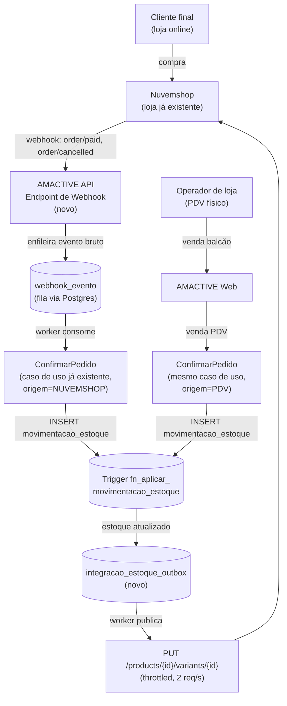
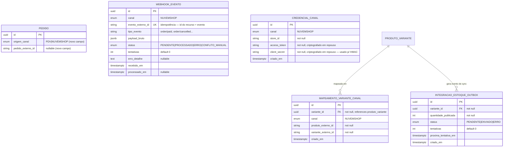

# Avaliação de Esforço — Integração AMACTIVE ↔ Nuvemshop (Tiendanube)

> Documento de **pesquisa e avaliação arquitetural**. Não é um SDD de implementação — nenhum código, migration ou contexto novo foi criado. Objetivo: dar subsídio para decisão de escopo e prioridade antes de qualquer trabalho de desenvolvimento.
>
> Premissa confirmada pelo usuário: a loja Nuvemshop **já existe e está operando**. O trabalho é de integração, não de criação de loja.

---

## 1. Pesquisa — API Nuvemshop / Tiendanube (estado atual, 2026)

Fontes primárias consultadas: documentação oficial em `tiendanube.github.io/api-documentation` (auth, product-variant, order, webhook, CHANGELOG) e `dev.nuvemshop.com.br` / `nuvemshop.dev` (apps privados vs públicos, uso de API/rate limit).

### 1.1 Autenticação

| Aspecto | Resposta |
|---|---|
| Modelo | OAuth2 restrito, somente `authorization_code` grant — mas **só é obrigatório para apps públicos** (App Store, multi-loja) |
| **App Privado** (caso do AMACTIVE) | Token de acesso permanente é **gerado diretamente no admin da loja** (Painel de Parceiros → criar app → modalidade "privado"), sem implementar o fluxo OAuth completo (sem callback URL, sem tela de autorização, sem homologação/review de app público). Sem taxa de parceiro. |
| Expiração do token | **Não expira.** Só é invalidado se um novo token for emitido ou se o app for desinstalado da loja |
| Escopos | `read`/`write` por recurso (`products`, `orders`, `customers`, `content`, `coupons`, `scripts`, `shipping`) — escopo de escrita implica leitura |
| Header obrigatório | `Authorization: Bearer <token>` **+** `User-Agent` (formato `AppName (contato@email)`) — ausência de `User-Agent` retorna `400` |
| Versionamento | URL contém a versão: `https://api.tiendanube.com/{versao}/{store_id}/...` (ex.: `2025-03`) — deve ser fixada explicitamente no client |

**Implicação prática:** como é uma única loja já existente (não um app a ser publicado para múltiplos lojistas), a rota correta é **App Privado com token permanente**, não OAuth completo. Isso reduz consideravelmente o esforço de Fase 1 (sem endpoint de callback, sem gestão de renovação de token, sem processo de homologação de parceiro).

### 1.2 Produtos, Variantes e Estoque

| Aspecto | Resposta |
|---|---|
| Unidade vendável | `Product` → `ProductVariant` (SKU, combinação de atributos como tamanho/cor via `values`) — modelo conceitualmente equivalente a `produto`/`produto_variante` do AMACTIVE |
| Campo de estoque | `stock` (int, nulo se `stock_management=false`) por variante — **single location por padrão** |
| Multi-depósito | Recurso **opcional/condicional** ("Multiple Locations") — quando ativado, `stock` no nível de variante vira agregado somente-leitura (deprecated para updates) e o controle passa para `inventory_levels[]` (`location_id` + `stock`). Precisa ser validado se a loja Nuvemshop do cliente tem esse recurso ativo |
| Endpoints de escrita de estoque | `PUT /products/{id}/variants/{id}` (campo único) e `POST /products/{id}/variants/stock` (ação `replace`/`variation` — permite delta ou valor absoluto) |
| Limite | Até 1000 variantes por produto; `stock >= 0` enforced pela API (não é possível gravar negativo via API) |
| Busca por SKU | `GET /products/sku/{sku}` — mas retorna o **primeiro** produto com uma variante com aquele SKU; documentação não garante unicidade global de SKU na Nuvemshop (diferente do AMACTIVE, onde `sku` é `UNIQUE` no banco) |

**Ponto de atenção crítico**: o modelo de dados do AMACTIVE assume SKU único (`produto_variante.sku UNIQUE`). A Nuvemshop **não garante** essa unicidade estruturalmente. O mapeamento correto deve ser por `product_id` + `variant_id` da Nuvemshop (não por SKU cru), usando o SKU apenas como chave de *matching* inicial/humano.

### 1.3 Pedidos

| Aspecto | Resposta |
|---|---|
| Ciclo de vida | `status` (open/closed/cancelled) × `payment_status` (pending/authorized/**paid**/partially_paid/refunded/...) × `shipping_status` — três máquinas de estado independentes |
| Linha de pedido | `variant_id`, `product_id`, `sku`, `quantity`, `price` (snapshot — mesmo padrão do AMACTIVE) |
| Confirmação de pagamento | Pedido é considerado pago quando uma `Transaction` com `status: success` é registrada — dispara `payment_status = paid` |
| Endpoints | `GET/POST /orders`, `GET /orders/{id}`, `POST /orders/{id}/close|open|cancel`, histórico de pagamento/edições |

### 1.4 Webhooks

| Aspecto | Resposta |
|---|---|
| Eventos relevantes | `order/created`, `order/paid`, `order/cancelled`, `order/fulfilled`, `order/edited`, etc.; `product/created`, `product/updated`, `product/deleted` |
| Assinatura | `POST /webhooks` com `{event, url}` — URL precisa ser HTTPS pública (não aceita localhost) |
| Payload | Mínimo — `{store_id, event, id}`. **Não traz o pedido completo**: é necessário um `GET /orders/{id}` de volta para obter itens/valores |
| Verificação de autenticidade | Header `x-linkedstore-hmac-sha256`, comparado via HMAC-SHA256 usando o `client_secret` do app |
| SLA de resposta | Endpoint deve responder **2xx em até 3 segundos** — processamento pesado não pode ser síncrono no handler |
| Retry | 4 tentativas quase imediatas, depois backoff (~5, 10, 15 min), depois backoff exponencial (fator 1.4x) por até 48h, **máx. 16 tentativas** |
| Idempotência | Documentação explicita que entregas duplicadas podem ocorrer — dedup é responsabilidade do consumidor |

### 1.5 Rate Limits

| Aspecto | Resposta |
|---|---|
| Algoritmo | Leaky Bucket: **2 requisições/segundo sustentadas**, **burst de 40** (planos superiores: 10x) |
| Escopo do limite | Por loja **e** por app, individualmente |
| Headers | `x-rate-limit-limit`, `x-rate-limit-remaining`, `x-rate-limit-reset` |
| Excedente | `429 Too Many Requests` |
| Paginação | Não paginada por padrão — usar `page`/`per_page` (máx. 200) e seguir o header `Link` em vez de montar URLs manualmente; consultas de pedidos têm teto de 10.000 itens (exige filtro por período) |

**Implicação prática**: qualquer sincronização em lote (ex.: carga inicial de catálogo, ou reconciliação diária de estoque) precisa de *throttling* explícito no client HTTP (respeitar 2 req/s) — nada de loop `for sku in todos_skus: PUT stock`. Recomenda-se fila com *rate limiter* (ex.: token bucket local espelhando o da API) e processamento em lote via job assíncrono, nunca inline numa requisição HTTP do usuário.

### 1.6 Limitações conhecidas relevantes ao modelo do AMACTIVE

- **Unicidade de SKU não garantida** pela plataforma (mapeamento deve usar IDs internos da Nuvemshop, não SKU puro).
- **Multi-depósito é opcional/condicional** — precisa confirmar se a loja atual usa Multiple Locations; se sim, o AMACTIVE (que é single-depósito no MVP, ver `data-model.md` §Decisões #2) precisa decidir para qual `location_id` publicar o estoque (provavelmente um único depósito "loja física" representando o saldo total do AMACTIVE).
- **Webhook não traz o payload completo** — todo processamento de pedido exige uma chamada de API de volta (custo extra de rate limit e latência).
- **Sem garantia de entrega única** de webhook — duplicação é esperada e deve ser tratada por idempotência própria.
- **Token de app privado é de altíssimo privilégio** (acesso amplo à loja) — deve ficar exclusivamente no backend do AMACTIVE, nunca exposto ao frontend.

---

## 2. Cruzamento com a Arquitetura Atual do AMACTIVE

Lido: `docs/SDD.md` (bounded contexts, ADRs), `docs/data-model.md` (schema e, principalmente, a seção **"Estratégia de Concorrência — Baixa de Estoque"**), `docs/openapi.yaml` (contrato de `/pedidos`).

### 2.1 O que já existe e é reaproveitável

- **Regra de ouro do domínio**: nenhuma baixa de estoque é feita por `UPDATE` direto — é sempre um `INSERT INTO movimentacao_estoque`, e um trigger de banco (`fn_aplicar_movimentacao_estoque`) aplica o delta atomicamente, com `UPDATE ... WHERE quantidade + delta >= 0`, sob `READ COMMITTED`. Isso **já resolve** a corrida entre uma venda de balcão (PDV) e uma venda originada da Nuvemshop, **desde que ambas passem pelo mesmo caso de uso** (`ConfirmarPedido`), sem nenhum código adicional de lock — é o mesmo mecanismo que já protege duas vendas simultâneas de PDV hoje.
- **Shared Kernel restrito** já existente entre Vendas e Catálogo & Estoque (Vendas conhece só a porta `IEstoquePort`, nunca a tabela `estoque` diretamente) é exatamente o padrão que uma integração de canal deve seguir: o novo contexto de integração **não deve escrever em `estoque`/`movimentacao_estoque` diretamente** — deve invocar os mesmos casos de uso que o PDV usa.
- `pagamento_pedido` 1:N e `cliente_id` nullable já suportam pedido sem cadastro completo de cliente (venda de balcão) — útil porque nem todo pedido Nuvemshop trará CPF/CNPJ completo utilizável 1:1 com o cadastro de `cliente` do AMACTIVE.
- A disciplina já documentada de **ordenar itens por `variante_id` antes do insert** para evitar deadlock (§ Estratégia de Concorrência) precisa ser aplicada identicamente no novo fluxo — é a mesma regra, não uma nova.

### 2.2 O que não existe e precisa ser adicionado

- Não há hoje nenhum conceito de **canal de origem** de um pedido (`PDV` vs. `NUVEMSHOP`) — `pedido` não tem esse campo.
- Não há **mapeamento de identidade externa** (SKU/variante AMACTIVE ↔ `product_id`/`variant_id` Nuvemshop).
- Não há **recebimento de webhook** de nenhum tipo — a API do AMACTIVE hoje é 100% síncrona, sem endpoints públicos não-autenticados por JWT interno, sem verificação HMAC de terceiros.
- Não há **processamento assíncrono/worker** — tudo no AMACTIVE hoje é request/response direto (ADR-004 explicitamente evita infra de fila até haver necessidade real). A integração é o primeiro caso real que justifica isso.
- Não há **idempotência de evento externo** — o sistema nunca precisou lidar com "a mesma entrada pode chegar duas vezes de uma fonte que não controlamos".
- Não há tratamento de **falha parcial que exige intervenção humana** (ex.: pedido Nuvemshop pago, mas AMACTIVE não tem mais estoque — hoje `422 estoque-insuficiente` simplesmente rejeita a requisição de um operador humano no PDV, que vê o erro na hora e decide; no canal Nuvemshop não há humano na hora do erro).

---

## 3. Decisão Arquitetural — Direção do Fluxo de Dados

### 3.1 Diagrama de contexto proposto



### 3.2 Estoque: quem é a fonte da verdade

**Recomendação: AMACTIVE como fonte única da verdade do saldo total, publicando de forma unidirecional (push) para a Nuvemshop.** A Nuvemshop passa a ser tratada como um **canal de venda consumidor** de estoque, nunca como editor autoritativo.

Justificativa:
- O AMACTIVE já tem um mecanismo de concorrência robusto e auditável (trigger + `movimentacao_estoque` append-only). Introduzir a Nuvemshop como segunda fonte de escrita autoritativa exigiria resolução de conflito bidirecional (last-write-wins ou CRDT-like), o que é ordem de magnitude mais complexo e não tem justificativa de negócio aqui (uma marca, um depósito físico real).
- Como o valor publicado é sempre o **saldo absoluto atual** (não um delta), pedidos originados na própria Nuvemshop (que ela já decrementou localmente no checkout) recebem de volta a mesma confirmação/correção de saldo do AMACTIVE — é idempotente, não duplica a baixa, apenas mantém os dois sistemas concordantes após o AMACTIVE processar o pedido pelo mesmo pipeline do PDV.
- Isso elimina a necessidade de qualquer lógica nova de concorrência no domínio: o pedido vindo da Nuvemshop **entra no mesmo funil** (`ConfirmarPedido`) que uma venda de balcão, e o trigger já existente resolve a corrida entre os dois canais exatamente como já resolve hoje entre dois operadores de PDV.

**Risco irredutível (documentado, não "resolvido"):** overselling entre canais por **latência de sincronização**, não por corrida dentro da mesma transação. Exemplo: última unidade é vendida no PDV; antes do worker de outbox publicar o novo saldo (segundos, sujeito a rate limit de 2 req/s) na Nuvemshop, um cliente online finaliza a compra da mesma unidade. O trigger do AMACTIVE vai rejeitar corretamente a baixa (`422 estoque-insuficiente`) quando o webhook `order/paid` for processado — mas nesse ponto o cliente já "comprou" no site. Isso **não é resolvível só com engenharia de dados** (é uma limitação inerente a qualquer integração assíncrona entre dois sistemas de estoque separados); mitigações possíveis, não eliminação: (a) publicar saldo com pequeno **buffer de segurança** (ex.: nunca publicar a última unidade, deixando 0 disponível na Nuvemshop quando o AMACTIVE tem 1), (b) push do outbox o mais rápido possível (segundos, não minutos), (c) fila de **conflitos de estoque** para atendimento manual (cancelar/reembolsar o pedido excedente na Nuvemshop — ação humana, não automática na Fase 1).

### 3.3 Pedidos: webhook, não polling

**Recomendação: webhook, com fila de processamento assíncrono via Postgres (sem broker externo na Fase 1).**

Fluxo:
1. Nuvemshop envia `order/paid` para um novo endpoint público (não-JWT, autenticado por HMAC) do AMACTIVE.
2. O endpoint **apenas** valida o HMAC, grava o evento bruto (`id`, `event`, `store_id`, payload, timestamp) em uma tabela `webhook_evento` com status `PENDENTE`, e responde `200` — cumprindo a janela de 3s exigida pela Nuvemshop, sem acoplar a resposta HTTP ao processamento de negócio.
3. Um worker assíncrono (processo próprio ou *background task* recorrente dentro do mesmo container da API, usando `SELECT ... FOR UPDATE SKIP LOCKED` sobre `webhook_evento` para permitir múltiplas réplicas sem duplicar processamento) consome o evento: chama `GET /orders/{id}` na Nuvemshop (payload do webhook não traz os itens), resolve/cria `Cliente`, mapeia SKUs → `variante_id` via tabela de mapeamento, e invoca o **mesmo** caso de uso `ConfirmarPedido` já existente, com um novo campo `origem_canal=NUVEMSHOP` e `pedido_externo_id`.
4. Falha de estoque insuficiente nesse ponto **não** deve ser silenciosa — grava em uma fila/tabela de conflito para revisão humana (dashboard ou, minimamente, log de erro + alerta).

Por que webhook e não polling: a Nuvemshop já oferece webhooks nativos (com retry de até 48h/16 tentativas), então polling seria estritamente pior — mais latência, mais consumo de rate limit (2 req/s é escasso para polling frequente em vários endpoints), e reinventa o que a plataforma já garante. **Polling é recomendado apenas como rede de segurança secundária** (job de reconciliação diário: comparar pedidos pagos na Nuvemshop dos últimos N dias contra pedidos já importados no AMACTIVE, para capturar os casos raros em que os 16 retries do webhook se esgotaram — ex.: AMACTIVE fora do ar por mais de 48h).

---

## 4. Impacto na Arquitetura Atual

### 4.1 Novo Bounded Context: "Integração de Canais"

**Recomendação: novo bounded context (Supporting Subdomain), não extensão de Vendas nem de Catálogo & Estoque.**

Justificativa (DDD): a lógica de tradução entre o modelo externo da Nuvemshop (product/variant/order com seus próprios ciclos de vida e nomenclatura) e o modelo interno do AMACTIVE é, por definição, uma **Anti-Corruption Layer (ACL)** — deve viver isolada para que o vocabulário e as peculiaridades da API de terceiros (rate limit, HMAC, retry, `location_id`, `payment_status` de 8 estados) nunca vazem para dentro dos contextos Core (Vendas, Catálogo & Estoque). Colocar esse código dentro de `Vendas` ou `Catálogo & Estoque` violaria a separação de fronteiras já estabelecida no SDD (§1.2) e misturaria regra de negócio interna com detalhe de infraestrutura externa.

```
apps/api/src/amactive/contexts/integracao_canais/
├── domain/
│   ├── entities.py           # CanalVenda, MapeamentoVariante, WebhookEvento
│   ├── value_objects.py      # IdentidadeExterna (canal + id_externo)
│   └── repositories.py       # portas: MapeamentoRepository, WebhookEventoRepository
├── application/
│   └── use_cases/
│       ├── processar_webhook_pedido.py   # chama IPedidoPort (Vendas) — não recria a lógica
│       ├── sincronizar_estoque_canal.py  # chama IEstoqueQueryPort (Catálogo) — só leitura
│       └── reconciliar_pedidos.py        # job de segurança (polling de baixa frequência)
└── infrastructure/
    ├── nuvemshop/
    │   ├── client.py          # ACL: HTTP client + rate limiter + HMAC verify
    │   └── mappers.py         # traduz payload Nuvemshop <-> DTOs internos
    ├── persistence/
    │   ├── models.py          # webhook_evento, mapeamento_variante_canal, credencial_canal, estoque_outbox
    │   └── repositories.py
    └── api/
        └── router.py          # POST /integracoes/nuvemshop/webhooks (público, HMAC)
```

**Padrão de integração com os contextos Core**: `Integração de Canais` consome `Vendas` e `Catálogo & Estoque` exatamente como `Relatórios` já consome hoje (Published Language / Open Host Service interno) — nunca acessa `movimentacao_estoque` ou `pedido` diretamente. Isso é uma extensão natural e de baixo risco do padrão de fronteiras já em uso no projeto, não uma exceção nova.

### 4.2 Worker assíncrono: necessário, mas proporcional

A ADR-004 do SDD (monolito modular, sem infra distribuída sem necessidade real) continua válida. A Fase 1 **não precisa** de Kafka/RabbitMQ/SQS — o volume de uma loja (pedidos por dia, movimentações de estoque) é baixo o suficiente para um padrão **outbox sobre PostgreSQL** (tabelas `webhook_evento` e `integracao_estoque_outbox`, consumidas por um loop assíncrono simples, com `SKIP LOCKED` para segurança). Isso é consistente com o que o SDD já reserva como evolução (§6: "eventos de domínio já são declarados... podem publicar em fila real sem alterar o domínio") — a integração é o primeiro consumidor real desses eventos, mas não exige a fila real ainda.

Reavaliar broker externo apenas se: múltiplos canais forem adicionados simultaneamente (Fase 3), ou o volume de webhooks/movimentações crescer a ponto de um único worker polling não sustentar a latência desejada.

### 4.3 Mudanças de modelo de dados necessárias



Notas:
- `webhook_evento.evento_externo_id` com `UNIQUE` é a garantia de idempotência contra entregas duplicadas (documentadas como esperadas pela própria Nuvemshop).
- `pedido.origem_canal`/`pedido_externo_id` são as únicas mudanças em uma tabela Core existente — deliberadamente mínimas, para não acoplar o domínio de Vendas ao vocabulário de canais externos além do necessário para rastreabilidade/auditoria.
- `credencial_canal.access_token`/`client_secret` **precisam** de criptografia em repouso (não é um requisito hoje no AMACTIVE, que só tem `senha_hash` com bcrypt — token de app privado não é hash, é um segredo reversível que a aplicação precisa usar ativamente, logo requer criptografia simétrica com chave gerenciada, não apenas hashing).
- Falha de estoque insuficiente em pedido de canal externo é registrada como `webhook_evento.status = CONFLITO_MANUAL` — não existe hoje no AMACTIVE um conceito de "pedido que não pôde ser criado e precisa de decisão humana"; é um requisito funcional novo (mínimo: log + alerta; ideal: item de fila visível no painel).

---

## 5. Riscos Técnicos Principais

| Risco | Descrição | Mitigação na Fase 1 |
|---|---|---|
| **Overselling entre canais** | Latência entre uma venda PDV/Nuvemshop e a propagação do novo saldo para o outro canal permite venda de item já esgotado | Buffer de segurança no saldo publicado + push rápido via outbox + fila de conflito manual (não eliminável, apenas mitigável) |
| **Falha/atraso de webhook** | Nuvemshop reduziu janela de resposta para 3s e timeout de retry para 48h/16 tentativas; se o AMACTIVE ficar fora do ar além disso, o pedido nunca chega | Job de reconciliação diário (polling de segurança) comparando pedidos pagos na Nuvemshop × pedidos importados no AMACTIVE |
| **Duplicidade de evento** | Nuvemshop declara explicitamente que entregas duplicadas podem ocorrer | `webhook_evento.evento_externo_id UNIQUE` + processamento idempotente (upsert, nunca "criar sempre") |
| **Rate limit (2 req/s, burst 40)** | Sincronização de estoque em lote (ex.: carga inicial ou reconciliação de catálogo grande) pode estourar o limite e sofrer `429` | Rate limiter local no client HTTP (token bucket espelhando o da API) + outbox processado em lote controlado, nunca loop inline numa request do usuário |
| **SKU não é globalmente único na Nuvemshop** | Diferente da constraint `UNIQUE` do AMACTIVE — mapeamento ingênuo por SKU pode colidir | Mapeamento por `product_id`+`variant_id` da Nuvemshop, com SKU usado apenas como auxílio de matching inicial humano |
| **Segredo de app privado com alto privilégio** | Token dá acesso amplo à loja (produtos, pedidos, clientes) | Nunca expor ao frontend; armazenar criptografado; backend AMACTIVE é o único chamador da API Nuvemshop |
| **Multi-depósito da Nuvemshop (se ativo na loja)** | AMACTIVE é single-depósito hoje — se a loja usa Multiple Locations, é preciso decidir para qual `location_id` publicar | Validar com o cliente se o recurso está ativo antes da Fase 1; se estiver, publicar sempre no `location_id` único representando o depósito físico do AMACTIVE |
| **Conflito de estoque insuficiente em pedido pago** | Pedido já pago na Nuvemshop não pode simplesmente ser descartado — cliente já pagou | Fila de `CONFLITO_MANUAL` para o operador decidir (cancelar/reembolsar na Nuvemshop, ou repor estoque manualmente) — automação fica para Fase 2 |

---

## 6. Estimativa de Esforço

> Estimativas qualitativas para 1 desenvolvedor sênior full-cycle (mesmo perfil hoje mantendo o AMACTIVE), assumindo que a Fase 1 é o primeiro contato do time com integração de webhook/worker assíncrono neste projeto — não é reaproveitamento de um padrão já existente.

### Fase 1 — MVP: Estoque unidirecional (AMACTIVE → Nuvemshop) + Recebimento de Pedidos (Nuvemshop → AMACTIVE)

| Item | Tamanho | Estimativa |
|---|---|---|
| Setup de app privado Nuvemshop + client HTTP (auth, rate limiter, HMAC verify) | P | 2–3 dias |
| Novo bounded context `integracao_canais` (estrutura Clean Architecture, portas) | M | 3–4 dias |
| Migrations: `webhook_evento`, `mapeamento_variante_canal`, `integracao_estoque_outbox`, `credencial_canal`, campos novos em `pedido` | P | 1–2 dias |
| Endpoint de webhook + verificação HMAC + idempotência + worker de processamento de pedido (reusa `ConfirmarPedido`) | M | 4–5 dias |
| Outbox de estoque (trigger de publicação após movimentação) + worker de push com throttling | M | 3–4 dias |
| Matching inicial de catálogo (script de correlação SKU AMACTIVE ↔ produto/variante Nuvemshop) | P | 1–2 dias (+ tempo de curadoria manual dos dados, variável, fora do controle de engenharia) |
| Fila de conflito manual (estoque insuficiente em pedido externo) — mínimo log + alerta | P | 1–2 dias |
| Testes (mocks de webhook, contract tests do client Nuvemshop, teste de idempotência e de concorrência PDV×Nuvemshop) | M | 3–4 dias |
| Observabilidade (logs estruturados de sync, métricas de erro de webhook/push) | P | 1 dia |
| **Total Fase 1** | **G** | **≈ 19–27 dias úteis (4–5,5 semanas)** |

### Fase 2 — Catálogo bidirecional + robustez operacional

| Item | Tamanho | Estimativa |
|---|---|---|
| Sincronização de criação/atualização de produto (definir fonte da verdade de catálogo — decisão pendente, ver §7) | M–G | 5–8 dias |
| Mais eventos (`product/updated`, `order/cancelled`, `order/edited`) + cancelamento cruzado (estorno de estoque) | M | 3–5 dias |
| Painel administrativo de monitoramento (fila de conflitos visível na UI, reprocessamento manual) | M | 3–4 dias |
| Suporte a Multiple Locations (se a loja usar) | P–M | 2–4 dias |
| **Total Fase 2** | **M–G** | **≈ 13–21 dias úteis (3–4,5 semanas)** |

### Fase 3 — Multi-canal genérico (opcional, fora do escopo desta avaliação)

Generalizar `integracao_canais` para outros marketplaces (Mercado Livre, Shopee) reaproveitando o padrão ACL; avaliar broker externo se o volume justificar. Não estimável sem escopo específico definido — tratar como iniciativa separada, não como extensão natural garantida.

---

## 7. Riscos e Decisões Pendentes (requerem validação com o usuário/stakeholder)

- **Fonte da verdade do catálogo (produto/preço/descrição)**: hoje não está definido se o catálogo é mantido no AMACTIVE e replicado para a Nuvemshop, ou o inverso (loja já existente provavelmente já tem produtos cadastrados diretamente nela). Esta avaliação assume que a Fase 1 **não mexe em catálogo** (só estoque + pedidos), deixando essa decisão para a Fase 2 — mas precisa ser confirmada antes de qualquer sincronização de produto.
- **A loja atual usa Multiple Locations na Nuvemshop?** Não pesquisável sem acesso à conta real — precisa ser confirmado antes da Fase 1, pois muda o endpoint de escrita de estoque a ser usado (`stock` direto vs. `inventory_levels[]`).
- **Volume real de pedidos/dia da loja Nuvemshop** não foi informado — influencia diretamente se o padrão outbox-sobre-Postgres da Fase 1 é suficiente ou se um broker externo já se justificaria desde já.
- **Política de conflito de estoque insuficiente**: a Fase 1 propõe fila manual (sem automação de cancelamento/reembolso na Nuvemshop). Confirmar se isso é operacionalmente aceitável ou se automação já é requisito desde o MVP.
- **Dados de cliente do pedido Nuvemshop** (CPF/CNPJ, endereço) podem não bater 1:1 com o cadastro `cliente` do AMACTIVE — regra de match/criação de cliente (por e-mail? por CPF?) precisa ser definida com o time de negócio, não é uma decisão puramente técnica.

---

## 8. Premissas Assumidas Nesta Avaliação

- Integração via **App Privado** da Nuvemshop (token permanente gerado no admin da loja), não app público com OAuth completo — adequado por ser uma única loja já existente, não um produto a ser distribuído a múltiplos lojistas.
- AMACTIVE continua single-depósito na Fase 1 — a Nuvemshop, se usar múltiplos locais, é mapeada para um único `location_id` representando o depósito físico real.
- Fase 1 não inclui sincronização de catálogo (produto/preço) — apenas estoque (push) e pedidos (pull via webhook).
- Não há requisito de tempo real rígido (sub-segundo) para sincronização de estoque — segundos a poucos minutos de latência são aceitáveis, desde que a mitigação de buffer de segurança esteja em vigor.
