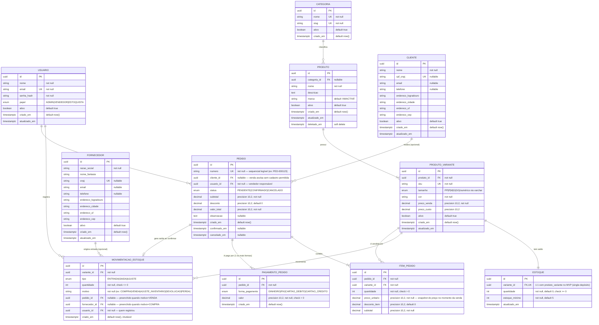

# Modelagem de Dados — AMACTIVE

> Complementa `docs/SDD.md` §2. Modelo lógico de referência para o `data-expert` produzir as migrations físicas definitivas em `migrations/`.

---

## Diagrama ERD Completo



---

## Justificativa do Tipo de Banco

**Relacional (PostgreSQL)** — ver ADR-002 em `docs/SDD.md`. Resumo: integridade referencial forte entre Produto → Variante → Estoque → Movimentação e Pedido → Item → Pagamento; necessidade de transações ACID multi-tabela na confirmação de venda (baixa de estoque atômica); consultas relacionais/agregadas (relatórios) são o padrão de acesso dominante.

---

## Decisões de Modelagem

1. **UUID v7 como chave primária** de todas as tabelas — ordenável por tempo de criação (facilita paginação e índices de range), evita previsibilidade de UUID v4 sequencial exposto em URLs públicas, e mantém consistência com a convenção usada em outros projetos do autor.

2. **`estoque` 1:1 com `produto_variante`** no MVP (não 1:N com depósito) — decisão deliberada de simplicidade para single-location. A FK `estoque.variante_id` é `UNIQUE`, o que torna trivial evoluir para `estoque` 1:N (multi-depósito) no futuro apenas removendo a constraint `UNIQUE` e adicionando `deposito_id` — sem migração destrutiva.

3. **`movimentacao_estoque` é apêndice imutável (append-only)** — nunca é atualizada ou deletada, apenas inserida. O saldo em `estoque.quantidade` é um valor **derivado/cache** mantido por trigger ou pela camada de aplicação a cada movimentação, mas a tabela de movimentações é a fonte da verdade auditável (permite reconstruir o saldo a qualquer momento — importante para investigar divergências).

4. **`preco_unitario` em `item_pedido` é um snapshot**, não uma referência a `produto_variante.preco_venda` — preços mudam ao longo do tempo; o histórico de vendas não pode ser retroativamente alterado por uma mudança de preço no catálogo.

5. **`pagamento_pedido` é 1:N com `pedido`** desde o MVP — suporta pagamento misto (ex: parte em PIX, parte em dinheiro) sem exigir redesenho quando a necessidade surgir. Validação de negócio (soma dos pagamentos = `valor_total`) fica na camada de aplicação (`application/use_cases/confirmar_pedido.py`), não é constraint de banco (constraint de soma entre tabelas não é trivial em SQL puro e o caso de uso já valida antes de persistir).

6. **`cliente_id` e `fornecedor_id` são nullable** onde aplicável — venda de balcão sem cadastro de cliente é um fluxo válido (moda fitness de loja física tem grande volume de vendas avulsas); entrada de estoque por motivo diferente de compra (ex: devolução, ajuste de inventário) não exige fornecedor.

7. **Soft delete apenas onde há histórico dependente**: `produto` tem `deletado_em` (pois `produto_variante`/`item_pedido` podem referenciar produtos descontinuados que ainda aparecem em vendas históricas). `cliente` e `fornecedor` usam `ativo=false` (inativação) em vez de soft delete formal, suficiente para o caso de uso de "arquivar sem excluir". `produto_variante` também usa `ativo=false` pelo mesmo motivo (nunca é fisicamente deletada se já referenciada em `item_pedido` ou `movimentacao_estoque` — `ON DELETE RESTRICT`).

8. **Enums como tipo `ENUM` nativo do Postgres** (`status_pedido`, `tipo_movimentacao`, `forma_pagamento`, `papel_usuario`) — validação de domínio garantida no banco, alinhada com a validação Pydantic no nível de aplicação (dupla camada de proteção, conforme Clean Architecture: domínio nunca confia cegamente na camada externa).

### Chaves Estrangeiras — `ON DELETE`

| FK | Ação | Motivo |
|---|---|---|
| `produto_variante.produto_id → produto.id` | `RESTRICT` | Produto com variantes não pode ser excluído fisicamente (usar `ativo=false`) |
| `estoque.variante_id → produto_variante.id` | `CASCADE` | Se a variante for fisicamente removida (caso raro, sem histórico), o saldo de estoque associado não faz mais sentido |
| `movimentacao_estoque.variante_id → produto_variante.id` | `RESTRICT` | Histórico de movimentação nunca pode ficar órfão |
| `movimentacao_estoque.pedido_id → pedido.id` | `SET NULL` | Cancelamento/expurgo administrativo de pedido não deve apagar o histórico de movimentação |
| `movimentacao_estoque.fornecedor_id → fornecedor.id` | `SET NULL` | Fornecedor pode ser removido sem invalidar o histórico de entrada |
| `movimentacao_estoque.usuario_id → usuario.id` | `RESTRICT` | Auditoria — nunca perder o registro de quem fez a movimentação |
| `pedido.cliente_id → cliente.id` | `SET NULL` | Cliente pode ser removido sem apagar o histórico de vendas |
| `pedido.usuario_id → usuario.id` | `RESTRICT` | Auditoria — nunca perder o registro de quem vendeu |
| `item_pedido.pedido_id → pedido.id` | `CASCADE` | Item não existe sem o pedido pai |
| `item_pedido.variante_id → produto_variante.id` | `RESTRICT` | Histórico de venda nunca pode ficar órfão de produto |
| `pagamento_pedido.pedido_id → pedido.id` | `CASCADE` | Pagamento não existe sem o pedido pai |
| `produto.categoria_id → categoria.id` | `SET NULL` | Categoria pode ser removida/reorganizada sem apagar produtos |

### Índices Críticos

```
produto_variante(sku)                          -- UNIQUE, busca por SKU no PDV
produto_variante(produto_id)                   -- FK, listagem de variantes por produto
estoque(variante_id)                           -- UNIQUE, join constante com produto_variante
estoque(quantidade) WHERE quantidade <= estoque_minimo   -- índice parcial para alertas de estoque baixo
movimentacao_estoque(variante_id, criado_em DESC)         -- histórico por variante, ordenado
pedido(status, criado_em DESC)                 -- listagem/filtro por status e período (dashboard)
pedido(cliente_id)                             -- FK, histórico de compras por cliente
item_pedido(pedido_id)                         -- FK, montagem do pedido completo
item_pedido(variante_id)                       -- relatório de produtos mais vendidos
produto(nome) USING gin (nome gin_trgm_ops)    -- busca textual (extensão pg_trgm) no catálogo
```

### Views de Leitura (Relatórios & Dashboard — ver SDD §1.5)

| View | Propósito |
|---|---|
| `vw_vendas_por_periodo` | Agrega `pedido`/`item_pedido` por dia/semana/mês, apenas `status = CONFIRMADO` |
| `vw_produtos_mais_vendidos` | Agrega `item_pedido` por `variante_id`, ordenado por quantidade/faturamento |
| `vw_giro_estoque` | Cruza `movimentacao_estoque` (saídas) com `estoque.quantidade` para calcular giro por variante/período |

### Estratégia de Migração

- Migrations forward-only em SQL puro, numeradas sequencialmente: `migrations/000001_initial_schema.up.sql` / `.down.sql` (ver arquivo inicial já criado no repositório como ponto de partida — schema completo do MVP).
- Nenhuma migration é editada após ser aplicada em qualquer ambiente compartilhado; correções viram uma nova migration.
- Seeds de dados de desenvolvimento (categorias padrão, usuário admin inicial) ficam em migrations separadas e claramente nomeadas (ex: `000002_seed_dev.up.sql`), nunca misturadas ao DDL do schema — responsabilidade final de definição fica com o `data-expert`.
