# Modelagem de Dados — AMACTIVE

> Complementa `docs/SDD.md` §2. Modelo lógico de referência para o `data-expert` produzir as migrations físicas definitivas em `migrations/`.

---

## Diagrama ERD Completo

```mermaid
erDiagram
    USUARIO {
        uuid id PK
        string nome "not null"
        string email UK "not null"
        string senha_hash "not null"
        enum papel "ADMIN|VENDEDOR|ESTOQUISTA"
        boolean ativo "default true"
        timestamptz criado_em "default now()"
        timestamptz atualizado_em
    }

    CATEGORIA {
        uuid id PK
        string nome UK "not null"
        string slug UK "not null"
        boolean ativo "default true"
        timestamptz criado_em "default now()"
    }

    PRODUTO {
        uuid id PK
        uuid categoria_id FK "nullable"
        string nome "not null"
        text descricao
        string marca "default 'AMACTIVE'"
        decimal desconto_percentual "precision 5,2, nullable — NULL = sem promoção ativa, check (0, 100]"
        boolean ativo "default true"
        timestamptz criado_em "default now()"
        timestamptz atualizado_em
        timestamptz deletado_em "soft delete"
    }

    PRODUTO_VARIANTE {
        uuid id PK
        uuid produto_id FK "not null"
        string sku UK "not null"
        enum tamanho "PP|P|M|G|GG|numérico via varchar"
        string cor "not null"
        decimal preco_venda "precision 10,2, not null"
        decimal preco_custo "precision 10,2"
        boolean ativo "default true"
        timestamptz criado_em "default now()"
        timestamptz atualizado_em
    }

    PRODUTO_IMAGEM {
        uuid id PK
        uuid produto_id FK "not null"
        string cor "not null — vincula à cor, não à variante tamanho+cor"
        string url "not null — caminho relativo em disco (volume Docker local)"
        smallint ordem "default 0 — ordem de exibição na galeria da cor"
        boolean principal "default false — no máx. 1 true por produto_id+cor"
        timestamptz criado_em "default now()"
    }

    ESTOQUE {
        uuid id PK
        uuid variante_id FK,UK "1:1 com produto_variante no MVP (single-depósito)"
        int quantidade "not null, default 0, check >= 0"
        int estoque_minimo "not null, default 5"
        timestamptz atualizado_em
    }

    MOVIMENTACAO_ESTOQUE {
        uuid id PK
        uuid variante_id FK "not null"
        enum tipo "ENTRADA|SAIDA|AJUSTE"
        int quantidade "not null, check <> 0"
        enum motivo "COMPRA|VENDA|AJUSTE_INVENTARIO|DEVOLUCAO|PERDA"
        uuid pedido_id FK "nullable — preenchido quando motivo=VENDA"
        uuid fornecedor_id FK "nullable — preenchido quando motivo=COMPRA"
        uuid usuario_id FK "not null — quem registrou"
        timestamptz criado_em "default now(), imutável"
    }

    CLIENTE {
        uuid id PK
        string nome "not null"
        string cpf_cnpj UK "nullable"
        string email "nullable"
        string telefone "nullable"
        string endereco_logradouro
        string endereco_cidade
        string endereco_uf
        string endereco_cep
        boolean ativo "default true"
        timestamptz criado_em "default now()"
        timestamptz atualizado_em
    }

    FORNECEDOR {
        uuid id PK
        string razao_social "not null"
        string nome_fantasia
        string cnpj UK "nullable"
        string email "nullable"
        string telefone "nullable"
        string endereco_logradouro
        string endereco_cidade
        string endereco_uf
        string endereco_cep
        boolean ativo "default true"
        timestamptz criado_em "default now()"
        timestamptz atualizado_em
    }

    PEDIDO {
        uuid id PK
        string numero UK "not null — sequencial legível (ex: PED-000123)"
        uuid cliente_id FK "nullable — venda avulsa sem cadastro permitida"
        uuid usuario_id FK "not null — vendedor responsável"
        enum status "PENDENTE|CONFIRMADO|CANCELADO"
        decimal subtotal "precision 10,2, not null"
        decimal desconto "precision 10,2, default 0"
        decimal valor_total "precision 10,2, not null"
        text observacao "nullable"
        timestamptz criado_em "default now()"
        timestamptz confirmado_em "nullable"
        timestamptz cancelado_em "nullable"
    }

    ITEM_PEDIDO {
        uuid id PK
        uuid pedido_id FK "not null"
        uuid variante_id FK "not null"
        int quantidade "not null, check > 0"
        decimal preco_unitario "precision 10,2, not null — snapshot do preço no momento da venda"
        decimal desconto_item "precision 10,2, default 0"
        decimal subtotal "precision 10,2, not null"
    }

    PAGAMENTO_PEDIDO {
        uuid id PK
        uuid pedido_id FK "not null"
        enum forma_pagamento "DINHEIRO|PIX|CARTAO_DEBITO|CARTAO_CREDITO"
        decimal valor "precision 10,2, not null, check > 0"
        timestamptz criado_em "default now()"
    }

    CATEGORIA ||--o{ PRODUTO : "classifica"
    PRODUTO ||--|{ PRODUTO_VARIANTE : "possui"
    PRODUTO ||--o{ PRODUTO_IMAGEM : "exibe (galeria por cor)"
    PRODUTO_VARIANTE ||--|| ESTOQUE : "tem saldo"
    PRODUTO_VARIANTE ||--o{ MOVIMENTACAO_ESTOQUE : "movimenta"
    FORNECEDOR ||--o{ MOVIMENTACAO_ESTOQUE : "origina entrada (opcional)"
    USUARIO ||--o{ MOVIMENTACAO_ESTOQUE : "registra"

    CLIENTE ||--o{ PEDIDO : "realiza (opcional)"
    USUARIO ||--o{ PEDIDO : "vende"
    PEDIDO ||--|{ ITEM_PEDIDO : "contém"
    PRODUTO_VARIANTE ||--o{ ITEM_PEDIDO : "é vendida em"
    PEDIDO ||--|{ PAGAMENTO_PEDIDO : "é pago por (1 ou mais formas)"
    PEDIDO ||--o| MOVIMENTACAO_ESTOQUE : "gera saída ao confirmar"
```



---

## Justificativa do Tipo de Banco

**Relacional (PostgreSQL)** — ver ADR-002 em `docs/SDD.md`. Resumo: integridade referencial forte entre Produto → Variante → Estoque → Movimentação e Pedido → Item → Pagamento; necessidade de transações ACID multi-tabela na confirmação de venda (baixa de estoque atômica); consultas relacionais/agregadas (relatórios) são o padrão de acesso dominante.

---

## Decisões de Modelagem

1. **UUID como chave primária** de todas as tabelas, gerado via `gen_random_uuid()` (extensão `pgcrypto`) — que produz **UUID v4** (aleatório), não v7. Correção em relação a uma versão anterior deste documento que mencionava "UUID v7": o PostgreSQL 16 (fixado em `docs/SDD.md` ADR-002) **não tem geração nativa de UUIDv7** — isso só chega no Postgres 18 (função `uuidv7()`). Implementar um gerador de UUIDv7 via função SQL/PLpgSQL própria antes disso é possível, mas foi deliberadamente descartado aqui: é código de bit-manipulação não trivial rodando no caminho mais crítico do sistema (geração de PK de toda tabela), para resolver um problema — hotspot de inserção em índice B-tree por PK não ordenável — que não é real nesta escala (uma única loja, baixo volume de escrita, sem exigência de paginação por PK além dos índices explícitos já existentes em `criado_em`). Fica registrado como evolução futura: se/quando o projeto migrar para PostgreSQL 18, trocar o `DEFAULT` das colunas `id` para `uuidv7()` é uma migration isolada e não-destrutiva (mesmo tipo de coluna `uuid`).

2. **`estoque` 1:1 com `produto_variante`** no MVP (não 1:N com depósito) — decisão deliberada de simplicidade para single-location. A FK `estoque.variante_id` é `UNIQUE`, o que torna trivial evoluir para `estoque` 1:N (multi-depósito) no futuro apenas removendo a constraint `UNIQUE` e adicionando `deposito_id` — sem migração destrutiva.

3. **`movimentacao_estoque` é apêndice imutável (append-only)** — nunca é atualizada ou deletada, apenas inserida. O saldo em `estoque.quantidade` é um valor **derivado/cache**, mantido atomicamente por um trigger de banco (`fn_aplicar_movimentacao_estoque`, decisão #9) a cada `INSERT` em `movimentacao_estoque` — não pela camada de aplicação (a versão original deste documento deixava as duas opções em aberto; a auditoria física fixou trigger como decisão definitiva, ver "Estratégia de Concorrência — Baixa de Estoque" abaixo). A tabela de movimentações continua sendo a fonte da verdade auditável (permite reconstruir o saldo a qualquer momento — importante para investigar divergências).

4. **`preco_unitario` em `item_pedido` é um snapshot**, não uma referência a `produto_variante.preco_venda` — preços mudam ao longo do tempo; o histórico de vendas não pode ser retroativamente alterado por uma mudança de preço no catálogo.

5. **`pagamento_pedido` é 1:N com `pedido`** desde o MVP — suporta pagamento misto (ex: parte em PIX, parte em dinheiro) sem exigir redesenho quando a necessidade surgir. Validação de negócio (soma dos pagamentos = `valor_total`) fica na camada de aplicação (`application/use_cases/confirmar_pedido.py`), não é constraint de banco (constraint de soma entre tabelas não é trivial em SQL puro e o caso de uso já valida antes de persistir).

6. **`cliente_id` e `fornecedor_id` são nullable** onde aplicável — venda de balcão sem cadastro de cliente é um fluxo válido (moda fitness de loja física tem grande volume de vendas avulsas); entrada de estoque por motivo diferente de compra (ex: devolução, ajuste de inventário) não exige fornecedor.

7. **Soft delete apenas onde há histórico dependente**: `produto` tem `deletado_em` (pois `produto_variante`/`item_pedido` podem referenciar produtos descontinuados que ainda aparecem em vendas históricas). `cliente` e `fornecedor` usam `ativo=false` (inativação) em vez de soft delete formal, suficiente para o caso de uso de "arquivar sem excluir". `produto_variante` também usa `ativo=false` pelo mesmo motivo (nunca é fisicamente deletada se já referenciada em `item_pedido` ou `movimentacao_estoque` — `ON DELETE RESTRICT`).

8. **Enums como tipo `ENUM` nativo do Postgres** (`status_pedido`, `tipo_movimentacao`, `forma_pagamento`, `papel_usuario`, `motivo_movimentacao`) — validação de domínio garantida no banco, alinhada com a validação Pydantic no nível de aplicação (dupla camada de proteção, conforme Clean Architecture: domínio nunca confia cegamente na camada externa). `motivo_movimentacao` foi adicionado na auditoria física (não estava na migration original como enum, apenas `varchar(50)` livre) — é um conjunto fechado de valores (`COMPRA|VENDA|AJUSTE_INVENTARIO|DEVOLUCAO|PERDA`) tanto no modelo lógico quanto no `openapi.yaml` (`CriarMovimentacaoRequest.motivo`), então não há razão para deixá-lo como texto livre no banco. `tamanho` em `produto_variante` permanece deliberadamente `varchar(10)`, não enum — tamanhos numéricos (ex: "38", "40") coexistem com tamanhos por letra (PP/P/M/G/GG) no catálogo de moda fitness, e o conjunto de valores não é fixo o suficiente para justificar um tipo fechado no banco (validação de formato fica na camada de aplicação).

9. **Consistência de sinal em `movimentacao_estoque.quantidade`** — a migration original permitia `CHECK (quantidade <> 0)` para qualquer `tipo`, o que tecnicamente permitia inserir uma `ENTRADA` ou `SAIDA` com quantidade negativa (uma baixa "disfarçada" de entrada, por exemplo). Corrigido com a constraint `chk_movimentacao_sinal`: `ENTRADA`/`SAIDA` exigem `quantidade > 0` (o sinal é dado pelo `tipo`, não pelo valor), e `AJUSTE` aceita qualquer valor não-nulo (correção de inventário pode ser para mais ou para menos). Adicionalmente, `chk_movimentacao_venda_tem_pedido` garante que toda movimentação com `motivo = 'VENDA'` tenha `pedido_id` preenchido — a rastreabilidade venda→estoque deixa de ser apenas uma convenção da aplicação e passa a ser uma garantia do banco.

10. **Timestamps de auditoria mantidos por trigger, não pela aplicação** — todas as tabelas com `atualizado_em` (`usuario`, `cliente`, `fornecedor`, `produto`, `produto_variante`) ganharam um trigger `BEFORE UPDATE` (`fn_atualizar_timestamp`) que seta o campo automaticamente. Isso evita o bug comum de um `UPDATE` esquecer de tocar o campo (a migration original declarava a coluna mas nada a preenchia).

11. **Criação do saldo de estoque é responsabilidade do banco, não da aplicação** — um trigger `AFTER INSERT` em `produto_variante` (`fn_criar_estoque_inicial`) cria automaticamente a linha correspondente em `estoque` (zerada) assim que uma variante é criada, garantindo por construção o invariante "toda variante tem exatamente um saldo de estoque" (1:1), em vez de depender do caso de uso da aplicação lembrar de fazer os dois inserts na mesma transação. Isso é o que já estava descrito em `docs/openapi.yaml` (`POST /produtos/{id}/variantes`: "estoque inicial zerado é criado automaticamente") — a implementação física agora cumpre esse contrato mesmo para inserts feitos fora da API (seeds, scripts administrativos, migrations de dados).

12. **Geração do `pedido.numero` via `SEQUENCE` dedicada** (`pedido_numero_seq`) — a migration original não definia como o número sequencial legível (`PED-000123`) seria gerado sem colisão sob concorrência. `nextval()` de uma sequence é atômico e livre de corrida por construção no PostgreSQL (ao contrário da baixa de estoque, não precisa de nenhum lock explícito), então a camada de aplicação deve gerar o número assim: `'PED-' || lpad(nextval('pedido_numero_seq')::text, 6, '0')`, dentro da mesma transação de criação do pedido.

13. **`produto_imagem` vincula a imagem à COR, não à `produto_variante` (tamanho+cor)** — introduzido em `migrations/000003_produto_imagem`. Uma foto de produto de moda fitness normalmente não muda por tamanho, apenas por cor (a mesma camiseta rosa fotografada uma vez serve PP, P, M, G e GG); modelar `produto_imagem.variante_id` referenciando `produto_variante` obrigaria duplicar a mesma imagem N vezes (uma por tamanho) só para satisfazer uma FK, sem nenhum ganho — e criaria inconsistência caso alguém atualizasse a imagem de um tamanho e esquecesse os demais. Por isso a FK é direto para `produto.id`, com uma coluna `cor` (`varchar(50)`, mesma convenção de texto livre de `produto_variante.cor` — deliberadamente **sem** introduzir uma tabela/enum de cores normalizada, para não generalizar além do necessário nesta fase). Como `cor` não é chave em `produto_variante`, não existe FK composta possível entre as duas tabelas; a validação de que a cor informada numa imagem corresponde a uma cor que de fato existe entre as variantes daquele produto é responsabilidade da camada de aplicação, não do banco. A regra "no máximo uma imagem principal (capa) por produto+cor" é garantida por um índice único parcial (`uq_produto_imagem_principal_por_cor ON produto_imagem(produto_id, cor) WHERE principal = true`) em vez de trigger — é uma constraint estática (não depende de lógica condicional além do próprio filtro), então o índice parcial único já é suficiente e mais simples. Armazenamento é em disco local via volume Docker nesta fase (`url` guarda um caminho relativo, ex: `/media/produtos/{produto_id}/{uuid}.jpg`), não um bucket S3 — evolução futura registrada, mas fora do escopo desta migration (trocar `url` de caminho relativo para URL absoluta de um object storage não exigiria migration destrutiva, o tipo da coluna permanece `varchar`).

14. **`produto.desconto_percentual` é um único campo `NULL`-ável**, introduzido em `migrations/000004_produto_desconto_promocional`, em vez de um par `em_promocao boolean` + `desconto_percentual decimal` — um valor `NULL` já significa inequivocamente "sem promoção ativa hoje", e uma coluna boolean adicional só criaria um estado inconsistente possível (`em_promocao=true` com `desconto_percentual=NULL`, ou vice-versa) sem nenhum ganho de expressividade. A constraint `chk_produto_desconto_percentual` (`CHECK (desconto_percentual IS NULL OR (desconto_percentual > 0 AND desconto_percentual <= 100))`) garante no banco que, quando presente, o valor é sempre um percentual válido e estritamente positivo (0% não é "desconto", é a ausência dele — daí `NULL` em vez de `0`). Diferente de `produto_imagem` (decisão #13), aqui a decisão de negócio já confirmada é que o desconto **afeta o preço efetivamente cobrado no PDV**, não é um atributo passivo de catálogo: `GET /produtos`, `GET /produtos/{id}` e `GET /variantes/{id}` (usado na busca por SKU do PDV) passam a expor `preco_promocional` (já calculado com o desconto aplicado, via `shared_kernel/money.aplicar_desconto_percentual`) ao lado do `preco_venda` original. O cálculo em si não é persistido — é sempre derivado em tempo de leitura a partir de `produto.desconto_percentual` × `produto_variante.preco_venda`, então uma mudança de preço ou de desconto nunca fica dessincronizada. O valor efetivamente cobrado numa venda confirmada continua sendo controlado por `item_pedido.desconto_item` (decisão de longa data, ver `docs/SDD.md`) — a integração entre "desconto promocional calculado" e "desconto aplicado no carrinho" é responsabilidade do frontend no momento de montar o pedido, não do backend em `POST /pedidos`.

### Chaves Estrangeiras — `ON DELETE`

| FK | Ação | Motivo |
|---|---|---|
| `produto_variante.produto_id → produto.id` | `RESTRICT` | Produto com variantes não pode ser excluído fisicamente (usar `ativo=false`) |
| `estoque.variante_id → produto_variante.id` | `CASCADE` | Se a variante for fisicamente removida (caso raro, sem histórico), o saldo de estoque associado não faz mais sentido |
| `movimentacao_estoque.variante_id → produto_variante.id` | `RESTRICT` | Histórico de movimentação nunca pode ficar órfão |
| `movimentacao_estoque.pedido_id → pedido.id` | `SET NULL` | Cancelamento/expurgo administrativo de pedido não deve apagar o histórico de movimentação |
| `movimentacao_estoque.fornecedor_id → fornecedor.id` | `SET NULL` | Fornecedor pode ser removido sem invalidar o histórico de entrada |
| `movimentacao_estoque.usuario_id → usuario.id` | `RESTRICT` | Auditoria — nunca perder o registro de quem fez a movimentação |
| `pedido.cliente_id → cliente.id` | `SET NULL` | Cliente pode ser removido sem apagar o histórico de vendas |
| `pedido.usuario_id → usuario.id` | `RESTRICT` | Auditoria — nunca perder o registro de quem vendeu |
| `item_pedido.pedido_id → pedido.id` | `CASCADE` | Item não existe sem o pedido pai |
| `item_pedido.variante_id → produto_variante.id` | `RESTRICT` | Histórico de venda nunca pode ficar órfão de produto |
| `pagamento_pedido.pedido_id → pedido.id` | `CASCADE` | Pagamento não existe sem o pedido pai |
| `produto.categoria_id → categoria.id` | `SET NULL` | Categoria pode ser removida/reorganizada sem apagar produtos |
| `produto_imagem.produto_id → produto.id` | `CASCADE` | Imagem não existe sem o produto pai (mesmo padrão de `item_pedido.pedido_id`) |

### Índices Críticos

```
produto_variante(sku)                          -- UNIQUE, busca por SKU no PDV
produto_variante(produto_id)                   -- FK, listagem de variantes por produto
estoque(variante_id)                           -- UNIQUE, join constante com produto_variante
estoque(quantidade) WHERE quantidade <= estoque_minimo    -- índice parcial para alertas de estoque baixo
movimentacao_estoque(variante_id, criado_em DESC)          -- histórico por variante, ordenado
pedido(status, criado_em DESC)                 -- listagem/filtro por status e período (dashboard)
pedido(cliente_id, criado_em DESC) WHERE cliente_id IS NOT NULL  -- listagem de pedidos por cliente + período
item_pedido(pedido_id)                         -- FK, montagem do pedido completo
item_pedido(variante_id)                       -- relatório de produtos mais vendidos
produto(nome) USING gin (nome gin_trgm_ops) WHERE deletado_em IS NULL   -- busca textual no catálogo ativo
produto(categoria_id) WHERE deletado_em IS NULL           -- listagem de produtos por categoria (catálogo ativo)
produto_imagem(produto_id, cor)                            -- galeria de imagens de uma cor do produto
produto_imagem(produto_id, cor) WHERE principal = true     -- UNIQUE parcial, no máx. 1 capa por produto+cor
```

> Ajuste da auditoria física: `pedido(cliente_id)` (índice simples) foi substituído por `pedido(cliente_id, criado_em DESC) WHERE cliente_id IS NOT NULL` — o padrão de acesso real (`GET /pedidos?cliente_id=&data_inicio=&data_fim=`) sempre filtra por cliente **e** ordena/filtra por período; um índice simples em `cliente_id` obrigaria um sort adicional. A cláusula parcial exclui vendas avulsas (`cliente_id IS NULL`), que nunca são alvo desse padrão de consulta, mantendo o índice menor. Os índices de `produto` também ganharam `WHERE deletado_em IS NULL`: como o catálogo consultável no dia a dia é sempre o não-deletado, isso reduz o tamanho do índice e evita que produtos descontinuados (mantidos apenas para histórico de vendas) poluam buscas e listagens ativas.

Não foi adicionado índice de busca textual (`pg_trgm`) em `cliente.nome`/`fornecedor.razao_social` apesar de `GET /clientes` e `GET /fornecedores` aceitarem parâmetro `busca` — no volume esperado para uma única loja (dezenas a poucas centenas de cadastros), um `Seq Scan` nessas tabelas é irrelevante em termos de latência; adicionar o índice agora seria over-engineering. Reavaliar se o volume de cadastros crescer significativamente (ex: múltiplas lojas).

### Views de Leitura (Relatórios & Dashboard — ver SDD §1.5)

| View | Propósito |
|---|---|
| `vw_vendas_por_periodo` | Agrega `pedido`/`item_pedido` por dia/semana/mês, apenas `status = CONFIRMADO` |
| `vw_produtos_mais_vendidos` | Agrega `item_pedido` por `variante_id`, ordenado por quantidade/faturamento |
| `vw_giro_estoque` | Cruza `movimentacao_estoque` (saídas) com `estoque.quantidade` para calcular giro por variante/período |

### Estratégia de Concorrência — Baixa de Estoque

> Risco identificado em `docs/SDD.md` §7: "duas vendas simultâneas da última unidade de uma variante podem gerar condição de corrida." Esta seção fixa a estratégia definitiva (auditoria do `data-expert`), substituindo a mitigação genérica antes apenas anotada como requisito não-funcional para o `dev-expert-fullcycle` implementar por conta própria.

**Decisão: lock pessimista implícito via `UPDATE` atômico dentro de um trigger de banco, sob isolamento `READ COMMITTED` (padrão do Postgres) — não `SERIALIZABLE`, não coluna de versão para lock otimista.**

Por quê não as outras opções:

- **Lock otimista (coluna `versao`)**: exigiria que toda escrita em `estoque` fosse um `UPDATE ... WHERE versao = :esperada`, com retry na aplicação em caso de conflito. Funciona, mas empurra a responsabilidade de detectar e reagir à corrida para a aplicação, com custo de retry/backoff a implementar em cada caso de uso que toca estoque (venda, cancelamento, movimentação manual). Desnecessário aqui porque o padrão de escrita em `estoque` é sempre um delta aritmético (soma/subtração), não uma substituição de valor — não há "última escrita vence" a proteger, só "não deixar ficar negativo".
- **`SERIALIZABLE`**: garante correção, mas introduz falhas de serialização (`40001`) que exigem retry de transação inteira em qualquer conflito de leitura/escrita concorrente no banco, não só em `estoque` — overhead desnecessário para o volume de uma única loja, e a aplicação precisaria de lógica de retry genérica em toda a stack.
- **Escolhida: `UPDATE` atômico via trigger, `READ COMMITTED`**: o `UPDATE estoque SET quantidade = quantidade + :delta WHERE variante_id = :id AND quantidade + :delta >= 0` combina em uma única instrução SQL a leitura, a validação de saldo e a escrita. A própria instrução `UPDATE` adquire o lock de linha antes de avaliar o `WHERE` contra o valor mais recente **committed** — isto é semântica padrão do Postgres sob `READ COMMITTED` para `UPDATE` (ele espera o lock, depois reavalia a condição com os dados atualizados), eliminando a janela clássica de corrida de um `SELECT ... FOR UPDATE` seguido de um `UPDATE` em uma segunda instrução. Não exige `SERIALIZABLE` nem retry de transação — só falha (0 linhas afetadas) quando genuinamente não há saldo suficiente.

**Como está implementado (ver `migrations/000001_initial_schema.up.sql`):**

1. A aplicação **nunca** executa `UPDATE estoque SET quantidade = ...` diretamente. Toda alteração de saldo — venda, compra, ajuste de inventário, devolução, perda — é sempre um `INSERT INTO movimentacao_estoque (...)`.
2. O trigger `trg_movimentacao_atualiza_estoque` (função `fn_aplicar_movimentacao_estoque`) dispara `AFTER INSERT` em `movimentacao_estoque` e aplica o delta atomicamente em `estoque.quantidade`, dentro da mesma transação do `INSERT`.
3. Se o saldo for insuficiente, o trigger levanta uma exceção com `ERRCODE = 'P0001'` — a aplicação deve capturar esse código e traduzi-lo para a resposta `422 estoque-insuficiente` já definida em `docs/openapi.yaml`/`docs/SDD.md` §3.2. Como o `INSERT` original faz parte da mesma transação de `POST /pedidos`, uma exceção aqui provoca `ROLLBACK` automático de **todos** os itens do pedido — cumprindo literalmente o contrato do OpenAPI: "Falha (422) se qualquer item não tiver saldo de estoque suficiente — nenhuma alteração parcial é persistida."
4. `CHECK (quantidade >= 0)` em `estoque` permanece como rede de segurança adicional (defesa em profundidade), caso algum caminho de código no futuro escreva em `estoque` fora do trigger.

**Orientação obrigatória para o `dev-expert-fullcycle` ao implementar `ConfirmarPedido`/`criarPedido`:**

- **Ordene os itens do pedido por `variante_id` antes de inserir as movimentações** (`ORDER BY variante_id` na lista de itens, não a ordem em que o cliente digitou no carrinho). Isso garante uma ordem determinística de aquisição de locks entre transações concorrentes que compartilham SKUs, evitando deadlock (duas vendas simultâneas com os mesmos dois SKUs, mas em ordem inversa, poderiam travar uma na outra sem essa disciplina).
- Mesmo com a ordenação, o Postgres pode eventualmente detectar um deadlock genuíno (`ERRCODE 40P01`) em cenários adversos — a aplicação deve tratar esse código com um retry único da transação (não é o caminho comum, é rede de segurança).
- O `INSERT` em `movimentacao_estoque` para o motivo `VENDA` deve sempre incluir `pedido_id` (reforçado pela constraint `chk_movimentacao_venda_tem_pedido`) e usar `tipo = 'SAIDA'` com `quantidade` positiva (magnitude, o sinal já é dado pelo `tipo`).
- O cancelamento de um pedido `CONFIRMADO` (`PATCH /pedidos/{id}/cancelar`) usa exatamente o mesmo mecanismo: `INSERT` de movimentações `tipo = 'ENTRADA'`, `motivo = 'DEVOLUCAO'` por item — o trigger devolve o saldo de forma igualmente atômica, sem necessidade de lógica de concorrência adicional.
- Isolamento de transação recomendado para os casos de uso de Vendas e Estoque: `READ COMMITTED` (padrão do driver/SQLAlchemy) — não é necessário elevar para `REPEATABLE READ`/`SERIALIZABLE`.

### Estratégia de Migração

- Migrations forward-only em SQL puro, numeradas sequencialmente: `migrations/000001_initial_schema.up.sql` / `.down.sql` (ver arquivo inicial já criado no repositório como ponto de partida — schema completo do MVP).
- Nenhuma migration é editada após ser aplicada em qualquer ambiente compartilhado; correções viram uma nova migration.
- Seeds de dados de desenvolvimento (categorias padrão, usuário admin inicial) ficam em migrations separadas e claramente nomeadas (ex: `000002_seed_dev.up.sql`), nunca misturadas ao DDL do schema — responsabilidade final de definição fica com o `data-expert`.
