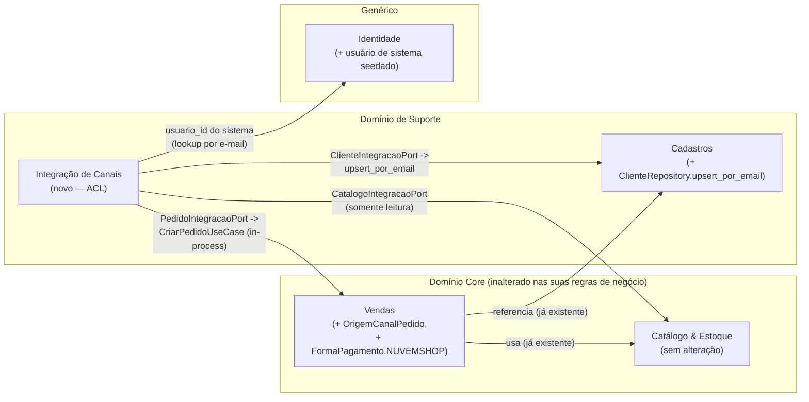
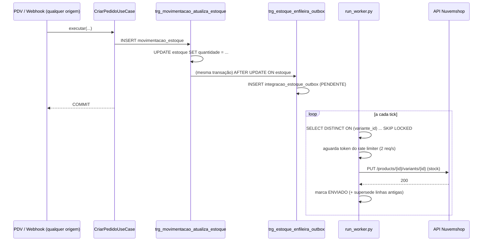
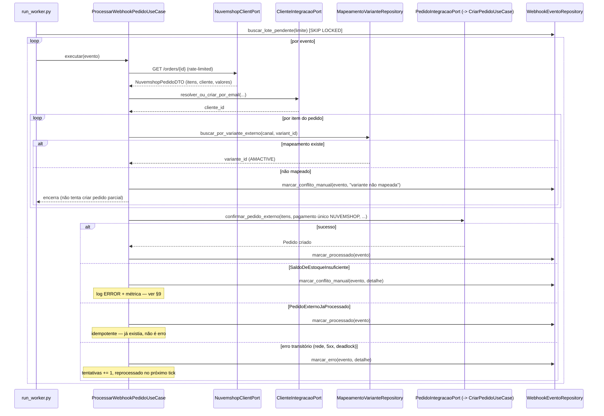
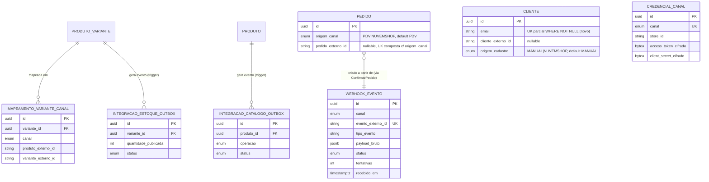

# Design Técnico — Integração AMACTIVE ↔ Nuvemshop, Fase 1

> Este documento **traduz em design implementável** as decisões já avaliadas e
> aprovadas em [`docs/avaliacao-integracao-nuvemshop.md`](./avaliacao-integracao-nuvemshop.md)
> (leia-o primeiro — ele é a fonte das decisões de negócio/arquitetura de alto
> nível; este documento não reabre nenhuma delas). Escopo: exclusivamente a
> **Fase 1** definida em §6 daquele documento — catálogo (AMACTIVE →
> Nuvemshop), estoque (AMACTIVE → Nuvemshop) e recebimento de pedidos/clientes
> (Nuvemshop → AMACTIVE via webhook).
>
> Não é código. É o design de referência para o `data-expert` (migrations
> físicas, a partir de §6 deste documento) e para o `dev-expert-fullcycle`
> (implementação, seguindo a ordem de §8). Segue rigorosamente os padrões já
> em uso no restante do AMACTIVE — toda decisão de estrutura aqui foi
> confirmada lendo o código real de `contexts/vendas`, `contexts/catalogo_estoque`
> e `contexts/cadastros`, não inventada.

---

## 1. Premissas e uma correção em relação à avaliação

Todas as decisões de §7 da avaliação permanecem fechadas: sem Multiple
Locations, catálogo centralizado no AMACTIVE, cliente sempre importado via
payload do pedido (nunca casado manualmente), outbox sobre Postgres sem
broker externo, fila de conflito manual reduzida a log/alerta.

**Uma correção factual, não uma decisão de negócio**: a avaliação (§3.3, §6)
lista como pendente "adicionar campo de imagem/mídia" a `produto`/
`produto_variante`, com estimativa própria ("migration + upload"). Ao ler
`docs/data-model.md` (decisão #13) e o código real
(`contexts/catalogo_estoque/infrastructure/storage.py`,
`ArmazenamentoDeImagemPort`), essa necessidade **já foi resolvida** —
`migrations/000003_produto_imagem` criou a tabela `produto_imagem` (galeria
por produto+cor, com upload em disco via volume Docker/PVC) antes desta
avaliação ter sido revisada. Este design **não** cria nada novo para imagem —
o outbox de catálogo (§4) apenas lê `produto_imagem` através da porta de
leitura já existente. O item de esforço "campo de imagem" da tabela de §6 da
avaliação deve ser considerado consumido/já entregue, não uma pendência da
Fase 1 de integração.

Nenhuma outra decisão da avaliação é alterada. O restante deste documento
resolve **detalhes de implementação que a avaliação deliberadamente deixou em
nível de decisão arquitetural**, não de design concreto (ex.: schema exato de
tabelas, assinatura de portas, quem popula o outbox e como, qual usuário
interno assina pedidos vindos da Nuvemshop).

---

## 2. Bounded Context `integracao_canais`

### 2.1 Por que um contexto novo (recap)

Confirmado em avaliação §4.1: Anti-Corruption Layer isolada, Supporting
Subdomain. O vocabulário externo (rate limit, HMAC, `location_id`,
`payment_status` de 8 estados, IDs da Nuvemshop) nunca deve vazar para
`vendas`, `catalogo_estoque` ou `cadastros`. Este contexto consome os três
via as mesmas portas (Protocols) que eles já publicam — **nunca acessa suas
tabelas físicas**.

### 2.2 Estrutura de pastas

Segue exatamente o padrão de `docs/SDD.md` §1.4, já confirmado nos quatro
contextos existentes (`domain/` sem `sqlalchemy`/`fastapi`; portas em
`domain/repositories.py`; casos de uso em `application/use_cases/`;
adaptadores em `infrastructure/`):

```
apps/api/src/amactive/contexts/integracao_canais/
├── domain/
│   ├── entities.py            # WebhookEvento, MapeamentoVarianteCanal,
│   │                           # IntegracaoEstoqueOutbox, IntegracaoCatalogoOutbox,
│   │                           # CredencialCanal + enums (CanalIntegracao,
│   │                           # StatusWebhookEvento, StatusOutbox, OperacaoCatalogoOutbox)
│   ├── exceptions.py           # AssinaturaWebhookInvalida, VarianteNaoMapeada, ...
│   └── repositories.py         # Protocols — ver §2.5
├── application/
│   ├── dto.py                  # DTOs de entrada/saída dos casos de uso
│   └── use_cases/
│       ├── registrar_webhook.py           # Command — usado pelo controller (resposta <3s)
│       ├── processar_webhook_pedido.py     # Command — usado pelo worker
│       ├── publicar_estoque_canal.py       # Command — usado pelo worker
│       ├── publicar_catalogo_canal.py      # Command — usado pelo worker
│       └── reconciliar_pedidos.py          # Command — job de segurança, ver §5.5
└── infrastructure/
    ├── nuvemshop/
    │   ├── client.py            # ACL: HTTP client + rate limiter + retry — ver §7
    │   ├── mappers.py           # payload Nuvemshop <-> DTOs internos
    │   └── webhook_verifier.py  # HMAC-SHA256 — ver §5.1
    ├── gateways/
    │   ├── vendas_gateway.py     # implementa PedidoIntegracaoPort chamando CriarPedidoUseCase
    │   ├── cadastros_gateway.py  # implementa ClienteIntegracaoPort chamando ClienteRepository
    │   └── catalogo_gateway.py   # implementa CatalogoIntegracaoPort (somente leitura)
    ├── persistence/
    │   ├── models.py             # webhook_evento, mapeamento_variante_canal,
    │   │                          # integracao_estoque_outbox, integracao_catalogo_outbox,
    │   │                          # credencial_canal
    │   └── repositories.py       # implementação concreta dos Protocols de domain/
    └── api/
        ├── router.py             # POST /integracoes/nuvemshop/webhooks (público, HMAC)
        └── schemas.py            # Pydantic — payload mínimo do webhook
```

Diferença deliberada em relação ao esqueleto esboçado na avaliação (§4.1):
lá, `sincronizar_estoque_canal.py` e o client viviam em um único módulo;
aqui, separo `publicar_estoque_canal.py` de `publicar_catalogo_canal.py` (dois
casos de uso, um outbox cada) porque são acionados em cadências e com
payloads diferentes — mantém cada caso de uso pequeno e testável
isoladamente, consistente com o padrão Command/Query já usado em todos os
outros contextos (`CriarProdutoCommand`, `ListarProdutosQuery`, etc.).

### 2.3 Enums

```python
# domain/entities.py

class CanalIntegracao(str, Enum):
    NUVEMSHOP = "NUVEMSHOP"

class StatusWebhookEvento(str, Enum):
    PENDENTE = "PENDENTE"
    PROCESSADO = "PROCESSADO"
    ERRO = "ERRO"
    CONFLITO_MANUAL = "CONFLITO_MANUAL"

class StatusOutbox(str, Enum):
    PENDENTE = "PENDENTE"
    ENVIADO = "ENVIADO"
    ERRO = "ERRO"

class OperacaoCatalogoOutbox(str, Enum):
    CRIAR = "CRIAR"
    ATUALIZAR = "ATUALIZAR"
```

**Nota de Ubiquitous Language**: `CanalIntegracao` (aqui, hoje só
`NUVEMSHOP`) é vocabulário de `integracao_canais` — identifica qual
adaptador/credencial/mapeamento tratou o evento. É um tipo Postgres
**diferente** de `origem_canal_pedido` (`PDV`|`NUVEMSHOP`, ver §3.1) e de
`origem_cadastro_cliente` (`MANUAL`|`NUVEMSHOP`, ver §3.3), que são
vocabulário de `vendas` e `cadastros` respectivamente — cada contexto nomeia
e versiona seu próprio enum mesmo compartilhando o valor literal
`"NUVEMSHOP"` hoje. Isso evita acoplar o schema de Vendas/Cadastros ao ritmo
de evolução de `integracao_canais` (ex.: Fase 3 adicionar Mercado Livre não
deveria forçar migration em três contextos ao mesmo tempo por causa de um
tipo compartilhado).

### 2.4 Entidades de domínio

Todas seguem o padrão já usado em `vendas/domain/entities.py`:
`@dataclass(frozen=True)`, sem métodos de persistência, sem import de
infraestrutura.

#### `WebhookEvento`

```python
@dataclass(frozen=True)
class WebhookEvento:
    id: UUID
    canal: CanalIntegracao
    evento_externo_id: str        # "{canal}:{tipo_evento}:{id_recurso_externo}"
    tipo_evento: str              # ex.: "order/paid"
    id_recurso_externo: str       # o "id" cru do payload — usado no GET de volta
    payload_bruto: dict
    status: StatusWebhookEvento
    tentativas: int
    erro_detalhe: str | None
    recebido_em: datetime
    processado_em: datetime | None
```

**Por que existe**: a Nuvemshop declara explicitamente que entregas
duplicadas podem ocorrer (avaliação §1.4) e que o payload do webhook não traz
o recurso completo. Esta entidade é, ao mesmo tempo, (a) a fila durável que
desacopla a resposta HTTP em <3s da lógica de negócio, e (b) o registro de
auditoria de **tudo** que a Nuvemshop já tentou entregar, processado ou não —
essencial para depurar "por que este pedido não apareceu no AMACTIVE".

**Invariante**: `evento_externo_id` é construído pelo `mappers.py` como
`f"{canal.value}:{tipo_evento}:{id_recurso_externo}"`, não é o `id` bruto do
payload sozinho — dois eventos diferentes sobre o mesmo recurso (`order/paid`
e depois, na Fase 2, `order/cancelled`) do mesmo pedido não podem colidir na
constraint `UNIQUE`.

#### `MapeamentoVarianteCanal`

```python
@dataclass(frozen=True)
class MapeamentoVarianteCanal:
    id: UUID
    variante_id: UUID           # produto_variante.id (AMACTIVE)
    canal: CanalIntegracao
    produto_externo_id: str     # Nuvemshop product_id
    variante_externo_id: str    # Nuvemshop variant_id
    criado_em: datetime
    atualizado_em: datetime | None
```

**Por que existe**: avaliação §1.2/§1.6 já identificou que SKU **não** é
garantidamente único na Nuvemshop — o mapeamento correto é por
`product_id`+`variant_id`, nunca por SKU cru. Esta tabela é a fonte da
verdade dessa correspondência, criada no momento da primeira publicação (não
mais "matching" de catálogo legado, ver avaliação §3.3).

**Invariantes**: `UNIQUE(variante_id, canal)` (uma variante AMACTIVE tem no
máximo um mapeamento por canal) e `UNIQUE(canal, variante_externo_id)` (um
`variant_id` da Nuvemshop nunca mapeia para duas variantes AMACTIVE
diferentes — impede corrupção de estoque cruzado por bug de mapeamento).

#### `IntegracaoEstoqueOutbox`

```python
@dataclass(frozen=True)
class IntegracaoEstoqueOutbox:
    id: UUID
    variante_id: UUID
    quantidade_publicada: int    # snapshot do saldo no momento do enfileiramento
    status: StatusOutbox
    tentativas: int
    proxima_tentativa_em: datetime | None
    erro_detalhe: str | None
    criado_em: datetime
    processado_em: datetime | None
```

**Por que existe**: desacopla a escrita de estoque (rápida, transacional, já
protegida pelo trigger `fn_aplicar_movimentacao_estoque`) do push HTTP lento e
sujeito a rate limit (2 req/s) para a Nuvemshop. Sem isso, `ConfirmarPedido`
teria que fazer uma chamada HTTP síncrona à Nuvemshop dentro da transação de
venda — inaceitável (latência de rede dentro do caminho crítico do PDV, e
acoplamento de disponibilidade: uma Nuvemshop fora do ar travaria vendas
locais).

#### `IntegracaoCatalogoOutbox`

```python
@dataclass(frozen=True)
class IntegracaoCatalogoOutbox:
    id: UUID
    produto_id: UUID
    operacao: OperacaoCatalogoOutbox
    status: StatusOutbox
    tentativas: int
    proxima_tentativa_em: datetime | None
    erro_detalhe: str | None
    criado_em: datetime
    processado_em: datetime | None
```

**Por que existe**: mesma razão do outbox de estoque, para produto/variante/
preço/imagem. Granularidade é **produto**, não variante — a Nuvemshop modela
variante como sub-recurso do produto (a criação em lote de variantes já
existe no AMACTIVE desde §3.4 da avaliação, e a API da Nuvemshop também
aninha variantes na publicação do produto) — republicar o produto inteiro
(todas as variantes + galeria de imagens da cor) é mais simples e correto do
que tentar sincronizar campo a campo.

#### `CredencialCanal`

```python
@dataclass(frozen=True)
class CredencialCanal:
    id: UUID
    canal: CanalIntegracao
    store_id: str
    access_token_cifrado: bytes    # pgp_sym_encrypt — nunca em texto puro em memória além do necessário
    client_secret_cifrado: bytes
    criado_em: datetime
    atualizado_em: datetime | None
```

**Por que existe**: o app privado da Nuvemshop usa um token permanente de
altíssimo privilégio (avaliação §1.1, §1.6) — nunca pode ficar em texto puro
em repouso. `UNIQUE(canal)` na Fase 1 (uma única loja por canal); ver §7.2
para a estratégia de criptografia (reaproveita `pgcrypto`, já habilitado no
banco — não introduz dependência Python nova).

### 2.5 Portas (`domain/repositories.py`)

Protocols publicados por `integracao_canais` para seus próprios casos de uso
— a implementação concreta vive em `infrastructure/`.

```python
class NuvemshopClientPort(Protocol):
    async def buscar_pedido(self, pedido_externo_id: str) -> NuvemshopPedidoDTO: ...
    async def criar_produto(self, produto: ProdutoParaPublicacao) -> PublicacaoResultado: ...
    async def atualizar_produto(
        self, produto_externo_id: str, produto: ProdutoParaPublicacao
    ) -> PublicacaoResultado: ...
    async def atualizar_estoque_variante(
        self, variante_externo_id: str, quantidade: int
    ) -> None: ...

class WebhookVerifierPort(Protocol):
    def verificar(self, *, corpo_bruto: bytes, assinatura: str, client_secret: str) -> bool: ...

class WebhookEventoRepository(Protocol):
    async def registrar_se_novo(
        self, *, canal: CanalIntegracao, tipo_evento: str, id_recurso_externo: str,
        payload_bruto: dict,
    ) -> WebhookEvento | None:
        """INSERT ... ON CONFLICT (evento_externo_id) DO NOTHING — retorna None se duplicado."""
        ...
    async def buscar_lote_pendente(self, *, limite: int) -> list[WebhookEvento]:
        """SELECT ... FOR UPDATE SKIP LOCKED, status IN ('PENDENTE', 'ERRO')."""
        ...
    async def marcar_processado(self, evento_id: UUID) -> None: ...
    async def marcar_erro(self, evento_id: UUID, *, detalhe: str) -> None: ...
    async def marcar_conflito_manual(self, evento_id: UUID, *, detalhe: str) -> None: ...

class MapeamentoVarianteRepository(Protocol):
    async def buscar_por_variante_externo(
        self, *, canal: CanalIntegracao, variante_externo_id: str
    ) -> MapeamentoVarianteCanal | None: ...
    async def buscar_por_variante_id(
        self, *, variante_id: UUID, canal: CanalIntegracao
    ) -> MapeamentoVarianteCanal | None: ...
    async def upsert(
        self, *, variante_id: UUID, canal: CanalIntegracao,
        produto_externo_id: str, variante_externo_id: str,
    ) -> MapeamentoVarianteCanal: ...

class IntegracaoEstoqueOutboxRepository(Protocol):
    async def buscar_lote_pendente_coalescido(self, *, limite: int) -> list[IntegracaoEstoqueOutbox]:
        """DISTINCT ON (variante_id) ... ORDER BY variante_id, criado_em DESC — ver §4.2."""
        ...
    async def marcar_enviado(self, outbox_id: UUID, *, superseded_ids: list[UUID]) -> None: ...
    async def marcar_erro_com_retry(
        self, outbox_id: UUID, *, detalhe: str, proxima_tentativa_em: datetime
    ) -> None: ...

class IntegracaoCatalogoOutboxRepository(Protocol):
    # mesma forma de IntegracaoEstoqueOutboxRepository, chave produto_id
    ...

class CredencialCanalRepository(Protocol):
    async def buscar_token_decifrado(self, canal: CanalIntegracao) -> CredencialDecifrada | None: ...

# Portas consumidas de outros contextos — ver §3
class PedidoIntegracaoPort(Protocol):
    async def confirmar_pedido_externo(
        self, *, cliente_id: UUID, itens: list[ItemPedidoInput], pagamentos: list[PagamentoInput],
        origem_canal: "OrigemCanalPedido", pedido_externo_id: str,
    ) -> "Pedido": ...

class ClienteIntegracaoPort(Protocol):
    async def resolver_ou_criar_por_email(
        self, *, email: str, nome: str, cpf_cnpj: str | None, telefone: str | None,
        endereco: EnderecoExterno | None, cliente_externo_id: str,
    ) -> UUID: ...

class CatalogoIntegracaoPort(Protocol):
    async def buscar_produto_para_publicacao(self, produto_id: UUID) -> ProdutoParaPublicacao: ...
    async def buscar_saldo_estoque(self, variante_id: UUID) -> int: ...
```

### 2.6 Exceções de domínio

Seguem o padrão de `shared_kernel/exceptions.py` (`DomainError` +
`status_code`/`type_slug`/`title`), igual a todos os outros contextos:

```python
# domain/exceptions.py
class AssinaturaWebhookInvalida(NaoAutorizado):
    """HMAC não confere com client_secret da credencial ativa."""

class VarianteNaoMapeada(ErroDeValidacao):
    """Item de pedido externo referencia um variant_id sem MapeamentoVarianteCanal."""

class CredencialCanalAusente(EntidadeNaoEncontrada):
    """Nenhuma CredencialCanal configurada para o canal — worker não pode operar."""

class PedidoExternoJaProcessado(ConflitoDeEstado):
    """UNIQUE(origem_canal, pedido_externo_id) violado — defesa em profundidade, ver §3.1."""
```

---

## 3. Integração com os contextos existentes

### 3.1 Vendas — reaproveitamento estrito de `CriarPedidoUseCase`

Mudança aditiva e mínima (backward-compatible) em `contexts/vendas`:

**`domain/entities.py`** — novo enum e dois campos novos em `Pedido`:

```python
class OrigemCanalPedido(str, Enum):
    PDV = "PDV"
    NUVEMSHOP = "NUVEMSHOP"

@dataclass(frozen=True)
class Pedido:
    # ... campos existentes, inalterados ...
    origem_canal: OrigemCanalPedido
    pedido_externo_id: str | None
```

**`application/use_cases/criar_pedido.py`** — dois novos parâmetros com
default, todos os call sites existentes (router de PDV) continuam
funcionando sem alteração:

```python
async def executar(
    self,
    *,
    cliente_id: UUID | None,
    desconto: Decimal,
    observacao: str | None,
    itens: list[ItemPedidoInput],
    pagamentos: list[PagamentoInput],
    usuario_id: UUID,
    origem_canal: OrigemCanalPedido = OrigemCanalPedido.PDV,   # novo
    pedido_externo_id: str | None = None,                        # novo
) -> Pedido:
```

`PedidoRepository.criar(...)` e `PedidoModel` recebem os mesmos dois campos
(ver §6.6). Nenhuma linha de `vendas/infrastructure/api/router.py`
(endpoint `POST /pedidos` do PDV) precisa mudar.

**Gap não coberto pela avaliação, resolvido aqui**: `PagamentosNaoConferem`
exige que a soma dos pagamentos declarados seja igual a `valor_total`
(`vendas/application/use_cases/criar_pedido.py`, linha 84-89). Um pedido
Nuvemshop chega **já pago** no ato do webhook `order/paid` — não há forma de
paga em dinheiro/PIX/cartão físico do MVP (`FormaPagamento` hoje é fechado em
`DINHEIRO|PIX|CARTAO_DEBITO|CARTAO_CREDITO`). Proposta: **adicionar um valor
novo ao enum existente**, `FormaPagamento.NUVEMSHOP`, representando "pago
externamente via checkout do canal — detalhamento por método (PIX/cartão
específico do comprador) não é replicado no MVP". `PedidoIntegracaoPort`
sempre cria um único `PagamentoInput(forma_pagamento=FormaPagamento.NUVEMSHOP,
valor=valor_total_do_pedido)`. Isso satisfaz o invariante existente sem
reescrevê-lo, e é uma alteração aditiva ao tipo `forma_pagamento` do Postgres
(`ALTER TYPE forma_pagamento ADD VALUE 'NUVEMSHOP'`) — não destrutiva.

**Gap de `usuario_id` (obrigatório, `NOT NULL`, "quem vendeu"), resolvido
aqui**: um pedido do worker de webhook não tem um `usuario` operador por trás.
A avaliação não define isso explicitamente. Proposta, deliberadamente sem
alterar o schema de `pedido`/`movimentacao_estoque` (evitar tornar
`usuario_id` nullable, o que enfraqueceria a auditoria para o caso comum de
PDV): **um usuário de sistema seedado**, `papel = VENDEDOR`, `ativo = false`
(nunca deve logar — `ativo=false` é uma segunda camada de defesa mesmo que a
senha aleatória vaze, já que `get_current_user` rejeita usuários inativos;
irrelevante para a chamada direta ao caso de uso, que não passa por
`get_current_user`). Ver §8 (script `bootstrap_usuario_integracao.py`, mesmo
padrão de `bootstrap_admin.py`) e §3.4 (diagrama). O worker resolve o `id`
desse usuário uma vez, por e-mail bem-conhecido
(`integracao.nuvemshop@sistema.amactive.internal`), no startup, e mantém em
cache de processo — evita hardcodar um UUID que mudaria entre ambientes (dev/
staging/prod geram UUIDs diferentes via `gen_random_uuid()`).

**Defesa em profundidade contra duplicidade de pedido**: além da
idempotência de `webhook_evento.evento_externo_id` (§2.4), adiciono
`UNIQUE (origem_canal, pedido_externo_id) WHERE pedido_externo_id IS NOT NULL`
em `pedido` (§6.6). Protege contra um segundo caminho de criação do mesmo
pedido externo (ex.: o job de reconciliação de §3.5/§5.5 tentando reprocessar
algo que o webhook já criou) — se violada, o gateway traduz a
`IntegrityError` do Postgres em `PedidoExternoJaProcessado` (§2.6), e o
worker trata isso como sucesso idempotente (marca o `webhook_evento` como
`PROCESSADO`), não como erro.

### 3.2 Catálogo & Estoque — leitura para publicação, sem escrita cruzada

`CatalogoIntegracaoPort` (§2.5) é implementado por
`infrastructure/gateways/catalogo_gateway.py` **só leitura**: instancia
`ProdutoRepository`/`VarianteRepository`/`ImagemRepository`/`EstoqueRepository`
de `catalogo_estoque` (os mesmos Protocols já publicados por aquele contexto,
usados hoje por seus próprios casos de uso) e monta o DTO
`ProdutoParaPublicacao` (nome, descrição, preço/promoção já calculados,
variantes com sku/tamanho/cor, galeria de imagens por cor). Nenhuma escrita —
`integracao_canais` nunca chama `ProdutoRepository.criar/atualizar` nem
`MovimentacaoRepository.registrar`. Isso é **exatamente** o padrão que
`Relatórios` já usa (avaliação §4.1: "consome Vendas e Catálogo & Estoque
como Relatórios já consome hoje").

A baixa/ajuste de estoque, mesmo quando originada por um pedido Nuvemshop,
**sempre** passa por `EstoquePort.registrar_saida_venda` dentro de
`CriarPedidoUseCase` (via `CatalogoEstoqueGateway`, já existente e
inalterado) — o mesmo caminho que o PDV usa, exatamente como determinado pela
avaliação §2.1/§3.2. `integracao_canais` nunca chama estoque diretamente.

### 3.3 Cadastros — resolução de cliente por e-mail

Extensão mínima e aditiva de `cadastros/domain/repositories.py`
(`ClienteRepository`):

```python
class ClienteRepository(Protocol):
    # ... métodos existentes, inalterados ...
    async def upsert_por_email(
        self, *, email: str, nome: str, cpf_cnpj: str | None, telefone: str | None,
        endereco_logradouro: str | None, endereco_cidade: str | None,
        endereco_uf: str | None, endereco_cep: str | None,
        cliente_externo_id: str, origem_cadastro: "OrigemCadastroCliente",
    ) -> Cliente: ...
```

Implementado como `INSERT ... ON CONFLICT (email) DO UPDATE` (exige o novo
índice único parcial `uq_cliente_email_nao_nulo` — ver §6.6), não um
"buscar depois criar/atualizar" em dois passos — evita condição de corrida
entre réplicas do worker (§4.2 já usa `SKIP LOCKED` pensando em múltiplas
réplicas; um upsert em dois passos quebraria sob concorrência real).

**Detalhe de correção não coberto pela avaliação**: no `ON CONFLICT`, o
upsert **nunca** sobrescreve `origem_cadastro` nem `cliente_externo_id` de um
cliente que já existia (ex.: cadastrado manualmente no PDV, que depois compra
pela Nuvemshop usando o mesmo e-mail) — `origem_cadastro` reflete como o
registro **nasceu**, não o último canal que o tocou (fiel à linguagem da
própria avaliação, §3.5: "cada pedido importado atualiza os dados do cliente
... upsert simples", não "recategoriza a origem"). `cliente_externo_id` é
preenchido via `COALESCE(cliente.cliente_externo_id, EXCLUDED.cliente_externo_id)`
— só grava se ainda estiver vazio, nunca substitui um valor diferente já
gravado (defesa contra o caso raro de dois `customer_id` distintos da
Nuvemshop compartilharem e-mail, o que não deveria acontecer mas não deve
corromper o registro se acontecer).

`cadastros/domain/entities.py` (`Cliente`) recebe os dois campos novos
(`cliente_externo_id: str | None`, `origem_cadastro: OrigemCadastroCliente`),
com o enum `OrigemCadastroCliente(MANUAL|NUVEMSHOP)` também definido em
`cadastros/domain/entities.py` (mesma nuance de Ubiquitous Language de §2.3).

`ClienteIntegracaoPort` (§2.5) é implementado por
`infrastructure/gateways/cadastros_gateway.py`, chamando exclusivamente
`ClienteRepository.upsert_por_email`.

### 3.4 Diagrama de dependências entre contextos



Nenhuma seta entra em `IC` a partir de `VE`/`CE`/`CA` — a dependência é
sempre de `integracao_canais` para os contextos Core, nunca o inverso,
preservando o isolamento de ACL da avaliação §4.1.

---

## 4. Fluxo de Outbox (estoque e catálogo)

### 4.1 Como é populado: trigger de banco, não evento de domínio in-process

**Decisão de design**: ambos os outbox são populados por **triggers de
banco** (`AFTER UPDATE`/`AFTER INSERT`), não por eventos de domínio
publicados pela camada de aplicação Python.

| Outbox | Trigger | Tabela/evento de origem |
|---|---|---|
| `integracao_estoque_outbox` | `trg_estoque_enfileira_outbox` → `fn_enfileirar_outbox_estoque()` | `AFTER UPDATE ON estoque`, `WHEN (OLD.quantidade IS DISTINCT FROM NEW.quantidade)` |
| `integracao_catalogo_outbox` | `trg_produto_enfileira_outbox` → `fn_enfileirar_outbox_catalogo()` | `AFTER INSERT OR UPDATE ON produto` |
| `integracao_catalogo_outbox` | `trg_variante_enfileira_outbox` → `fn_enfileirar_outbox_catalogo_variante()` | `AFTER INSERT OR UPDATE ON produto_variante` (enfileira o `produto_id` pai) |
| `integracao_catalogo_outbox` | `trg_imagem_enfileira_outbox` → `fn_enfileirar_outbox_catalogo_imagem()` | `AFTER INSERT OR UPDATE OR DELETE ON produto_imagem` (enfileira o `produto_id`, usa `OLD.produto_id` no `DELETE`) |

**Por que trigger, não evento de domínio in-process (justificativa
arquitetural)**:

1. **Garantia transacional real ("transactional outbox" de verdade)**: o
   padrão outbox exige que a escrita do evento aconteça na **mesma
   transação** que a mudança de estado que ele representa. Neste projeto, a
   escrita real de `estoque.quantidade` **não acontece em código Python** —
   é o trigger `fn_aplicar_movimentacao_estoque` (já existente) quem faz o
   `UPDATE`. Um evento de domínio publicado depois de `session.commit()` na
   camada de aplicação correria o risco clássico de "commitou o pedido, o
   processo caiu antes de publicar o evento" — inconsistência silenciosa e
   indetectável entre AMACTIVE e Nuvemshop. Um segundo trigger, disparado
   pela mesma escrita, elimina essa janela por construção.
2. **Zero mudança de código nos contextos Core para o outbox de estoque**:
   `criar_pedido.py`, `cancelar_pedido.py`, `estoque_use_cases.py` (ajuste
   manual) continuam sem saber que `integracao_canais` existe — qualquer
   caminho de código presente ou futuro que altere `estoque.quantidade`
   (mesmo um script administrativo direto no banco) automaticamente
   alimenta o outbox, sem exigir que cada caso de uso lembre de publicar um
   evento.
3. **Consistência entre os dois outbox**: aplicar a mesma estratégia
   (trigger) para catálogo evita ter dois mecanismos de propagação
   diferentes (um trigger, um in-process) para o mesmo padrão conceitual —
   mais simples de operar, documentar e testar.

Custo aceito desta escolha: lógica de enfileiramento vive em SQL/PLpgSQL, não
em Python — consistente com o resto da estratégia de concorrência do projeto
(ADR já registrada em `docs/data-model.md` § Estratégia de Concorrência, que
também resolve tudo via trigger). O `data-expert` implementa as quatro
funções/triggers acima como parte da migration de §6.

### 4.2 Consumo pelo worker: coalescing + `SKIP LOCKED`

Cada outbox pode acumular múltiplas linhas `PENDENTE` para a **mesma**
`variante_id`/`produto_id` (ex.: três vendas da mesma variante em sequência
rápida, ou o operador editando um produto três vezes antes do worker rodar).
Publicar cada linha isoladamente desperdiçaria rate limit (2 req/s) com
chamadas redundantes — só o **último** estado importa (o valor publicado é
sempre o saldo/produto absoluto atual, nunca um delta, conforme avaliação
§3.2).

Consulta de coalescing (`buscar_lote_pendente_coalescido`):

```sql
SELECT DISTINCT ON (variante_id) *
FROM integracao_estoque_outbox
WHERE status IN ('PENDENTE', 'ERRO')
  AND (proxima_tentativa_em IS NULL OR proxima_tentativa_em <= now())
ORDER BY variante_id, criado_em DESC
FOR UPDATE SKIP LOCKED
LIMIT :limite;
```

Ao processar com sucesso a linha mais recente de uma `variante_id`, o worker
marca **todas** as linhas `PENDENTE` mais antigas daquela `variante_id` como
`ENVIADO` também (superseded — nunca chegaram a ser publicadas
individualmente, mas o estado que elas representavam já foi superado pela
mais recente, que foi enviada). Mesmo padrão para `produto_id` no outbox de
catálogo.

`FOR UPDATE SKIP LOCKED` é o mesmo mecanismo sugerido pela avaliação §3.5 —
permite rodar múltiplas réplicas do worker sem duplicar processamento
(nenhuma réplica trava esperando o lock de outra; simplesmente pega o próximo
lote livre).

### 4.3 Idempotência e retry

- **Idempotência do lado Nuvemshop**: como o valor publicado é sempre
  absoluto (saldo atual, produto completo), reenviar o mesmo payload é
  inofensivo — não há necessidade de deduplicação no lado da API externa,
  diferente do webhook de entrada.
- **Retry**: erro de rede/5xx/`429` → `marcar_erro_com_retry`, calculando
  `proxima_tentativa_em` com backoff exponencial + jitter (mesma política já
  registrada em `docs/SDD.md` §5.2 para futuras integrações externas):
  tentativa 1 → 2s, tentativa 2 → 4s, tentativa 3 → 8s (± 20% jitter), até um
  teto de tentativas (`_MAX_TENTATIVAS_OUTBOX = 8`, ≈ alguns minutos de
  janela total — adequado para o volume baixo de uma loja). Esgotadas as
  tentativas, `status = ERRO` definitivo — fica visível para o alerta de
  observabilidade (§9), não trava o worker (`WHERE status IN ('PENDENTE',
  'ERRO')` só reconsidera `ERRO` enquanto `proxima_tentativa_em` está no
  futuro; depois do teto, uma flag adicional `tentativas >= 8` exclui a
  linha da fila ativa até intervenção manual/reenfileiramento).
- **Erros 4xx (exceto 429)** não são retentados automaticamente — mesmo
  princípio já fixado em `docs/SDD.md` §5.2 ("nunca para 4xx"): um payload
  malformado não se corrige sozinho reenviando.

### 4.4 Throttling — rate limiter local

Ver contrato completo do client em §7. Resumo: um **token bucket**
compartilhado por todo o processo worker (`rate=2.0/s`, `capacity=40`,
espelhando exatamente os limites documentados na avaliação §1.5), que todo
método de `NuvemshopClientPort` adquire antes de qualquer chamada HTTP. Isso
cobre tanto o outbox de estoque quanto o de catálogo quanto as chamadas
`GET /orders/{id}` do processamento de webhook — **um único limiter para
todo o processo**, porque o limite da Nuvemshop é por loja+app, não por tipo
de operação (avaliação §1.5).

### 4.5 Processo do worker — deployment

Processo próprio, não uma `BackgroundTask` dentro do processo `uvicorn` da
API. Justificativa:

- **Isolamento de falha**: uma Nuvemshop lenta/fora do ar (aguardando rate
  limiter, retry com backoff) nunca deve competir por recursos com o
  processo que atende `POST /pedidos` do PDV nem o endpoint de webhook (que
  tem SLA de 3s).
- **Escala independente**: o worker pode rodar com `SKIP LOCKED` em N
  réplicas sem replicar a API inteira; hoje 1 réplica é suficiente (volume
  baixo, avaliação §7).
- **Simplicidade**: evita interações complexas entre o event loop do
  `uvicorn`/FastAPI e um loop de polling de longa duração competindo pelo
  mesmo processo.

Novo script `apps/api/src/amactive/scripts/run_worker.py` (mesmo padrão de
`apply_migrations.py`/`bootstrap_admin.py`): loop assíncrono com tick curto
(ex.: 2s), a cada tick processa um lote pequeno de cada fila (`webhook_evento`
pendente, `integracao_estoque_outbox` coalescido, `integracao_catalogo_outbox`
coalescido), captura `SIGTERM` para desligar de forma graciosa (compatível
com rollout do Kubernetes). Localmente, novo serviço `worker` em
`docker-compose.yml` (mesma imagem da API, `command` diferente). Em produção,
novo `Deployment` `amactive-worker` em `infra/k8s/` (mesma imagem, sem
`Service`/porta exposta) — fora do escopo deste documento detalhar o
manifesto, mas é um item explícito da ordem de implementação (§8).

### 4.6 Diagrama de sequência — push de estoque



---

## 5. Endpoint de Webhook

### 5.1 Recepção — HMAC e resposta rápida

```
POST /integracoes/nuvemshop/webhooks
```

Único endpoint público (sem JWT) do AMACTIVE — exceção explícita à regra
`security: [bearerAuth: []]` global do `openapi.yaml` (documentar
`security: []` só nesta rota). Passos do controller (thin, sem lógica de
negócio, mesmo estilo de `vendas/infrastructure/api/router.py`):

1. Lê o corpo **bruto** (`await request.body()`) — a verificação HMAC precisa
   dos bytes exatos recebidos, antes de qualquer parsing Pydantic.
2. Busca a `CredencialCanal` ativa (`CredencialCanalRepository.buscar_token_decifrado`)
   para obter o `client_secret` decifrado.
3. `WebhookVerifierPort.verificar(corpo_bruto, header["x-linkedstore-hmac-sha256"], client_secret)`
   — `hmac.compare_digest(hmac.new(secret, corpo_bruto, hashlib.sha256).hexdigest(), assinatura)`.
   Falha → `AssinaturaWebhookInvalida` (401), sem tocar o banco.
4. Parse do payload mínimo (`{store_id, event, id}` — `schemas.py`,
   `WebhookRecebidoRequest`).
5. `RegistrarWebhookCommand.executar(...)` → `WebhookEventoRepository.registrar_se_novo(...)`
   (`INSERT ... ON CONFLICT (evento_externo_id) DO NOTHING`).
6. Responde **`200`** imediatamente, independentemente de o evento ser novo
   ou duplicado — nenhum processamento de negócio acontece na requisição.
   Cumpre a janela de 3s exigida pela Nuvemshop (avaliação §1.4) por
   construção (a única operação é um `INSERT`/`SELECT` simples).

### 5.2 Idempotência

Garantida em duas camadas, como já detalhado: `webhook_evento.evento_externo_id
UNIQUE` (não processa o mesmo evento duas vezes) e `pedido.(origem_canal,
pedido_externo_id) UNIQUE` (não cria o mesmo pedido duas vezes mesmo que,
por algum bug futuro, o mesmo pedido externo chegue via dois eventos
diferentes — ex.: reconciliação + webhook simultâneos).

### 5.3 Processamento assíncrono — `ProcessarWebhookPedidoUseCase`

Executado pelo worker (§4.5), um evento por vez, para `tipo_evento ==
"order/paid"` (único tipo assinado na Fase 1 — `order/cancelled` e
`product/updated` ficam para a Fase 2, conforme avaliação §6):



Passo a passo textual (equivalente ao diagrama, para quem lê antes de
implementar):

1. `GET /orders/{id}` via `NuvemshopClientPort.buscar_pedido` — o payload do
   webhook não traz os itens (avaliação §1.4), esta chamada é obrigatória.
2. `ClienteIntegracaoPort.resolver_ou_criar_por_email` com os dados do
   comprador vindos do pedido (nome, e-mail, documento, endereço) — upsert
   simples, conforme §3.3.
3. Para cada item: resolve `variant_id` externo → `variante_id` AMACTIVE via
   `MapeamentoVarianteRepository`. Se **qualquer** item não tiver mapeamento,
   o evento inteiro vai para `CONFLITO_MANUAL` — não cria um pedido parcial
   (mesma filosofia de "tudo ou nada" de `CriarPedidoUseCase`).
4. Monta `ItemPedidoInput` (mesmo DTO que o PDV usa) e um único
   `PagamentoInput(forma_pagamento=NUVEMSHOP, valor=valor_total)`.
5. Chama `PedidoIntegracaoPort.confirmar_pedido_externo`, que por baixo
   constrói e executa `CriarPedidoUseCase` com `usuario_id` do usuário de
   sistema (§3.1), `origem_canal=NUVEMSHOP`, `pedido_externo_id=<id>`.
6. Trata os três desfechos possíveis exatamente como no diagrama:
   sucesso → `PROCESSADO`; estoque insuficiente → `CONFLITO_MANUAL` (ver
   §5.4); erro transitório → `ERRO` com `tentativas += 1`, reprocessado no
   próximo tick (mesmo padrão de retry do outbox, §4.3).

### 5.4 Conflito manual

Conforme avaliação §3.2/§4.3/§5 — risco reclassificado como hipotético sem
segundo canal ativo, mitigação reduzida a log + alerta (não uma fila
operacional dedicada nesta fase). Design mínimo suficiente: `WebhookEvento`
com `status = CONFLITO_MANUAL` e `erro_detalhe` preenchido já **é** a fila —
não precisa de tabela nova. Observabilidade (§9) expõe uma métrica
(`webhook_evento_conflito_manual_total`) e um log estruturado nível `ERROR`
no momento em que o status é marcado; consulta manual (`SELECT * FROM
webhook_evento WHERE status = 'CONFLITO_MANUAL'`) é suficiente para operação
nesta fase. Painel/reprocessamento manual pela UI é explicitamente Fase 2
(avaliação §6).

### 5.5 Job de reconciliação — nota de escopo

A avaliação (§3.5, §5) descreve um "job de reconciliação diário" como
mitigação para o risco "webhook nunca chega" (AMACTIVE fora do ar por mais
de 48h). **Importante**: esse item **não aparece como linha própria** na
tabela de estimativa de esforço da Fase 1 (§6 da avaliação) — só é citado na
tabela de riscos (§5). Recomendação deste design: tratar
`reconciliar_pedidos.py` (já reservado na estrutura de pastas, §2.2) como
**stretch goal de baixa prioridade dentro da Fase 1**, implementável só
depois que webhook + outbox estiverem estáveis, sem bloquear o restante do
plano de §8. Quando implementado, reaproveita integralmente o mesmo
`ProcessarWebhookPedidoUseCase` e a mesma proteção de idempotência
(`pedido.UNIQUE(origem_canal, pedido_externo_id)`) — não é um caminho de
código novo, é apenas uma segunda forma de descobrir `pedido_externo_id`
candidatos (via `GET /orders?since=...` em vez de via webhook).

---

## 6. Schema de dados — modelo lógico

> Modelo lógico para o `data-expert` produzir a migration física (sugestão:
> `migrations/000005_integracao_nuvemshop.up.sql`/`.down.sql`, um único
> arquivo cobrindo todas as tabelas/enums/colunas/triggers desta fase, mesmo
> padrão de `000001_initial_schema`). Convenções idênticas às já fixadas em
> `docs/data-model.md`: UUID via `gen_random_uuid()`, enums nativos do
> Postgres, `timestamptz`, `ON DELETE` explícito por FK.

### 6.1 Novos tipos ENUM

```
canal_integracao          NUVEMSHOP
status_webhook_evento     PENDENTE | PROCESSADO | ERRO | CONFLITO_MANUAL
status_outbox             PENDENTE | ENVIADO | ERRO
operacao_catalogo_outbox  CRIAR | ATUALIZAR
origem_canal_pedido       PDV | NUVEMSHOP              -- novo enum em vendas
origem_cadastro_cliente   MANUAL | NUVEMSHOP            -- novo enum em cadastros
```

Mais uma alteração **aditiva** a um enum já existente:
```sql
ALTER TYPE forma_pagamento ADD VALUE 'NUVEMSHOP';
```
(Não destrutiva — `ALTER TYPE ... ADD VALUE` não requer `BEGIN/COMMIT`
convencional em versões recentes do Postgres 16 fora de uma transação com
outras alterações de enum na mesma migration; o `data-expert` deve confirmar
se precisa rodar em statement isolado.)

### 6.2 `webhook_evento`

| Coluna | Tipo | Constraint |
|---|---|---|
| `id` | `uuid` | PK, default `gen_random_uuid()` |
| `canal` | `canal_integracao` | not null |
| `evento_externo_id` | `varchar(255)` | `UNIQUE`, not null |
| `tipo_evento` | `varchar(50)` | not null |
| `id_recurso_externo` | `varchar(100)` | not null |
| `payload_bruto` | `jsonb` | not null |
| `status` | `status_webhook_evento` | not null, default `'PENDENTE'` |
| `tentativas` | `int` | not null, default `0` |
| `erro_detalhe` | `text` | nullable |
| `recebido_em` | `timestamptz` | not null, default `now()` |
| `processado_em` | `timestamptz` | nullable |

Índices: `UNIQUE(evento_externo_id)` (já cobre a constraint);
`idx_webhook_evento_fila ON webhook_evento(status, recebido_em) WHERE status
IN ('PENDENTE','ERRO')` (leitura do worker); `idx_webhook_evento_conflito ON
webhook_evento(status) WHERE status = 'CONFLITO_MANUAL'` (parcial, para a
query de alerta de §5.4/§9, mantém o índice minúsculo).

### 6.3 `mapeamento_variante_canal`

| Coluna | Tipo | Constraint |
|---|---|---|
| `id` | `uuid` | PK |
| `variante_id` | `uuid` | FK → `produto_variante.id`, not null, `ON DELETE RESTRICT` |
| `canal` | `canal_integracao` | not null |
| `produto_externo_id` | `varchar(100)` | not null |
| `variante_externo_id` | `varchar(100)` | not null |
| `criado_em` | `timestamptz` | default `now()` |
| `atualizado_em` | `timestamptz` | nullable, trigger `fn_atualizar_timestamp` reaproveitado |

Constraints: `UNIQUE(variante_id, canal)`; `UNIQUE(canal, variante_externo_id)`.
`ON DELETE RESTRICT` pelo mesmo motivo de `item_pedido.variante_id` em
`docs/data-model.md` (histórico de integração nunca pode ficar órfão;
descontinuar uma variante usa `ativo=false`, não exclusão física).

Índices: as duas `UNIQUE` já cobrem os acessos principais; adicional
`idx_mapeamento_produto_externo ON mapeamento_variante_canal(produto_externo_id)`
para consultas por produto (útil já na Fase 2, ao tratar `product/updated`).

### 6.4 `integracao_estoque_outbox`

| Coluna | Tipo | Constraint |
|---|---|---|
| `id` | `uuid` | PK |
| `variante_id` | `uuid` | FK → `produto_variante.id`, not null, `ON DELETE CASCADE` |
| `quantidade_publicada` | `int` | not null |
| `status` | `status_outbox` | not null, default `'PENDENTE'` |
| `tentativas` | `int` | not null, default `0` |
| `proxima_tentativa_em` | `timestamptz` | nullable |
| `erro_detalhe` | `text` | nullable |
| `criado_em` | `timestamptz` | default `now()` |
| `processado_em` | `timestamptz` | nullable |

`ON DELETE CASCADE` (não `RESTRICT`): se a variante for fisicamente removida
(caso raro sem histórico, mesmo cenário já descrito em `estoque.variante_id`
em `docs/data-model.md` decisão #2), a fila de publicação associada perde o
sentido — mesmo padrão já adotado ali.

Índices: `idx_estoque_outbox_fila ON integracao_estoque_outbox(status,
proxima_tentativa_em) WHERE status IN ('PENDENTE','ERRO')`;
`idx_estoque_outbox_coalescing ON integracao_estoque_outbox(variante_id,
criado_em DESC)` (suporta a query `DISTINCT ON` de §4.2).

### 6.5 `integracao_catalogo_outbox`

| Coluna | Tipo | Constraint |
|---|---|---|
| `id` | `uuid` | PK |
| `produto_id` | `uuid` | FK → `produto.id`, not null, `ON DELETE CASCADE` |
| `operacao` | `operacao_catalogo_outbox` | not null |
| `status` | `status_outbox` | not null, default `'PENDENTE'` |
| `tentativas` | `int` | not null, default `0` |
| `proxima_tentativa_em` | `timestamptz` | nullable |
| `erro_detalhe` | `text` | nullable |
| `criado_em` | `timestamptz` | default `now()` |
| `processado_em` | `timestamptz` | nullable |

Índices: `idx_catalogo_outbox_fila ON integracao_catalogo_outbox(status,
proxima_tentativa_em) WHERE status IN ('PENDENTE','ERRO')`;
`idx_catalogo_outbox_coalescing ON integracao_catalogo_outbox(produto_id,
criado_em DESC)`.

### 6.6 `credencial_canal`

| Coluna | Tipo | Constraint |
|---|---|---|
| `id` | `uuid` | PK |
| `canal` | `canal_integracao` | `UNIQUE`, not null |
| `store_id` | `varchar(50)` | not null |
| `access_token_cifrado` | `bytea` | not null — `pgp_sym_encrypt`, ver §7.2 |
| `client_secret_cifrado` | `bytea` | not null — idem |
| `criado_em` | `timestamptz` | default `now()` |
| `atualizado_em` | `timestamptz` | nullable |

Renomeação deliberada em relação ao ERD da avaliação (`access_token` →
`access_token_cifrado`): o nome da coluna deixa explícito, no próprio schema,
que o valor nunca é o token em texto puro — reduz o risco de alguém logar
`SELECT access_token FROM ...` casualmente esperando um valor usável.

### 6.7 Mudanças em tabelas Core existentes

**`pedido`** (contexto Vendas):

| Coluna nova | Tipo | Constraint |
|---|---|---|
| `origem_canal` | `origem_canal_pedido` | not null, default `'PDV'` |
| `pedido_externo_id` | `varchar(100)` | nullable |

Constraint: `UNIQUE (origem_canal, pedido_externo_id) WHERE pedido_externo_id
IS NOT NULL` (defesa em profundidade, ver §3.1). Índice adicional:
`idx_pedido_origem_canal ON pedido(origem_canal) WHERE origem_canal <>
'PDV'` — pequeno, útil para relatórios por canal (extensão natural e barata
de `Relatórios`, fora do escopo desta fase mas sem custo de schema adicional
depois).

**`cliente`** (contexto Cadastros):

| Coluna nova | Tipo | Constraint |
|---|---|---|
| `cliente_externo_id` | `varchar(100)` | nullable |
| `origem_cadastro` | `origem_cadastro_cliente` | not null, default `'MANUAL'` |

Constraints novas: `UNIQUE (origem_cadastro, cliente_externo_id) WHERE
cliente_externo_id IS NOT NULL`; e, **importante e não previsto
explicitamente pela avaliação**, `uq_cliente_email_nao_nulo UNIQUE(email)
WHERE email IS NOT NULL` — necessária para o `upsert_por_email` de §3.3 ser
atômico (`ON CONFLICT` exige uma constraint única na coluna de conflito). O
`data-expert` deve validar, antes de aplicar, que não há e-mails duplicados
hoje na base de `cliente` (`SELECT email, count(*) FROM cliente WHERE email
IS NOT NULL GROUP BY email HAVING count(*) > 1`) — se houver, é uma limpeza
de dados prévia à migration, não uma mudança de design.

### 6.8 ERD consolidado



---

## 7. Client HTTP Nuvemshop — contrato do adapter

`infrastructure/nuvemshop/client.py`, implementa `NuvemshopClientPort`.

### 7.1 Configuração fixa (não parametrizável em runtime)

| Aspecto | Valor |
|---|---|
| Base URL | `https://api.tiendanube.com/{versao}/{store_id}` |
| Versão da API | Fixada em constante (`NUVEMSHOP_API_VERSION = "2025-03"`, ou a mais recente estável no momento da implementação) — nunca lida de env var, para que uma mudança de versão seja sempre uma decisão de código revisada, não um efeito colateral de configuração |
| `store_id` | Vem de `credencial_canal.store_id` |
| `Authorization` | `Bearer {access_token decifrado}` |
| `User-Agent` | `"AMACTIVE ({email de contato})"` — obrigatório, ausência retorna `400` (avaliação §1.1) |

### 7.2 Autenticação e segredo

Token permanente de app privado (avaliação §1.1) — sem fluxo OAuth, sem
renovação. Criptografia em repouso via **`pgcrypto`** (extensão já habilitada
no banco — usada hoje para `gen_random_uuid()`/`crypt()`/`gen_salt()` em
`migrations/000002_seed_dev.up.sql`), não uma dependência Python nova:

```sql
-- escrita (script de configuração, ver §8)
UPDATE credencial_canal
SET access_token_cifrado = pgp_sym_encrypt(:token_texto_puro, :chave),
    client_secret_cifrado = pgp_sym_encrypt(:secret_texto_puro, :chave)
WHERE canal = 'NUVEMSHOP';

-- leitura (CredencialCanalRepository.buscar_token_decifrado, uma vez no startup do worker)
SELECT pgp_sym_decrypt(access_token_cifrado, :chave) AS access_token,
       pgp_sym_decrypt(client_secret_cifrado, :chave) AS client_secret,
       store_id
FROM credencial_canal
WHERE canal = 'NUVEMSHOP';
```

`:chave` vem de uma nova variável de ambiente
(`CREDENCIAL_CANAL_ENCRYPTION_KEY`, adicionada a `Settings` em
`core/config.py`, mesmo padrão de `jwt_secret` — sem default em produção,
`_rejeita_segredo_padrao_fora_de_dev` deve ser estendido para também validar
esta chave). Nunca é logada; passada sempre como parâmetro bind (nunca
interpolada na string SQL).

Configuração inicial/rotação: novo script
`scripts/configurar_credencial_nuvemshop.py` (mesmo padrão idempotente de
`bootstrap_admin.py`, `INSERT ... ON CONFLICT (canal) DO UPDATE`), executado
uma vez via `kubectl exec` com `STORE_ID`/`ACCESS_TOKEN`/`CLIENT_SECRET` como
variáveis de ambiente — **não** um endpoint HTTP administrativo (reduz
superfície de ataque; é uma operação rara, condizente com o restante da
política de credenciais do projeto).

### 7.3 Rate limiter

Token bucket em memória, um único `asyncio.Semaphore`-like objeto
compartilhado por todo o processo worker:

```python
class TokenBucketRateLimiter:
    def __init__(self, rate: float = 2.0, capacity: int = 40) -> None: ...
    async def adquirir(self) -> None:
        """Bloqueia até haver 1 token disponível; reabastece `rate` tokens/s
        até `capacity`."""
```

Todo método público do client chama `await self._limiter.adquirir()` antes
do `httpx.AsyncClient.request(...)`. Em `429`, além de propagar para a
política de retry (§4.3/§9), o client lê `x-rate-limit-reset` e ajusta o
próximo `adquirir()` como defesa adicional contra drift entre o bucket local
e o estado real do servidor.

### 7.4 Paginação e limites de consulta

`page`/`per_page` (máx. 200) seguindo o header `Link` (avaliação §1.5) — só
relevante para a Fase 2 (reconciliação/listagem em lote); a Fase 1 só faz
`GET /orders/{id}` pontual (um pedido por vez, disparado pelo webhook), sem
paginação.

### 7.5 Dependências novas

| Pacote | Uso |
|---|---|
| `httpx` | Cliente HTTP assíncrono para `client.py` (promovido de `dev` para dependência principal — hoje só existe em `[project.optional-dependencies].dev` para testes) |

Nenhuma outra dependência Python nova — a criptografia usa `pgcrypto`
(banco), não uma biblioteca de criptografia em Python.

---

## 8. Observabilidade específica desta integração

Estende `docs/SDD.md` §5.3 (three pillars já definidos), sem redesenhar a
estratégia geral:

| Sinal | Onde |
|---|---|
| Log estruturado (`structlog`) a cada transição de status de `webhook_evento`/outbox | `processar_webhook_pedido.py`, `publicar_estoque_canal.py`, `publicar_catalogo_canal.py` — sempre incluindo `evento_externo_id`/`outbox_id`, nunca o token/secret |
| Métrica `webhook_evento_recebido_total{tipo_evento}` | Controller do webhook (§5.1) |
| Métrica `webhook_evento_conflito_manual_total` | `WebhookEventoRepository.marcar_conflito_manual` — é o sinal de alerta operacional de §5.4 |
| Métrica `integracao_outbox_pendente{fila="estoque"\|"catalogo"}` (gauge) | Consulta periódica do worker — tamanho da fila é o principal indicador de saúde da sincronização |
| Métrica `nuvemshop_client_requisicoes_total{status_code}` | `client.py`, todo request |
| Log `ERROR` (não só métrica) quando `SaldoDeEstoqueInsuficiente` ocorre em pedido externo | Caminho de maior severidade de negócio (pedido já pago na Nuvemshop, não pôde ser criado no AMACTIVE) |

Nenhum tracing distribuído (OpenTelemetry) nesta fase — mesma justificativa
de `docs/SDD.md` §5.3 (sem múltiplos serviços a traçar; worker e API
continuam sendo o mesmo código-base, mesmo se processos separados).

---

## 9. Ordem de implementação recomendada (Fase 1)

Sequência pensada para permitir testar cada camada isoladamente antes de
integrar, e para desbloquear o `data-expert` o quanto antes (item 1).

1. **`data-expert`** — migration `000005_integracao_nuvemshop` (schema
   completo de §6: tipos ENUM, 5 tabelas novas, triggers de outbox, colunas
   novas em `pedido`/`cliente`, índice único parcial em `cliente.email`,
   valor novo em `forma_pagamento`). Validar ausência de e-mails duplicados
   em `cliente` antes de aplicar a constraint (§6.7).
2. **`dev-expert-fullcycle`** — esqueleto do bounded context
   `integracao_canais` (estrutura de §2.2, entidades/§2.4, portas/§2.5,
   exceções/§2.6, modelos SQLAlchemy espelhando a migration) — sem lógica de
   negócio ainda, só a estrutura, igual ao que já existe nos outros quatro
   contextos.
3. **`dev-expert-fullcycle`** — mudanças aditivas em `vendas` (§3.1:
   `OrigemCanalPedido`, `FormaPagamento.NUVEMSHOP`, parâmetros novos em
   `CriarPedidoUseCase`/`PedidoRepository`/`PedidoModel`) e em `cadastros`
   (§3.3: `OrigemCadastroCliente`, `ClienteRepository.upsert_por_email`).
   Rodar a suíte de testes existente de Vendas/Cadastros para confirmar que
   nada quebrou (mudança deve ser 100% backward-compatible).
4. **`dev-expert-fullcycle`** — script `bootstrap_usuario_integracao.py`
   (usuário de sistema, §3.1) e `configurar_credencial_nuvemshop.py`
   (§7.2). Sem eles, nada mais consegue ser testado de ponta a ponta.
5. **`dev-expert-fullcycle`** — `client.py` (rate limiter + HMAC verifier +
   chamadas HTTP), com testes de contrato usando mocks/fixtures gravadas da
   API real (sem depender da Nuvemshop estar acessível em CI).
6. **`dev-expert-fullcycle`** — gateways de leitura/escrita cruzada (§3.4:
   `vendas_gateway.py`, `cadastros_gateway.py`, `catalogo_gateway.py`) e os
   casos de uso `registrar_webhook.py` + `processar_webhook_pedido.py` +
   endpoint `POST /integracoes/nuvemshop/webhooks`. Neste ponto, um pedido
   Nuvemshop de teste já deve conseguir virar um `Pedido` `CONFIRMADO` no
   AMACTIVE, ponta a ponta.
7. **`dev-expert-fullcycle`** — outbox de estoque (`publicar_estoque_canal.py`
   + `run_worker.py` inicial só com esta fila) — validar que uma venda no PDV
   propaga o saldo pra Nuvemshop dentro de segundos.
8. **`dev-expert-fullcycle`** — outbox de catálogo
   (`publicar_catalogo_canal.py`, incluindo a primeira publicação que cria
   `MapeamentoVarianteCanal`) — validar criação e atualização de produto.
9. **Infra** (fora do escopo Python) — `docker-compose.yml` local: serviço
   `worker`; `infra/k8s/`: `Deployment` `amactive-worker` + variáveis de
   ambiente novas (`CREDENCIAL_CANAL_ENCRYPTION_KEY` via `SealedSecret`) +
   **endpoint HTTPS público** para o webhook (bloqueador explícito — a
   Nuvemshop não aceita `localhost` nem um IP interno do MetalLB sem TLS
   público; decisão de infra fora do escopo deste documento, análoga aos
   "Passos manuais pendentes" já documentados em `infra/README.md`).
10. **Testes de idempotência e conflito** — simular entrega duplicada de
    webhook, simular `order/paid` para SKU sem mapeamento, simular estoque
    insuficiente no momento do processamento — os três cenários que a
    avaliação identificou como não cobertos hoje (avaliação §2.2).
11. **Observabilidade** (§9) — métricas e logs, por último, depois que os
    fluxos principais estiverem estáveis (evita instrumentar algo que ainda
    vai mudar de forma).
12. *(stretch goal, não bloqueia o fechamento da Fase 1)* `reconciliar_pedidos.py`
    — ver §5.5.

---

## 10. Riscos e decisões em aberto desta fase de design

- **Endpoint HTTPS público para o webhook é um bloqueador de infra, não de
  código** — sem ele, nada neste documento pode ser validado contra a
  Nuvemshop real (só contra mocks). Ver item 9 de §8.
- **`FormaPagamento.NUVEMSHOP` e `origem_canal`/`origem_cadastro` tocam
  enums/tabelas de contextos Core** (`vendas`, `cadastros`) — deliberadamente
  minimizado (aditivo, sem quebrar nenhum call site existente), mas é a
  única exceção ao princípio "Core nunca conhece `integracao_canais`": Core
  ganha vocabulário próprio (`origem_canal`, `forma_pagamento=NUVEMSHOP`)
  sobre a **existência** de canais externos, sem conhecer nada sobre HMAC,
  rate limit ou a API da Nuvemshop em si — a fronteira semântica correta,
  não uma violação da ACL.
- **`uq_cliente_email_nao_nulo`** depende de limpeza prévia de dados (§6.7)
  — risco pequeno dado o volume atual (avaliação §7: "poucas centenas de
  cadastros"), mas deve ser checado antes de aplicar a migration, não
  assumido.
- **Granularidade do outbox de catálogo (produto inteiro, não campo a
  campo)** pode gerar mais chamadas HTTP do que o estritamente necessário
  (ex.: mudar só o preço de uma variante republica o produto inteiro,
  inclusive imagens). Aceito conscientemente pela simplicidade — revisitar
  só se o rate limit (2 req/s) se mostrar insuficiente na prática, o que é
  improvável dado o volume baixo confirmado (avaliação §7).
- **Job de reconciliação (§5.5)** tem prioridade deliberadamente rebaixada
  dentro da Fase 1 — decisão deste documento, não da avaliação original, por
  ambiguidade genuína entre §5 e §6 daquele documento (ver §5.5 acima).
