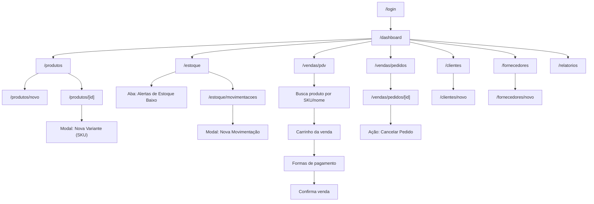
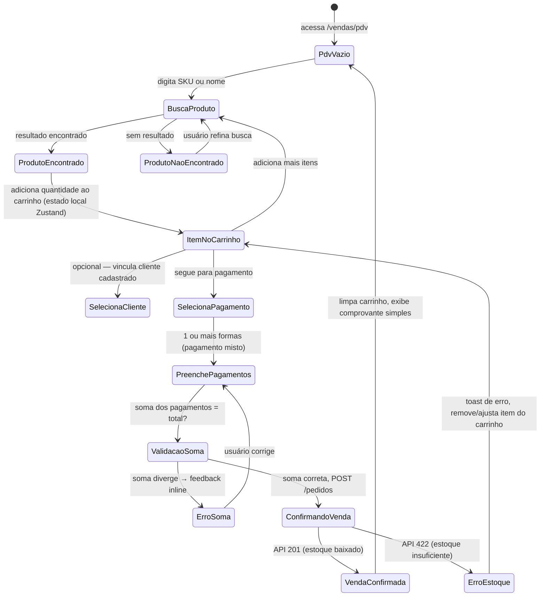
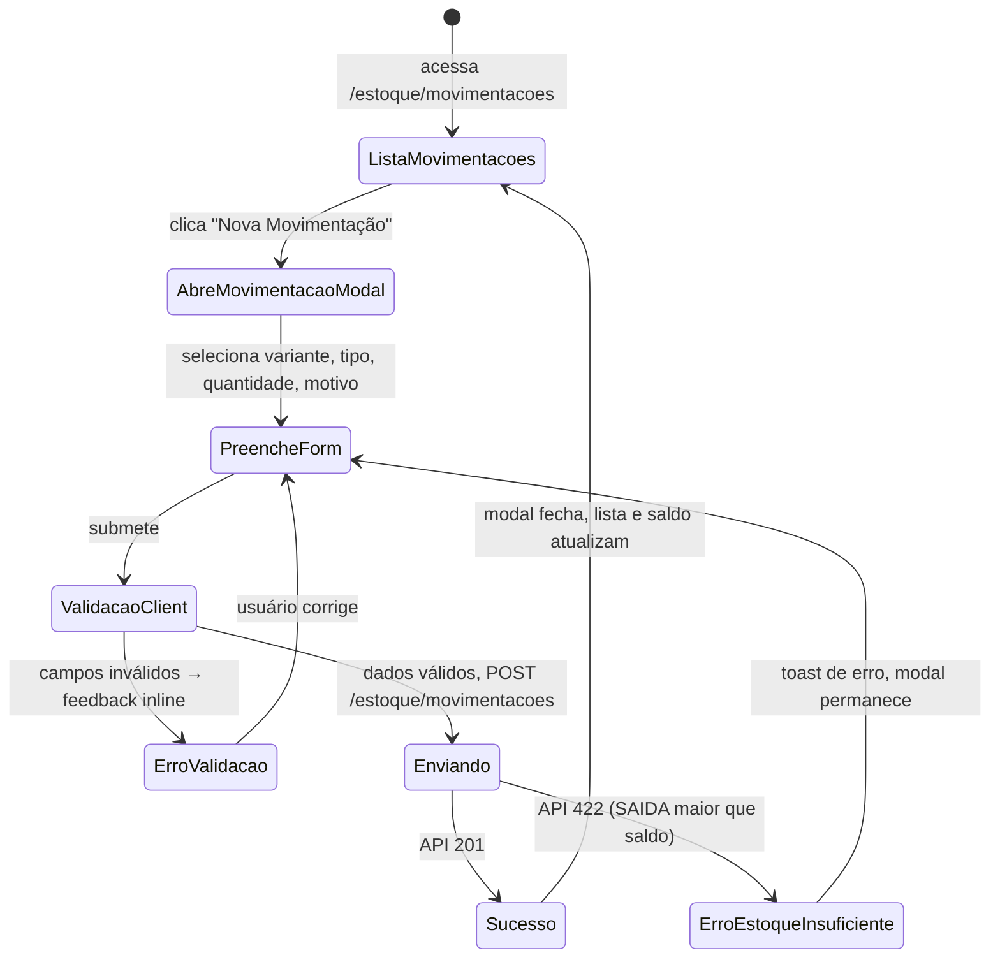

# AMACTIVE — Arquitetura de Frontend

> Leitura obrigatória para o `dev-expert-front` antes de implementar qualquer tela. Complementa `docs/SDD.md` (ADR-005) e `docs/openapi.yaml` (contrato consumido).

---

## 1. Visão Geral

- **Stack**: React 18 + TypeScript + Vite (SPA — não Next.js). Justificativa completa em `docs/SDD.md` ADR-005: painel interno sem requisito de SEO/SSR, com forte interatividade no fluxo de PDV.
- **Roteamento**: React Router v6 (`createBrowserRouter`), com guard de autenticação centralizado.
- **Estilo**: Tailwind CSS + Design Tokens (§7).
- **Estado de servidor**: TanStack Query (cache, refetch, loading/error states) — nunca `useEffect` + `fetch` manual em componentes.
- **Validação**: Zod, espelhando os schemas de `docs/openapi.yaml`.
- **Formulários**: React Hook Form + `zodResolver`.
- **Estado global de UI** (não-servidor): Zustand, reservado para casos reais de estado compartilhado entre features (ex: carrinho do PDV antes de confirmar a venda) — usado com parcimônia.

Não existe distinção Server/Client Component (não é Next.js) — toda a árvore é client-side. A distinção relevante aqui é **Componente de Página (rota)** vs **Componente de Feature** vs **Componente Compartilhado (`shared/ui`)**.

---

## 2. Bounded Contexts de Frontend (Feature Map)

O frontend espelha os bounded contexts do backend (`docs/SDD.md` §1.2), mas cada um vira uma **feature** independente — nunca uma feature importa diretamente de outra.

| Feature (frontend) | Contexto de backend correspondente | Telas |
|---|---|---|
| `dashboard` | Relatórios & Dashboard | Painel inicial |
| `produtos` | Catálogo & Estoque | Lista, cadastro/edição de produto, cadastro de variantes (SKU) |
| `estoque` | Catálogo & Estoque | Saldo de estoque, alertas, histórico de movimentações |
| `vendas` | Vendas | PDV (nova venda), lista de pedidos, detalhe/cancelamento de pedido |
| `clientes` | Cadastros | Lista, cadastro/edição de cliente |
| `fornecedores` | Cadastros | Lista, cadastro/edição de fornecedor |
| `relatorios` | Relatórios & Dashboard | Vendas por período, produtos mais vendidos, giro de estoque |
| `auth` (em `shared/`, não é feature de negócio) | Identidade & Acesso | Login |

Comunicação entre features (ex: PDV precisa buscar produto por SKU, que é "dono" da feature `produtos`) ocorre via `shared/lib/api-client.ts` + hooks expostos no `index.ts` público da feature dona do dado — nunca importando componentes internos de outra feature.

---

## 3. Estrutura de Pastas (Feature-Based)

```
apps/web/
├── src/
│   ├── app/                        # Shell da aplicação
│   │   ├── router.tsx              # Definição de rotas (React Router)
│   │   ├── App.tsx                 # Providers (QueryClient, Router, Theme)
│   │   └── AuthGuard.tsx           # Guard de rota autenticada
│   │
│   ├── features/
│   │   ├── dashboard/
│   │   │   ├── components/
│   │   │   │   ├── ResumoCards.tsx
│   │   │   │   └── AlertaEstoqueList.tsx
│   │   │   ├── hooks/
│   │   │   │   └── useDashboardResumo.ts
│   │   │   ├── pages/
│   │   │   │   └── DashboardPage.tsx
│   │   │   └── index.ts
│   │   │
│   │   ├── produtos/
│   │   │   ├── components/
│   │   │   │   ├── ProdutoCard.tsx
│   │   │   │   ├── ProdutoForm.tsx
│   │   │   │   ├── ProdutoTable.tsx
│   │   │   │   └── VarianteForm.tsx
│   │   │   ├── hooks/
│   │   │   │   ├── useProdutos.ts          # lista paginada
│   │   │   │   ├── useProduto.ts           # detalhe por id
│   │   │   │   ├── useCriarProduto.ts
│   │   │   │   └── useCriarVariante.ts
│   │   │   ├── schemas/
│   │   │   │   └── produto.schema.ts
│   │   │   ├── types/
│   │   │   │   └── produto.types.ts
│   │   │   ├── pages/
│   │   │   │   ├── ProdutosListPage.tsx
│   │   │   │   ├── ProdutoNovoPage.tsx
│   │   │   │   └── ProdutoDetalhePage.tsx
│   │   │   └── index.ts
│   │   │
│   │   ├── estoque/
│   │   │   ├── components/
│   │   │   │   ├── EstoqueTable.tsx
│   │   │   │   ├── AlertaEstoqueBadge.tsx
│   │   │   │   └── MovimentacaoModal.tsx
│   │   │   ├── hooks/
│   │   │   │   ├── useEstoque.ts
│   │   │   │   ├── useAlertasEstoque.ts
│   │   │   │   ├── useMovimentacoes.ts
│   │   │   │   └── useCriarMovimentacao.ts
│   │   │   ├── schemas/
│   │   │   │   └── movimentacao.schema.ts
│   │   │   ├── types/
│   │   │   │   └── estoque.types.ts
│   │   │   ├── pages/
│   │   │   │   ├── EstoquePage.tsx
│   │   │   │   └── MovimentacoesPage.tsx
│   │   │   └── index.ts
│   │   │
│   │   ├── vendas/
│   │   │   ├── components/
│   │   │   │   ├── PdvBuscaProduto.tsx
│   │   │   │   ├── PdvCarrinho.tsx
│   │   │   │   ├── PdvPagamentoForm.tsx
│   │   │   │   ├── PedidoTable.tsx
│   │   │   │   └── PedidoDetalheCard.tsx
│   │   │   ├── hooks/
│   │   │   │   ├── usePedidos.ts
│   │   │   │   ├── usePedido.ts
│   │   │   │   ├── useCriarPedido.ts
│   │   │   │   └── useCancelarPedido.ts
│   │   │   ├── schemas/
│   │   │   │   └── pedido.schema.ts
│   │   │   ├── types/
│   │   │   │   └── pedido.types.ts
│   │   │   ├── store/
│   │   │   │   └── carrinho.store.ts        # Zustand — estado do carrinho do PDV antes de confirmar
│   │   │   ├── pages/
│   │   │   │   ├── PdvPage.tsx
│   │   │   │   ├── PedidosListPage.tsx
│   │   │   │   └── PedidoDetalhePage.tsx
│   │   │   └── index.ts
│   │   │
│   │   ├── clientes/                        # mesmo padrão de produtos/estoque
│   │   │   ├── components/ hooks/ schemas/ types/ pages/
│   │   │   └── index.ts
│   │   │
│   │   ├── fornecedores/                    # mesmo padrão
│   │   │   ├── components/ hooks/ schemas/ types/ pages/
│   │   │   └── index.ts
│   │   │
│   │   └── relatorios/
│   │       ├── components/
│   │       │   ├── VendasPorPeriodoChart.tsx
│   │       │   ├── ProdutosMaisVendidosTable.tsx
│   │       │   └── GiroEstoqueTable.tsx
│   │       ├── hooks/
│   │       │   ├── useRelatorioVendas.ts
│   │       │   ├── useRelatorioProdutos.ts
│   │       │   └── useRelatorioGiroEstoque.ts
│   │       ├── pages/
│   │       │   └── RelatoriosPage.tsx
│   │       └── index.ts
│   │
│   ├── shared/
│   │   ├── components/
│   │   │   ├── ui/                  # Design system: Button, Input, Select, Modal, Badge, Table...
│   │   │   └── layout/              # Sidebar, Header, PageWrapper, AuthLayout
│   │   ├── hooks/
│   │   │   ├── useAuth.ts
│   │   │   └── useDebounce.ts
│   │   ├── lib/
│   │   │   ├── api-client.ts        # fetch wrapper com auth + tratamento RFC 7807
│   │   │   └── query-client.ts      # TanStack Query config global
│   │   └── types/
│   │       ├── api.types.ts         # tipos gerados/alinhados ao openapi.yaml
│   │       └── common.types.ts
│   │
│   ├── auth/                        # Identidade & Acesso — não é feature de domínio de negócio
│   │   ├── hooks/useLogin.ts
│   │   ├── schemas/auth.schema.ts
│   │   └── pages/LoginPage.tsx
│   │
│   ├── styles/
│   │   └── tokens.css
│   ├── main.tsx
│   └── App.tsx
├── public/
├── index.html
├── package.json
├── tsconfig.json
├── vite.config.ts
├── tailwind.config.ts
└── postcss.config.js
```

### Regras de fronteira

- Uma feature nunca importa de `features/outra-feature/components|hooks|store` — apenas de `features/outra-feature/index.ts` (barrel export) quando estritamente necessário (ex: `vendas` pode importar `useProdutoPorSku` exportado por `produtos/index.ts`).
- `shared/` é o único lugar verdadeiramente compartilhado — design system, cliente HTTP, hooks genéricos.
- Cada feature expõe em `index.ts` apenas hooks e tipos que outras camadas (rotas, outras features) precisam conhecer.

---

## 4. Mapa de Navegação (Sitemap) e User Flows

### 4.1 Sitemap



### 4.2 User Flow — PDV (Nova Venda), fluxo crítico do sistema



### 4.3 User Flow — Registrar Movimentação de Estoque



### 4.4 Checklist de UX aplicado a cada tela do MVP

```
[ ] Happy path documentado
[ ] Estados de erro mapeados (validação, API down, 401/403, estoque insuficiente)
[ ] Estados de loading (skeleton nas tabelas, spinner em botões de submit)
[ ] Estados vazios (ex: "Nenhum produto cadastrado ainda" com CTA "Cadastrar produto")
[ ] Confirmação antes de ação destrutiva (cancelar pedido, inativar produto/cliente/fornecedor)
[ ] Responsividade: desktop-first (uso primário é balcão de loja com desktop/tablet), mas layout não quebra em tablet 768px+
```

---

## 5. Contratos de Consumo de API

Mesma arquitetura em camadas descrita na diretriz de referência: **Componente → Hook customizado → API Client → Zod Schema → DTO**.

### 5.1 API Client centralizado

```typescript
// shared/lib/api-client.ts
const BASE_URL = import.meta.env.VITE_API_URL

export class ApiError extends Error {
  constructor(public title: string, public status: number, public detail?: string) {
    super(title)
  }
}

export async function apiClient<T>(path: string, options?: RequestInit): Promise<T> {
  const res = await fetch(`${BASE_URL}${path}`, {
    ...options,
    headers: {
      'Content-Type': 'application/json',
      ...(getToken() ? { Authorization: `Bearer ${getToken()}` } : {}),
      ...options?.headers,
    },
  })
  if (!res.ok) {
    const problem = await res.json().catch(() => ({}))  // RFC 7807
    throw new ApiError(problem.title ?? 'Erro inesperado', res.status, problem.detail)
  }
  if (res.status === 204) return undefined as T
  return res.json()
}
```

### 5.2 Zod Schema alinhado ao OpenAPI — exemplo (Pedido/PDV)

```typescript
// features/vendas/schemas/pedido.schema.ts
import { z } from 'zod'

export const FormaPagamentoSchema = z.enum(['DINHEIRO', 'PIX', 'CARTAO_DEBITO', 'CARTAO_CREDITO'])

export const ItemPedidoRequestSchema = z.object({
  variante_id: z.string().uuid(),
  quantidade: z.number().int().min(1, 'Quantidade mínima é 1'),
  desconto_item: z.string().regex(/^\d+\.\d{2}$/).default('0.00'),
})

export const PagamentoRequestSchema = z.object({
  forma_pagamento: FormaPagamentoSchema,
  valor: z.string().regex(/^\d+\.\d{2}$/, 'Formato inválido: use 129.90'),
})

export const CriarPedidoSchema = z.object({
  cliente_id: z.string().uuid().nullable().optional(),
  desconto: z.string().regex(/^\d+\.\d{2}$/).default('0.00'),
  observacao: z.string().optional(),
  itens: z.array(ItemPedidoRequestSchema).min(1, 'Adicione ao menos um item'),
  pagamentos: z.array(PagamentoRequestSchema).min(1, 'Informe ao menos uma forma de pagamento'),
})

export const PedidoResponseSchema = z.object({
  id: z.string().uuid(),
  numero: z.string(),
  status: z.enum(['PENDENTE', 'CONFIRMADO', 'CANCELADO']),
  valor_total: z.string(),
  criado_em: z.string(),
})

export type CriarPedidoDTO = z.infer<typeof CriarPedidoSchema>
export type Pedido = z.infer<typeof PedidoResponseSchema>
```

### 5.3 Hook TanStack Query — mutation com invalidação em cascata

O PDV altera dois agregados (`pedido` e `estoque`) — a mutation invalida ambas as `queryKey` afetadas:

```typescript
// features/vendas/hooks/useCriarPedido.ts
import { useMutation, useQueryClient } from '@tanstack/react-query'
import { apiClient } from '@/shared/lib/api-client'
import { CriarPedidoSchema, PedidoResponseSchema, type CriarPedidoDTO } from '../schemas/pedido.schema'

export function useCriarPedido() {
  const queryClient = useQueryClient()

  return useMutation({
    mutationFn: async (dto: CriarPedidoDTO) => {
      const payload = CriarPedidoSchema.parse(dto)
      const raw = await apiClient<unknown>('/pedidos', {
        method: 'POST',
        body: JSON.stringify(payload),
      })
      return PedidoResponseSchema.parse(raw)
    },
    onSuccess: () => {
      queryClient.invalidateQueries({ queryKey: ['pedidos'] })
      queryClient.invalidateQueries({ queryKey: ['estoque'] })          // venda dá baixa em estoque
      queryClient.invalidateQueries({ queryKey: ['dashboard-resumo'] })
    },
  })
}
```

### 5.4 Tabela de decisão: estratégia de fetch por tipo de tela

| Estratégia | Quando usar no AMACTIVE |
|---|---|
| **TanStack Query (padrão)** | Todas as listagens e detalhes — Produtos, Estoque, Pedidos, Clientes, Fornecedores, Relatórios |
| **Mutation + invalidateQueries** | Toda ação de escrita (criar produto, registrar movimentação, confirmar venda, cancelar pedido) |
| **Zustand (estado local, não-servidor)** | Apenas o carrinho do PDV antes da confirmação — é estado de rascunho que não existe no servidor até o `POST /pedidos` |

`staleTime` por tipo de dado:

| Dado | staleTime |
|---|---|
| Lista de produtos/variantes | 60s |
| Saldo de estoque | 15s (muda com frequência durante o expediente) |
| Lista de pedidos | 15s |
| Clientes / Fornecedores | 5min (mudam pouco) |
| Dashboard / Relatórios | 60s |

---

## 6. Performance

Sem Core Web Vitals de SEO a otimizar (SPA interna, sem crawler), mas os princípios de responsividade continuam válidos:

```
[ ] Code splitting por rota (React Router + React.lazy nas páginas de features)
[ ] Componentes pesados (ex: gráfico de relatórios) carregados sob demanda (dynamic import)
[ ] Debounce (300ms) em campos de busca (produtos, clientes, fornecedores) — shared/hooks/useDebounce.ts
[ ] Tabelas grandes com paginação no servidor (nunca carregar >100 itens de uma vez — contrato já pagina, ver docs/openapi.yaml)
[ ] Tailwind com content-purge configurado (apenas classes usadas no bundle final)
```

---

## 7. Design Tokens — Identidade Visual AMACTIVE

Marca de moda fitness feminina: tom **enérgico, confiante e clean**. Paleta com uma cor de assinatura vibrante (coral/rosa queimado) equilibrada por neutros (preto/grafite/branco) típicos de moda fitness — evita rosa "infantilizado", buscando um visual premium/atlético.

```css
/* styles/tokens.css */

:root {
  /* ── Primitivos ─────────────────────────────────────────── */
  --color-coral-50:   #fff1ee;
  --color-coral-400:  #ff8a70;
  --color-coral-500:  #ff6b4a;   /* cor de assinatura AMACTIVE */
  --color-coral-600:  #e6502f;
  --color-coral-700:  #c23f22;

  --color-graphite-50:  #f7f7f8;
  --color-graphite-200: #e2e2e6;
  --color-graphite-500: #6b6b74;
  --color-graphite-800: #232328;
  --color-graphite-900: #131316;

  --color-green-500: #22c55e;    /* sucesso / estoque ok */
  --color-amber-500: #f59e0b;    /* alerta / estoque baixo */
  --color-red-500:   #ef4444;    /* erro / estoque crítico / cancelado */
  --color-white:     #ffffff;

  --font-sans: 'Sora', 'Inter', system-ui, sans-serif;   /* títulos com presença, geométrica */
  --font-body: 'Inter', system-ui, sans-serif;

  --text-xs:   0.75rem;
  --text-sm:   0.875rem;
  --text-base: 1rem;
  --text-lg:   1.125rem;
  --text-xl:   1.25rem;
  --text-2xl:  1.5rem;

  --space-1: 0.25rem;  --space-2: 0.5rem;  --space-3: 0.75rem;
  --space-4: 1rem;     --space-6: 1.5rem;  --space-8: 2rem;
  --space-12: 3rem;    --space-16: 4rem;

  --radius-sm: 0.375rem;
  --radius-md: 0.5rem;
  --radius-lg: 0.75rem;
  --radius-full: 9999px;

  --shadow-sm: 0 1px 2px 0 rgb(0 0 0 / 0.05);
  --shadow-md: 0 4px 10px -2px rgb(0 0 0 / 0.10);

  --breakpoint-sm: 640px;  --breakpoint-md: 768px;
  --breakpoint-lg: 1024px; --breakpoint-xl: 1280px;
}

/* ── Semânticos (tema claro — único tema no MVP; dark theme é evolução futura) ── */
:root {
  --color-primary:        var(--color-coral-500);
  --color-primary-hover:  var(--color-coral-600);
  --color-primary-subtle: var(--color-coral-50);

  --color-danger:         var(--color-red-500);
  --color-success:        var(--color-green-500);
  --color-warning:        var(--color-amber-500);

  --color-bg:             var(--color-white);
  --color-bg-subtle:      var(--color-graphite-50);
  --color-text:           var(--color-graphite-900);
  --color-text-muted:     var(--color-graphite-500);
  --color-border:         var(--color-graphite-200);

  /* Status de estoque */
  --color-status-ok:        var(--color-green-500);
  --color-status-baixo:     var(--color-amber-500);
  --color-status-critico:   var(--color-red-500);

  /* Status de pedido */
  --color-status-pendente:  var(--color-amber-500);
  --color-status-confirmado: var(--color-green-500);
  --color-status-cancelado: var(--color-graphite-500);
}
```

### Integração Tailwind

```typescript
// tailwind.config.ts
import type { Config } from 'tailwindcss'

const config: Config = {
  content: ['./index.html', './src/**/*.{ts,tsx}'],
  theme: {
    extend: {
      colors: {
        primary:        'var(--color-primary)',
        'primary-hover': 'var(--color-primary-hover)',
        'primary-subtle': 'var(--color-primary-subtle)',
        danger:  'var(--color-danger)',
        success: 'var(--color-success)',
        warning: 'var(--color-warning)',
        'bg-subtle':   'var(--color-bg-subtle)',
        'text-muted':  'var(--color-text-muted)',
        status: {
          ok: 'var(--color-status-ok)',
          baixo: 'var(--color-status-baixo)',
          critico: 'var(--color-status-critico)',
          pendente: 'var(--color-status-pendente)',
          confirmado: 'var(--color-status-confirmado)',
          cancelado: 'var(--color-status-cancelado)',
        },
      },
      fontFamily: {
        sans: ['var(--font-sans)'],
        body: ['var(--font-body)'],
      },
      borderRadius: {
        sm: 'var(--radius-sm)', md: 'var(--radius-md)',
        lg: 'var(--radius-lg)', full: 'var(--radius-full)',
      },
    },
  },
}
export default config
```

### Checklist de Design Tokens

```
[ ] Paleta primitiva definida (nunca hex direto em componentes — sempre var(--color-*) via Tailwind)
[ ] Tokens semânticos mapeados (tema único no MVP — dark theme fica como evolução futura)
[ ] Tokens de status cobrindo estoque (ok/baixo/crítico) e pedido (pendente/confirmado/cancelado)
[ ] Escala tipográfica limitada a 6 tamanhos
[ ] Espaçamento em múltiplos de 4px
[ ] Tokens integrados ao Tailwind — sem valores hard-coded nas classes JSX
```

---

## 8. Checklist de Entrega — Fases sugeridas para o `dev-expert-front`

```
Fase 1 — Foundation (não depende da API rodando)
[ ] Scaffold Vite + Tailwind + Design Tokens
[ ] Design system básico em shared/components/ui (Button, Input, Select, Modal, Table, Badge)
[ ] Layout (Sidebar + Header + PageWrapper) e roteamento com AuthGuard
[ ] api-client.ts + query-client.ts + tratamento de erro RFC 7807

Fase 2 — Features Core (requer API rodando)
[ ] auth (login) + estoque + produtos
[ ] vendas (PDV) — fluxo crítico, priorizar

Fase 3 — Features Complementares
[ ] clientes, fornecedores, relatorios/dashboard

Fase 4 — Qualidade
[ ] Testes de componente (Vitest + Testing Library) nos fluxos críticos (PDV, movimentação de estoque)
[ ] Revisão de responsividade (768px+)
```
